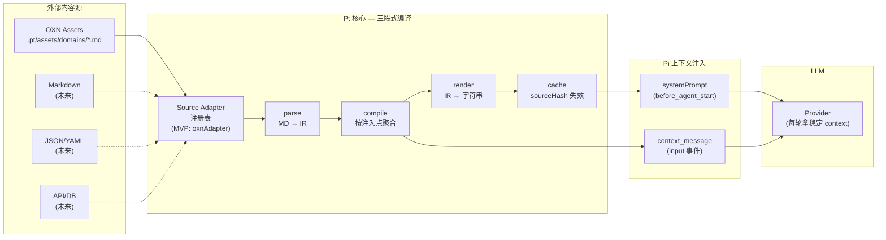

> **一页通览**：Pt 是什么、解决什么问题、适合谁用、在更大的方案里处于哪一阶段。读完你应该能向同事用三句话讲清楚 Pt。

## 一句话定位

**Pt（Polyglot Transpiler，多来源转译器）** 是一个 Pi Extension。它把多个来源渠道的业务知识（OXN Assets 是已实现的第一个来源，未来还会接入 Markdown、JSON/YAML、外部 API、其他知识库）**统一转译** 成 Pi Agent 能理解的 `systemPrompt` 上下文与 `context_message` 工具声明。

读完之后，你只需要记住这一句话：**让 Pi 直接加载多来源业务知识，用户不用每次写上下文**。它把"每次开新会话都得粘贴背景知识"这件事，自动化成"激活 Blueprint → 下一轮生效"。

Sources: [pt-design.md](pt-design.md#L1-L7), [docs/pt-asset-layering.md §0](docs/pt-asset-layering.md#L23-L49)

---

## 一、核心场景：它解决什么问题

### 1.1 使用者视角的"痛点"

假设你在用 Pi 写代码时，需要让 Agent 记住一整套业务规则：

| 场景 | 没有 Pt 时 | 有 Pt 时 |
|---|---|---|
| 开新会话 | 手动粘贴背景知识、术语表、工作流 | `pi --pt-context pt` 一句启动即生效 |
| 切换上下文（如从"开发模式"切到"测试模式"） | 重新粘贴另一份背景知识 | `/pt-context test` 一条命令即时切换 |
| 多来源知识（OXN assets + Markdown 笔记 + Notion 文档） | 自己手动整合 | 多 Adapter 自动聚合转译 |
| Provider Prompt Cache | 每次内容变化都失效 | 内容稳定时持续命中（详见下文 §3.3） |

对一个**初级开发者**最重要的是：你**不需要懂 Pi 的内部事件机制、不需要 fork pi-web、不需要写 SDK 组装代码**——Pt 已经把这些封装成一个 ~200 行的 Extension，你只需要会写 Markdown 资产就能用。

Sources: [pt-design.md](pt-design.md#L11-L29), [src/index.ts](src/index.ts#L68-L101)

### 1.2 项目在仓库里的物理位置

```
pt/                              ← 当前项目根
├── src/                         ← TypeScript 源码
│   ├── index.ts                  ← Pi Extension 入口
│   ├── transpile.ts              ← 三段式编译总管
│   ├── parse/                    ← 前端：MD → IR
│   ├── compile/                  ← 中端：IR → IR
│   ├── render/                   ← 后端：IR → 字符串
│   └── schema.ts                 ← IR 契约（v8）
├── .pt/
│   ├── assets/                   ← 你的知识资产
│   │   ├── domains/*.md          ← 内容层：异构领域知识
│   │   ├── channels/*.md         ← 结构层：注入点定义
│   │   └── blueprints/*.md       ← 配置层：每场景一份
│   └── contexts/cache/           ← 编译产物（自动生成）
└── docs/                         ← 设计文档与运行验证截图
```

**关键观察**：代码体积小（核心 ~200-700 行 TypeScript），但承载了一个完整的"内容→结构→配置→产物"四层模型——这是它能用极简代码服务多场景的关键。

Sources: [src/](src/index.ts), [.pt/assets/](.pt/assets/blueprints/pt.blueprint.md), [docs/pt-asset-layering.md §0](docs/pt-asset-layering.md#L23-L49)

---

## 二、它不是什么（澄清边界）

在开始读代码前，先排除几个常见误解——这一节列出的反例，能让你少走 80% 的弯路。

| 它**不是** | 为什么这么说 | 当你真的需要时再升级 |
|---|---|---|
| **不是框架** | 单文件 Extension（核心 ~200 行），不用继承、不用装配生命周期 | 真需要框架能力时升阶段 1（au-core SDK） |
| **不是 fork pi-web** | 零 fork、零入口脚本、零 SDK 组装——直接 `pi` 命令启动即生效 | 真需要 Web UI 时升阶段 2（au-web） |
| **不是 au-core 包** | Pt 是阶段 0，au-core 是阶段 1 | 真需要多 Agent 身份 / skills 合并时再升级 |
| **不是只服务 OXN** | OXN 只是已实现的首个 **Source Adapter**，架构预留了多来源接入点（Source Adapter Registry） | 加新来源 = 加 adapter，Pt 核心不感知 |
| **不是改写 Pi 的提示词文件读取逻辑** | Pi 的 `discoverSystemPromptFile()` / `systemPromptOverride` 都是 session 创建时硬编码的，扩展无权改。Pt 走 `before_agent_start` 钩子追加段 | 真要改加载时行为，必须升级到阶段 1 走 SDK |

**对初级开发者的实操建议**：如果你是第一次接触 Pt，**只用它"加载已写好的资产"和"切 Blueprint"** 这两个能力就够。等你熟悉了事件机制（`session_start` / `before_agent_start` / `input`）再考虑扩 Adapter 或改 IR。

Sources: [pt-design.md §一](pt-design.md#L11-L62), [pt-plugin-design.md §0](pt-plugin-design.md#L7-L96)

---

## 三、核心价值：四个具体收益

Pt 不是为了"看起来酷"，每一个能力都对应一个明确收益。下面用**架构角色图**说明数据流，再用收益表解读。

### 3.1 数据流架构（先看图）



> **图阅读指引**（先看这里再回看图）：
> - **左列**（外部内容源）：业务知识现在住在 Markdown 文件里，未来可来自任何结构
> - **中列**（Pt 核心）：从左到右走 `parse → compile → cache → render`，每一步只依赖 IR（`src/schema.ts`），不跨层互相调用
> - **右列**（Pi 上下文）：编译产物注入 Pi 的两个位置——`systemPrompt`（每轮稳定追加）和 `context_message`（用户输入触发）

关键设计：**Pt 定义 IR 接口（schema.ts），来源（OXN/YAML/...）实现 SourceAdapter；Pt 核心不感知来源格式**——加新来源 = 加 adapter，不改核心。

Sources: [src/transpile.ts](src/transpile.ts#L29-L78), [src/schema.ts L1-L20](src/schema.ts#L1-L20), [docs/pt-asset-layering.md §0](docs/pt-asset-layering.md#L57-L70)

### 3.2 v8 四层模型

Pt 在 v8 演进中确立了一个**清晰的四层职责切分**——这是它能稳定支撑多场景、多来源的核心抽象。

| 层 | 名称 | 定位 | 载体 | 复用性 |
|---|---|---|---|---|
| **内容层** | **Domain** | 异构领域知识——按 H2 切模块，frontmatter `type` 区分内容性质（`term` / `workflow` / `stack`） | `.pt/assets/domains/*.md` | 跨 Channel/Blueprint 复用 |
| **结构层** | **Channel** | 编译上下文通道——H2 = 注入点；定义"哪些 H2 段聚合、注入到 Pi 哪里、用什么 mode" | `.pt/assets/channels/*.md` | 跨项目复用 |
| **配置层** | **Blueprint** | 异构领域知识编译上下文通道蓝图——引用 Channel + 按注入点选 Domain + Trigger/Boundaries + 编译方式 | `.pt/assets/blueprints/*.md` | 每场景一份 |
| **产物层** | **Context** | 编译后目标上下文——按注入点聚合多 Domain 内容，物理文件 + `sourceHash` 缓存 | `.pt/contexts/cache/*.context.md` | 缓存复用 |

**对初级开发者的简化理解**：把 Domain 想成"原料"（如各领域的术语表），把 Channel 想成"管道结构"（如"开发知识"这个通道定义几个注入点），把 Blueprint 想成"配方"（哪个场景用哪些 Domain、怎么编排），把 Context 想成"成品"（一次编译出来的 context 文件）。

**H2 = 注入点**（v8 核心设计）：Channel 的每个 H2 标题对应 Pi 的一个上下文注入位置（如 system_prompt / context_message）。这样新增注入点 = Channel 加一个 H2 + render 代码不需改动。

Sources: [docs/pt-asset-layering.md §0 表格](docs/pt-asset-layering.md#L33-L38), [docs/pt-asset-layering.md §0.2](docs/pt-asset-layering.md#L81-L113), [src/schema.ts L11-L21](src/schema.ts#L11-L21)

### 3.3 四个具体收益

| 收益 | 含义 | 适用场景 | 关键支撑 |
|---|---|---|---|
| **零摩擦启动** | 直接 `pi` 命令加载，零 fork、零入口脚本、零 SDK 组装 | 想用 Pi 增强但不想改 Pi | `.pi/extensions/pt.ts` 形式存在即可生效 |
| **per-session 隔离** | 每个 `pi` 命令 = 独立 Node 进程 = 独立加载扩展模块 = 独立内存态 | 同一项目多个并发会话各自选不同 Blueprint | `let activeBlueprint` 在 Extension 模块作用域中（源码 [src/index.ts#L17](src/index.ts#L17-L26)） |
| **Provider Prompt Cache 友好** | `before_agent_start` 钩子追加稳定字符串 → provider prompt cache 持续命中 | 长会话、批量调用、降低 token 成本 | cache 失效的唯一情况是激活新工具集——纯文本追加不触发 |
| **多来源反转** | Pt 定义 IR 接口（schema），来源实现 SourceAdapter；加新来源不改核心 | 想接 Notion / 飞书 / 数据库 / API 等知识源 | `sourceAdapters: SourceAdapter[]` 注册表（源码 [src/transpile.ts#L30-L33](src/transpile.ts#L30-L33)） |
| **可验证可调式** | 提供 `/pt status` `/pt raw` `/pt full` `/pt flows` 命令查看编译产物 | 调试转译效果、定位"为什么我的 Domain 没注入" | `/pt` 子命令在 [src/index.ts#L164](src/index.ts#L164-L200) 注册 |

**对初级开发者的提醒**：第四项（多来源反转）是 Pt 设计哲学的核心——**Pt 不直接读任何特定格式的文件**。当前在 `src/parse/index.ts` 里只有 `oxnAdapter`，未来加 `yamlAdapter`、`dbAdapter` 都不会触碰核心 pipeline。这是你需要长期记住的扩展点。

Sources: [src/index.ts](src/index.ts#L1-L132), [src/transpile.ts](src/transpile.ts#L29-L78), [pt-design.md §二](pt-design.md#L65-L143)

---

## 四、阶段定位：它在整个方案里处于哪一站

Pt 是 AU 架构分阶段演进中的**阶段 0**——不是终点，是最小可验证版本。下表让你看清楚它和后续阶段的关系，决定你**现在该读哪份文档**：

| 阶段 | 形态 | 代码量 | 能力边界 | 当前进展 |
|---|---|---|---|---|
| **阶段 0（Pt）** | Pi Extension | ~200 行起步，已长为多文件管线 | OXN 来源渠道 → systemPrompt + context_message + Blueprint 切换；架构预留多来源接入 | ✅ **已实现（v8 四层模型 + 三段式编译）** |
| 阶段 1（au-core） | SDK 消费者 + au-tui 入口 | ~240 行 | + 加载时注入 / skills 合并 / 多 Agent / 更多来源渠道 | 🔜 当撞到 Extension 做不到的需求时升级 |
| 阶段 2（au-web） | fork pi-web | ~120 行 patch | + Web UI | 🔜 当需要 Web UI 时做 |

**v8 当前状态**（来自 [docs/pt-dev-phases.md](docs/pt-dev-phases.md#L13-L17)）：
- Channel H2 = 注入点 ✓
- Blueprint 按注入点选 Domain ✓
- Context 文件 H2 = 注入点名 ✓
- Compilation 配置可读（`cache-dir` + `split`）✓

Pt 的转译逻辑（读来源 + 转 H2）不会废弃——当升级到阶段 1 时搬到 `au-core/knowledge.ts`，Source Adapter 层独立扩展。

Sources: [pt-design.md §一 阶段表](pt-design.md#L54-L62), [docs/pt-dev-phases.md §"接手坐标"](docs/pt-dev-phases.md#L9-L48)

---

## 五、与写代码直接相关的动手入口

下面是你**马上可以做的 5 件事**，按学习曲线从低到高排：

| # | 动作 | 一句话命令 | 下一站文档 |
|---|---|---|---|
| 1 | 跑一次现有 Blueprint | `pi --pt-context pt` | [快速上手](2-kuai-su-shang-shou-cong-yuan-ma-dao-shou-lun-zhu-ru) |
| 2 | 看 `.pt/assets/` 下的资产结构 | `ls .pt/assets/{domains,channels,blueprints}` | [资产目录约定](3-zi-chan-mu-lu-yue-ding-yu-wen-jian-ming-ming) |
| 3 | 编写你的第一个 Domain | 新建 `.pt/assets/domains/my-domain.md` | [编写三类资产](4-bian-xie-domain-channel-blueprint-san-lei-zi-chan) |
| 4 | 查看当前编译产物 | 在 Pi 内运行 `/pt status` | [常用命令](5-chang-yong-ming-ling-yu-diao-shi-shu-chu) |
| 5 | 调试转译问题 | `/pt raw` / `/pt full` / `/pt flows` | [查看与导出产物](6-cha-kan-yu-dao-chu-zhuan-yi-chan-wu-pt-status-raw-full-flows) |

Sources: [src/index.ts](src/index.ts#L68-L161), [.pt/assets/](.pt/assets/blueprints/pt.blueprint.md)

---

## 六、阅读建议：从这里往哪里走

按目录结构推荐的递进路径（每一步基于上一步已掌握概念）：

```
当前位置: 项目定位与价值（你在这里）
         │
         ▼
[快速上手](2-kuai-su-shang-shou-cong-yuan-ma-dao-shou-lun-zhu-ru)            ← 第二步：clone → 跑通 → 首轮注入
         │
         ▼
[资产目录约定](3-zi-chan-mu-lu-yue-ding-yu-wen-jian-ming-ming)                ← 第三步：知道文件去哪放
         │
         ▼
[编写三类资产](4-bian-xie-domain-channel-blueprint-san-lei-zi-chan)           ← 第四步：写你的第一批 Markdown
         │
         ▼
[常用命令](5-chang-yong-ming-ling-yu-diao-shi-shu-chu)                         ← 第五步：会用 /pt /pt-context 等命令
         │
         ▼
[查看与导出产物](6-cha-kan-yu-dao-chu-zhuan-yi-chan-wu-pt-status-raw-full-flows)  ← 第六步：调试时怎么查
         │
         ▼
深入理解（按需查，不强制读完）：
  [v8 四层模型](7-v8-si-ceng-mo-xing-domain-channel-blueprint-context)
  [三段式编译](8-san-duan-shi-bian-yi-jia-gou-parse-compile-render)
  [Schema 与 IR](12-schema-yu-ir-qi-yue-src-schema-ts)
  ...
```

**对初级开发者的速读路径**：
1. 若你只想"用起来"：本文 → 快速上手 → 资产目录约定 → 常用命令（4 步即可上手）
2. 若你想"改资产"：上面 4 步 + 编写三类资产（共 5 步）
3. 若你想"理解架构"：再继续读深入理解章节，从 [v8 四层模型](7-v8-si-ceng-mo-xing-domain-channel-blueprint-context) 开始

Sources: 目录结构来自 [docs/pt-asset-layering.md §0](docs/pt-asset-layering.md#L23-L49), 代码入口 [src/index.ts](src/index.ts#L68-L161)

---

## 七、本页小结

| 如果你想知道…… | 看这里 |
|---|---|
| Pt 一句话是什么 | §一"一句话定位" |
| 用 Pt 解决什么具体问题 | §1.1 痛点对比表 |
| 数据怎么从 Markdown 流到 LLM | §3.1 架构图 |
| 四层模型如何切分职责 | §3.2 v8 四层模型表 |
| Pt 在更大方案里处于哪一阶段 | §四 阶段定位表 |
| 下一步该读哪份文档 | §六 阅读路径图 |

**记住三条铁律**（贯穿后续所有文档）：

1. **Pt 是 Pi Extension，不是框架、不是 SDK、不是 fork**（§二澄清边界）
2. **Pt 定义 IR，来源实现 SourceAdapter**（§3.1 架构图）
3. **Pt 当前是阶段 0，足够解决"自动加载业务知识"，更多需求再升级**（§四阶段定位）