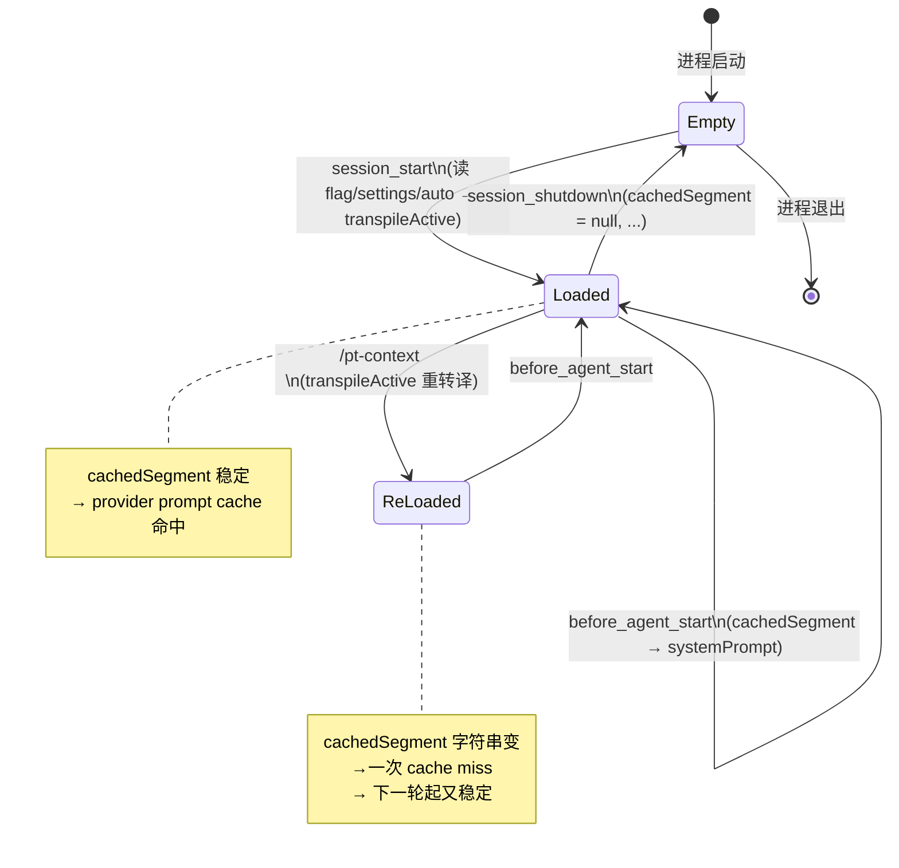
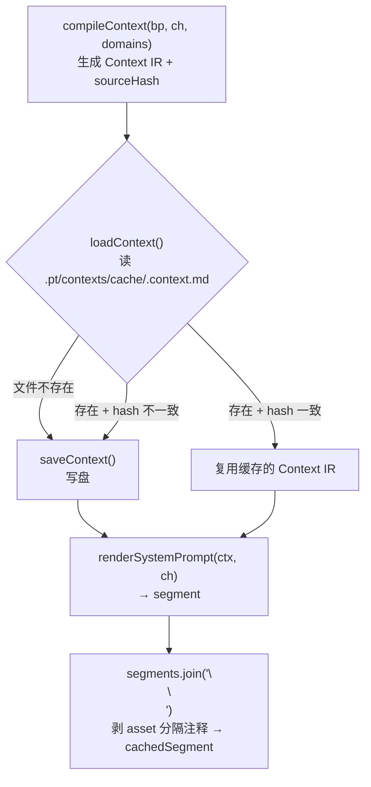
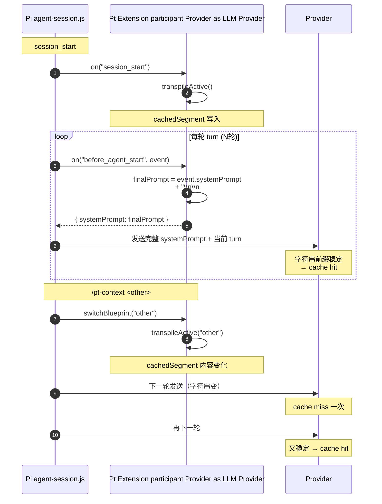
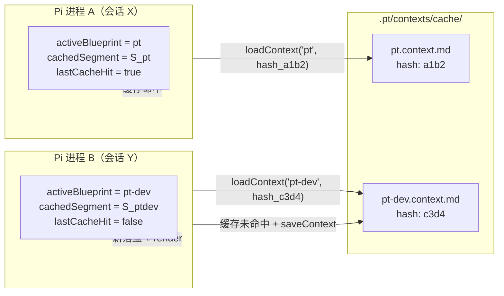

本页聚焦 Pt运行时最关键的一道"双层缓存链"——**进程内 per-session 内存态**与**进程间共享的 Context 文件缓存**——如何协同工作，使每一轮 LLM 调用既能拿到稳定的业务知识段，又能持续命中上游 **provider prompt cache**，从而把延迟与 token 费用压到最低。

阅读本页前，读者应当已经理解：[v8 四层模型](7-v8-si-ceng-mo-xing-domain-channel-blueprint-context)、[三段式编译架构](8-san-duan-shi-bian-yi-jia-gou-parse-compile-render)、[注入点机制与 Pi Extension 生命周期集成](9-zhu-ru-dian-ji-zhi-yu-pi-extension-sheng-ming-zhou-qi-ji-cheng)。其中涉及的具体函数签名可在 [Schema 与 IR 契约](12-schema-yu-ir-qi-yue-src-schema-ts) 与 [后端渲染](15-hou-duan-xuan-ran-system-prompt-yu-context-message-shu-chu) 中查阅。

Sources: [src/index.ts](../src/index.ts#L1-L30)

## 一、为什么需要两层缓存：设计动机`before_agent_start` 在每一轮 agent loop 都会被触发。如果每一轮都跑"全量 parse → compile → render"，对于一个 8 个 Domain × 3 个 Blueprint 的项目就是无谓的 I/O 与重复计算；如果每轮都把同样的字符串改写一遍到磁盘，又会破坏 provider端的 prefix 命中率。Pt 的策略是**两条独立但互补的缓存**：

|缓存层 | 存储位置 | 失效粒度 | 服务频率 | 谁来读写 |
|---|---|---|---|---|
| **per-session 内存态** | 进程内模块级变量 | 一次 `transpileActive` | `before_agent_start` 每轮读取 | `index.ts` 写入，`index.ts` 读取 |
| **Context 文件缓存** | `<cwd>/<compilation.cacheDir>/<name>.context.md` | `sourceHash`（FNV-1a 32-bit） | 跨进程复用 | `render/cache.ts` 读写，`transpile.ts` 触发 |

两者**作用域不同**：内存态服务于"同一会话的 N 轮 turn"，文件缓存服务于"不同会话、不同进程、不同时间戳对同一 Blueprint 的复用"。文件层命中后，render 仍要执行一次（廉价），但省去了最重的 parse 与中端聚合。

Sources: [src/transpile.ts](../src/transpile.ts#L46-L78), [src/render/cache.ts](../src/render/cache.ts#L25-L46)

## 二、per-session 内存态：6 个模块级变量

`src/index.ts` 顶部声明的 6 个 `let` 是 Pt 在该进程内持有的全部会话状态。它们的生命周期与 Pi 进程一致——`pi` 命令启动一个 Node 进程，扩展模块被加载一次；会话结束（`session_shutdown`）清空，进程退出后随 Node GC 释放。

| 变量 | 类型 | 写入时机 | 读取时机 | 用途 |
|---|---|---|---|---|
| `activeBlueprint` | `string \| null` | `session_start` / `transpileActive` / `switchBlueprint` | `/pt status` 展示、`findFlow` 索引查找 | 当前激活的 Blueprint 名 |
| `cachedSegment` | `string \| null` | `transpileActive`写入 `result.segment` | `before_agent_start` 每轮拼到 systemPrompt | 已渲染好的 systemPrompt 注入段 |
| `cachedBundles` | `SchemaBundle[] \| null` | `transpileActive` 写入 `result.bundles` | `input` 事件查 FlowTemplate、`/pt flows`、`/pt status` | 保留 IR 给 input handler 用 |
| `lastCwd` | `string` | `session_start` 写入 `ctx.cwd` | `/pt-context` 命令的补全 `getArgumentCompletions` | 命令补全需要 cwd |
| `lastBuiltPrompt` | `string \| null` | `before_agent_start` 写入 `finalPrompt` | 当前已不再读取（`/pt full` 改用现拼） | 历史遗留：曾经供 `/pt full` 用 |
| `lastCacheHit` | `boolean` | `transpileActive` 写入 `result.cacheHit` | `/pt status` 展示、`switchBlueprint` 通知文案 | 让用户知道上一次切 Blueprint 是否命中磁盘缓存 |

> **关键洞察**：这 6 个变量都是模块级（`let`），不是实例字段、不是 class、不是 closure。Node 模块缓存决定了**一个 Pi 进程 = 一份内存态**——多个并发会话（多个 `pi` 进程跑同一项目）天然隔离，互不污染。这正是 `pt-design.md §二` 中 v3 方案相对 v2（写 `APPEND_SYSTEM.md`）的根本优势。

Sources: [src/index.ts](../src/index.ts#L20-L29), [pt-design.md](../pt-design.md#L95-L115)

## 四、状态机的生命周期绑定

内存态与 Pi Extension 的 4 个事件钩子形成精确的状态机：



- **`session_start`** 是"入口"——按优先级 `flagVal > fromSettings > auto`选 Blueprint，调用 `transpileActive` 写满 6 个变量中的5 个（`lastBuiltPrompt` 仍为 `null`，因 `before_agent_start` 尚未触发）。
- **`before_agent_start`** 是"稳定读"——只读 `cachedSegment`，不修改内存态（除了 `lastBuiltPrompt`，但它已经废弃）。这一设计确保了字符串稳定性：只要不切换 Blueprint，`event.systemPrompt + "\n\n## 当前任务上下文\n\n" + cachedSegment` 这段拼接的字符串逐轮相同。
- **`/pt-context <name>`** 是"主动失效"——调用 `transpileActive` 重写所有相关变量，通知文案用 `lastCacheHit` 提示本次是命中磁盘缓存还是已重写。
- **`session_shutdown`** 是"出口"——清空全部 6 个变量，等价于回到 Empty状态；进程退出后 Node 自然回收。

Sources: [src/index.ts](../src/index.ts#L78-L120), [src/index.ts](../src/index.ts#L123-L143), [src/index.ts](../src/index.ts#L151-L165)

## 五、Context 文件缓存：sourceHash 失效策略

文件缓存是**跨进程共享的物理层**。当 `transpileActive` 调用 `loadAndTranspile` 时，每一轮 Blueprint编译都会经过同一个三角校验：



**sourceHash 是失效的"金标准"**。它的计算在 `computeSourceHash`（[src/compile/context.ts](../src/compile/context.ts#L504-L539)）：

```typescript
// 简化后的算法骨架
const payload = stableStringify({
  blueprint: stableStringify(blueprint),
  channel: stableStringify(channel),
  domains:   domains.map(d => stableStringify(d)),
});
return fnv1a32(payload) + "-" + payload.length;
```

| 维度 | 选择 | 含义 |
|---|---|---|
| **算法** | FNV-1a 32-bit | 足够用于缓存标识，不依赖 Node `crypto`（避免在 ESM 扩展加载链路产生阻塞） |
| **输入域** | blueprint + channel + domains 三者内容 | 任一变化即失效（符合"任何源资产改了就重编译"的直觉） |
| **序列化** | `stableStringify`（自定义递归排序键的 JSON） | 字段顺序不影响 hash，确保不同 adapter 顺序产生相同 hash |
| **长度后缀** | `-${length_hex}` | 防32-bit 碰撞——内容不同但 FNV 撞上的极端概率几乎归零 |

**失效矩阵**（哪些动作会让 `sourceHash` 变化）：

| 触发动作 | hash变化 | 行为 |
|---|---|---|
| 编辑 `.pt/assets/domains/*.md` | ✅ | 对应 Domain字符串变 → 重编译 |
| 编辑 `.pt/assets/channels/*.md` | ✅ | channel字符串变 → 重编译 |
| 编辑 `.pt/assets/blueprints/*.md` | ✅ | blueprint 字符串变 → 重编译 |
| 切换 Blueprint（不同 `bp.name`） | 不算"失效"，而是另一份缓存 | 写入新的 `<other-name>.context.md` |
| 仅编辑 Pt源码（`src/`） | ❌ | hash 不变 → 命中缓存（Pt 代码 bug 会展现为"编译产物不变"——按需手动清缓存） |
| 仅扩展 .pt 上下文（如 `.pi/settings.json`） | ❌ | hash 不变 → 不重编译 |

Sources: [src/compile/context.ts](../src/compile/context.ts#L504-L539), [src/render/cache.ts](../src/render/cache.ts#L7-L26)

## 六、cacheDir 与 split：从 Blueprint.compilation 读缓存目录与拆分策略在 v8 从硬编码常量变为 Blueprint 的 `## Compilation` 段声明：

```yaml
## Compilation
cache-dir: .pt/contexts/cache/
split: single-file
```

解析后得到 `CompilationConfig { cacheDir: ".pt/contexts/cache/", split: "single-file" }`（[src/schema.ts](../src/schema.ts#L193-L201)）。`split` 当前只实现 `single-file`（写一个 `<name>.context.md`），`by-injection-point` 留作扩展（[src/render/cache.ts](../src/render/cache.ts#L12-L18) 中的 TODO 注释）。

文件序列化格式（[src/render/cache.ts](../src/render/cache.ts#L55-L66)）：

```markdown
---
source-hash:1a2b3c4d-000001a4
name: pt---

## 会话知识
（聚合后的 markdown 段）

## 对话记忆
（聚合后的 markdown 段）
```

`deserializeContext` 通过 frontmatter 读 hash、按 `## H2` 切分回 `modules: Record<注入点名, 字符串>`——这与 `compileContext` 输出的 `Context IR` 一一对应，确保"写时什么结构、读时什么结构"。

Sources: [src/render/cache.ts](../src/render/cache.ts#L29-L110), [src/parse/blueprint.ts](../src/parse/blueprint.ts#L222-L230)

## 七、provider prompt cache 的命中路径

provider（OpenAI / Anthropic 等）的 prompt cache 看的是**发给它的 systemPrompt 字符串是否稳定**——不是看它来自 base 还是 override。Pt 的 systemPrompt 拼接路径如下：



**逐轮稳定的条件**：在同一个激活 Blueprint 内，`cachedSegment` 不变（因为它由 `loadAndTranspile → renderSystemPrompt(ctx, ch)` 产出，而 `ctx` 来自 hash 命中的磁盘缓存）；`event.systemPrompt` 由 Pi 自己维护（base 层只在创建会话、工具集变化、/reload 时变）。所以正常 N 轮 turn 内**两半都稳定** → 整个前缀稳定 → provider cache持续命中。

Sources: [pt-design.md](../pt-design.md#L120-L143), [src/index.ts](../src/index.ts#L123-L128)

## 八、cache 行为对照表

| 场景 | 内存态 (`cachedSegment`) | 文件缓存 (`sourceHash`) | provider prompt cache |
|---|---|---|---|
| 启动会话（首次） | 写入新内容 | 文件不存在 →写盘 | miss（首轮） |
| 同会话第 2~N 轮（不变） | 不变 | 已落盘、hash 一致 → 复用 | **持续命中** |
| 同会话 `/pt-context` 切到另一 Blueprint | 重写 | 另一份缓存文件 | miss一次（字符串变）→ 之后稳定 |
| 同 Blueprint 改域内容（`domains/*.md`） | 不会自动感知 | 下次启动会重编译 |字符串变 → miss 一次 |
| Pi 工具集变化（加/减工具） | 不变 | 不变（hash 只看 Pt 三件套） | miss一次（base 变） |
| 长会话触发 compaction | 不变（systemPrompt 不被压缩） | 不变 | **继续命中**（compaction 只动消息数组） |
| 进程崩溃 → 重启同一会话 | 全空（重建） | 不变 | miss一次（重建 cachedSegment 需一次 transpileActive） |

`compaction 不碰 systemPrompt` 是 Pt 设计的一个幸运副作用——长期业务知识不会被压缩丢失。

Sources: [pt-design.md](../pt-design.md#L143-L150)

## 九、内存态与文件缓存的协作协议



两个并发会话跑同一项目（两个终端各跑 `pi`）时：
- **进程隔离**：每个进程的6 个 `let` 互不干扰，内存态天然每会话隔离。
- **文件共享**：两个进程读同一份 `.pt/contexts/cache/pt.context.md`——这是预期行为，且**只读**（除非有人编辑了源资产）。
- **零写竞争**：写盘只发生在 `saveContext`（hash 不命中或文件不存在），且单文件原子（Node `writeFile` 整体写）。
- **可观测性**：`/pt status` 同时报告 `cache hit: yes/no` 与 `segment length: N chars`——通过 `lastCacheHit` 与 `cachedSegment.length` 给用户即时反馈。

Sources: [src/transpile.ts](../src/transpile.ts#L51-L72), [src/index.ts](../src/index.ts#L195-L207)

## 十、状态观测与调试接口

Pt 暴露了三个观测点帮开发者理解缓存是否健康：

| 接口 | 输出字段 | 帮助诊断 |
|---|---|---|
| `/pt status` | `pt context` / `pt segment length` / `pt cache hit` / `pt last built prompt` / `pt cwd` | 一眼看清：当前激活哪个、segment 多长、上次是否命中、最终 prompt 长度、cwd |
| `/pt raw` | 把 `cachedSegment` 写到 `.pt/raws/segment-<ts>.md` | 看 HTML 注释**剥除前**的原始拼接产物（含 `<!-- ===== Domain: ... ===== -->`） |
| `/pt full` | 把 `ctx.getSystemPrompt() + cachedSegment` 写到 `.pt/fulls/prompt-<ts>.md` | 看发送给 provider 的完整 systemPrompt（base + override拼合） |

`/pt full` 的实现是**现拼而非读 `lastBuiltPrompt`**——切换 Blueprint 后立即可用，不必先发一轮 turn 触发 `before_agent_start`。这是 v8 之后的小改进。

Sources: [src/index.ts](../src/index.ts#L242-L262), [src/index.ts](../src/index.ts#L228-L243)

## 十一、关键边界与陷阱

| 陷阱 | 现象 | 应对 |
|---|---|---|
| 编辑源资产后忘记 hash失效（Pt bug） | segment 不刷新、provider cache 命中"陈旧"内容 | 手动删 `<cacheDir>/<name>.context.md` 强制重编译；或 `split: by-injection-point` 后只删对应注入点文件 |
| 同一 Blueprint 被两个 Blueprint 资产引用（Channel 复用） | 一份缓存文件被两个 Blueprint 名复用——但 v8 一个 Context = 一个 Blueprint，不冲突 | 切换到不同 Blueprint 即换文件名 |
| `session_start` 失败（资产解析异常） | 降级 `cachedSegment = null`、`before_agent_start` 不注入 | 用户看到"无 context"状态；不抛错避免阻塞启动 |
| FNV-1a 32-bit 极小概率碰撞 | 错误命中缓存、产出 stale segment | 后缀长度（`-${length_hex}`）几乎消除此风险；生产若仍不放心可换 `crypto.createHash('sha256')` |
| `lastCacheHit` 只反映"上次 transpileActive" | 用户跑 `loadAndTranspile` 两次后切 Blueprint，状态文案可能误导 | 仅作 UI 文案用，真实命中以 `loadContext()` 返回为准 |

Sources: [src/transpile.ts](../src/transpile.ts#L17-L21), [src/compile/context.ts](../src/compile/context.ts#L533-L539)

## 十二、回归验证`tests/verify/verify-phase77.ts` 把"缓存命中 + segment 一致"作为硬指标之一：连续两次 `loadAndTranspile(cwd, 'pt')` 后断言 `r2.cacheHit === true` 且 `results.pt === r2.segment`（字符串字节级相等）。Phase 8.8 的 6 项硬指标验收中，第 5 项明确写着 **"Context 缓存 | cacheHit=true，segment 一致"**。

```typescript
// 简化后的回归断言
const r1 = await loadAndTranspile(cwd, "pt"); // cacheHit=false, 落盘
const r2 = await loadAndTranspile(cwd, "pt");      // cacheHit=true,  复用
assert(r2.cacheHit === true);
assert(r1.segment === r2.segment);  // 字节级稳定 → provider cache 才有意义
```

Sources: [tests/verify/verify-phase77.ts](../tests/verify/verify-phase77.ts#L48-L54), [docs/pt-dev-phases-v8.md](../docs/pt-dev-phases-v8.md#L743-L746)

## 十三、与相邻机制的关系

- **三段式架构**（[三段式编译架构](8-san-duan-shi-bian-yi-jia-gou-parse-compile-render)）：parse/compile/render 三个阶段的产物分别在三层缓存里"沉淀"——parse 产物（IR）短暂驻留在 `cachedBundles`，compile 产物（Context IR + hash）落盘到 `.pt/contexts/cache/`，render 产物（segment）驻留在 `cachedSegment`。
- **SchemaBundle**（[Schema 与 IR 契约](12-schema-yu-ir-qi-yue-src-schema-ts)）：`cachedBundles` 持有 `SchemaBundle[]`数组——当前 MVP 只 1 个 OXN adapter，未来多 adapter 时数组会增长，每个 adapter 各有自己的内存态入口与磁盘缓存。
- **Source Adapter 注册表**（[Source Adapter 注册表与依赖反转设计](11-source-adapter-zhu-ce-biao-yu-yi-lai-fan-zhuan-she-ji)）：每个 adapter 的 `load()` 返回独立 `SchemaBundle`，互不污染内存态；每份产物的缓存文件也是隔离的（取决于命名约定）。
- **注入点机制**（[注入点机制与 Pi Extension 生命周期集成](9-zhu-ru-dian-ji-zhi-yu-pi-extension-sheng-ming-zhou-qi-ji-cheng)）：本节展示的"逐轮稳定"在注入点语义下就是"target=system_prompt 的所有注入点聚合结果稳定"——单个注入点变动仍会触发整个 Context 重编译（因为 sourceHash 看 Blueprint整体）。

Sources: [src/transpile.ts](../src/transpile.ts#L1-L10), [src/schema.ts](../src/schema.ts#L222-L240)

## 收束：两条缓存的契约

把这一章压缩成三句话，开发者便可在脑中形成完整的运行时心智模型：

1. **内存态是"每轮的稳态"**——`cachedSegment` 在同一 Blueprint激活期内是只读的、不变的、可复用的；它的稳定性是 provider prompt cache 的充分条件。
2. **文件缓存是"跨进程的加速器"**——`sourceHash` 决定要不要重跑 compile；命中就跳过最重的一段；不命中就重写一次，下一轮起又稳态。
3. **切换 Blueprint = 主动失效**——`/pt-context <other>` 让字符串变一次，provider cache miss 一次，然后下一轮起又稳态；这是用"主动失效"换"业务上下文换装"的代价，是用户可接受的 trade-off。

理解了这三点，便可安全地扩展 Pt——无论是加新的 adapter、写新的 renderer，还是改 sourceHash 算法，都不会破坏既有缓存契约。