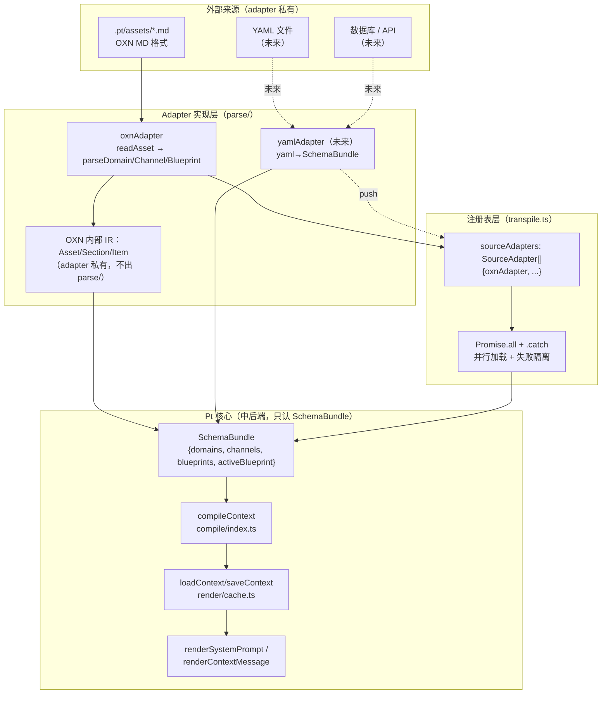

**文档定位**：本文是 Pt 三段式架构（parse → compile → render）中"前端注册表"的深入解读，聚焦 `SourceAdapter` 接口契约、`sourceAdapters` 注册表机制、以及依赖反转原则下"Pt 定义 Schema、各来源实现 adapter"的边界划分。理解本文需要先掌握 [三段式编译架构（parse→compile→render）](8-san-duan-shi-bian-yi-jia-gou-parse-compile-render) 与 [Schema 与 IR 契约（src/schema.ts）](12-schema-yu-ir-qi-yue-src-schema-ts)，下文不再赘述 IR 字段语义。

## 一、问题：来源异构与依赖方向

Pt 在 v6 之前是单一来源（OXN MD）的转译器，adapter 的存在只是为了"未来多来源"。当 v7 真正引入第二个潜在来源（如 YAML/JSON/API/DB）时，原架构暴露出**依赖方向反了**的问题：[pt-design.md](pt-design.md#L43-L43) 明确指出"转译层（每个 adapter 把来源内容转译成 systemPrompt 段）"是设计前提，但早期 `SourceAdapter.load()` 返回的是 `string`，转译逻辑在 adapter 内部调 `compileAsset`，而 `compileAsset` 消费的 `Asset/Section/Item` 带着 OXN MD 的解析痕迹（`## H2`、`### H3`、`- key: value`）。

这种"假解耦"意味着：新增一个 YAML 来源的 adapter，必须先把 YAML 翻译成 OXN 的 `Asset` 结构才能用 `compileAsset`——所有来源都被迫学习 OXN 的形状。设计文档 [§6.1](docs/pt-asset-layering.md#L952-L964) 把这种依赖标记为**向外**，而非理想的向内。

## 二、依赖反转：从"OXN 内置"到"OXN 一等公民 adapter"

[v8 重构后](docs/pt-asset-layering.md#L968-L974)，依赖方向被倒转：

- **反转前**：`Pt 核心 --消费--> OXN Asset 结构 <--解析-- OXN MD`
- **反转后**：`Pt 核心 --消费--> Pt Schema 接口 <--实现-- OXN Adapter <--解析-- OXN MD`（同样位置可换成 `YAML Adapter` / `DB Adapter`）

Pt 核心只认 [SchemaBundle](src/schema.ts#L249-L260) 这一种 IR，OXN MD 不再是"内部格式"——它降级为与 YAML、JSON、API 同级的"一等公民 adapter"，[pt-plugin-design.md §9](pt-plugin-design.md#L579-L611) 把 `sourceAdapters` 数组描述为"polyglot 的接入点"。

`SourceAdapter` 接口是这次反转的契约核心，定义于 [src/schema.ts#L246-L260](src/schema.ts#L246-L260)：

```typescript
export interface SourceAdapter {
  name: string;
  load(cwd: string, blueprintName: string): Promise<SchemaBundle>;
}
```

接口的**最小化**是反转成立的关键：`load()` 不接收"OXN 路径"也不返回"OXN 字符串"，只接收 `(工作目录, 蓝图名)` 并返回标准 IR。adapter 内部用什么格式（MD / YAML / DB）解析，是 adapter 自己的事。

## 三、`SchemaBundle`：adapter 必须交付的标准货物

每个 adapter 不管来源如何，最后都必须把资产折算成一包 `SchemaBundle`，定义于 [src/schema.ts#L249-L260](src/schema.ts#L249-L260)：

```typescript
export interface SchemaBundle {
  domains: Domain[];
  channels: Channel[];
  blueprints: Blueprint[];
  activeBlueprint: string;
}
```

这四个字段是 Pt 中端（`compileContext`）和后端（`renderSystemPrompt` / `renderContextMessage`）唯一接受的输入结构。`transpile.ts` 在 [第 36-49 行](src/transpile.ts#L36-L49) 调所有 adapter 并过滤掉 `null`——任何不符合 `SchemaBundle` 的产物都被链路抛弃。

这种"窄接口 + 宽数据"的组合带来三个好处：

| 收益 | 说明 |
|---|---|
| **正交扩展** | 加来源不动中后端（`compileContext` / `renderSystemPrompt`），加注入点不动前端（adapter） |
| **编译期类型保护** | TypeScript 在 `loadAndTranspile` 处强制 adapter 返 `SchemaBundle`，违反契约直接报错 |
| **运行时容错** | `Promise.all` + `.catch` 把单个 adapter 的失败隔离在注册表层（详见第五节） |

`SchemaBundle` 内的字段都是"语义化"——`Domain` 是异构领域知识、`Channel` 是结构层注入点定义、`Blueprint` 是配置层注入点实例化。它们**不带任何来源格式痕迹**（没有 `Section/Item/raw/heading`），这是与"假解耦"时代最本质的区别。

## 四、注册表：`sourceAdapters` 数组

注册表是依赖反转的**物理落点**——所有可用 adapter 在一个数组里被集中声明，由 `transpile.ts` 统一调度。MVP 实现位于 [src/transpile.ts#L30-L33](src/transpile.ts#L30-L33)：

```typescript
const sourceAdapters: SourceAdapter[] = [
  oxnAdapter,
  // 未来：yamlAdapter, dbAdapter, ...
];
```

`loadAndTranspile`（[src/transpile.ts#L36-L78](src/transpile.ts#L36-L78)）的调度流程：

1. **并行加载**：`Promise.all` 调每个 adapter 的 `load(cwd, blueprintName)`，互不阻塞
2. **失败隔离**：每个 adapter 调用包了一层 `.catch`，单个 adapter 抛错只让该 adapter 返 `null`
3. **空 bundle 短路**：`bundles.length === 0` 时直接返回空 segment，不进入 compile
4. **逐 bundle 编译**：对每个 bundle 取 `activeBlueprint`，找 Channel、跑 `compileContext`、查缓存、写缓存、调 `renderSystemPrompt` 拼成 segment
5. **资产分隔注释清洗**：`<!-- ===== -->` 注释是调试用分隔符，注入到 Pi 之前剥掉

注册表的设计遵循 [pt-design.md §四](pt-design.md#L274-L282) 的"MVP 只走 OXN adapter"原则——它把"未来扩展"显式编码在文件结构里（注释占位 + 数组类型），添加新 adapter 不需要改 `transpile.ts` 的调度逻辑。

## 五、OXN Adapter 实现：注册表首位成员

注册表当前唯一的成员 `oxnAdapter` 定义于 [src/parse/index.ts#L15-L57](src/parse/index.ts#L15-L57)。它实现 `SourceAdapter` 接口，把"按目录位置分发载体"的策略封装在内部：

```typescript
export const oxnAdapter: SourceAdapter = {
  name: "oxn",

  async load(cwd, blueprintName): Promise<SchemaBundle> {
    // 1. 枚举 domains/ → parseDomain → Domain[]
    const domains = await loadAllDomains(cwd);
    // 2. 枚举 channels/ → parseChannel → Channel[]
    const channels = await loadAllChannels(cwd);
    // 3. 枚举 blueprints/ → parseBlueprint → Blueprint[]
    const blueprints = await loadAllBlueprints(cwd);

    const active = findBlueprint(blueprints, blueprintName);
    if (!active) {
      // fallback：取第一个 Blueprint
      const fallback = blueprints[0];
      if (!fallback) {
        throw new Error(`Pt: 未找到 Blueprint "${blueprintName}"`);
      }
      return { domains, channels, blueprints, activeBlueprint: fallback.name };
    }

    return { domains, channels, blueprints, activeBlueprint: active.name };
  },
};
```

三个 `loadAll*` 辅助（[src/parse/index.ts#L61-L74](src/parse/index.ts#L61-L74)）都用同一个 `loadDir` 工具（[src/parse/index.ts#L76-L93](src/parse/index.ts#L76-L93)）做"枚举 + 解析 + 容错"：

- 目录不存在返空数组（`channels/` 在 v7.4 前可能尚未建立）
- 单文件解析失败只让该文件返 `null`，不影响其它文件
- 整体结果是 `T[]`，null 已被类型守卫剔除

**OXN adapter 内部的"中间表示"隔离**是依赖反转的另一关键。[src/parse/shared.ts#L26-L52](src/parse/shared.ts#L26-L52) 定义的 `Asset/Section/Item` 是 OXN adapter 私有的——`Pt 核心从不 import`。它只在 `src/parse/{domain,channel,blueprint}.ts` 三个 adapter 子模块之间流转，转换成 `SchemaBundle` 之后就消失。这意味着 [v6 时代的 `compileAsset` 路径](pt-design.md#L1047-L1058) 已经被打破，新来源不需要学 OXN 的形状。

## 六、注册表与三段式架构的关系

`SourceAdapter` 是 parse 前端的"工厂"，但 parse 之外的中后端与它完全解耦。下面是注册表在三段式架构中的位置图：



读图要点：

- **适配器层（parse/）只产 `SchemaBundle`**——中后端只见这层输入
- **OXN 的 `Asset/Section/Item`** 是 adapter 内部数据结构，**不出 `src/parse/` 边界**
- **每个 adapter 的失败被 `.catch` 隔离**，单个 adapter 抛错不会污染 `Promise.all` 的其它结果

## 七、故障隔离与容错契约

注册表的容错有两层：

**注册表层**（[src/transpile.ts#L38-L49](src/transpile.ts#L38-L49)）：每个 adapter 的 `load()` 都被 `.catch((e) => { console.error(...); return null })` 包裹，抛错转 `null`，下游用 `bundles.filter((b): b is SchemaBundle => b !== null)` 收窄类型。设计文档 [§9](pt-plugin-design.md#L607-L607) 把这条原则总结为"单个 adapter 失败不影响其它"。

**adapter 内部层**（[src/parse/index.ts#L83-L93](src/parse/index.ts#L83-L93)）：`loadDir` 对每个文件单独 `parser(f).catch(e => null)`，单文件解析失败只丢该文件。OXN 通道里 7 个 Domain 文件、2 个 Channel 文件、3 个 Blueprint 文件，坏一个不影响其它。

这种"双层容错"是注册表可用性的基础——它保证了"加来源"和"坏一个来源"都不会让整个 Pt 链路崩。在 [tests/verify/verify-phase77.ts](tests/verify/verify-phase77.ts#L78-L84) 的回归用例里，`glossary-test` 这个用假 type 的 Domain 也被 OXN adapter 接受——证明 adapter 的容错边界足够宽。

## 八、扩展模式：注册新 Source Adapter

添加新来源（YAML/JSON/DB）的标准路径（落地步骤详见 [接入新的 Source Adapter（多来源转译）](19-jie-ru-xin-de-source-adapter-duo-lai-yuan-zhuan-yi)，本节只点注册表侧的最小动作）：

| 步骤 | 改动位置 | 验证点 |
|---|---|---|
| 1. 实现 `SourceAdapter` | 新建 `src/parse/<name>-adapter.ts` | TS 类型检查通过：`load(cwd, bpName): Promise<SchemaBundle>` |
| 2. 注册到数组 | [src/transpile.ts#L30-L33](src/transpile.ts#L30-L33) 加一行 | `loadAndTranspile` 在 `Promise.all` 里能看到 |
| 3. 错误处理 | adapter `load()` 内 `try/catch`，异常返 `null` | 单 adapter 失败不污染 `bundles` |
| 4. 激活方式 | 中端 `compileContext` 用 `bundle.activeBlueprint` 选取；调度循环在 [src/transpile.ts#L54-L73](src/transpile.ts#L54-L73) | 同一 blueprint 多来源时全部参与编译 |

**关键不变量**：

- adapter **不允许修改 Pt 核心**（[src/transpile.ts](src/transpile.ts)、[src/compile/](src/compile/)、[src/render/](src/render/)）的任何文件
- adapter **不能假设中后端存在 OXN 字段**（`Asset/Section/Item` 等）
- adapter **可以新增 parse/ 内的私有文件**（如 `yaml/parser.ts`），只要最终输出 `SchemaBundle`

## 九、注册表对其它设计原则的支撑

依赖反转不是孤立的，它和 v8 的几个核心机制互为前提：

| 机制 | 与注册表的关系 |
|---|---|
| **H2 段名开放** | adapter 内部把 MD 的 `## Scene/Manual/Term` 折算成 `Domain.modules` 字典；不同来源可用不同的"开放 H2 名"，但落到 IR 后都是 `Record<string, unknown>` |
| **Type 标签分发** | `parseDomain` 在 [src/parse/domain.ts#L43-L76](src/parse/domain.ts#L43-L76) 按 `type` 分发到不同 renderer，是 OXN adapter 内部逻辑；新来源可以选择自带 `type`，也可以借用现有 type |
| **Context 缓存 hash** | `computeSourceHash` 在 [src/compile/context.ts](src/compile/context.ts) 算的是 `SchemaBundle` 的 hash——adapter 替换不影响失效策略（cache.ts 只看 `Domain/Channel/Blueprint` 内容） |
| **Channel/Blueprint 模块级引用** | 模块级 Domain 引用是 `InjectionPointInstance.domains: string[]`（[src/schema.ts#L121-L130](src/schema.ts#L121-L130)），引用靠名字——adapter 之间的 Domain 名空间隔离是注册表调度时的 bundle 隔离 |
| **FlowTemplate 展开** | `findFlowInBundle`（[src/render/context-message.ts#L120-L148](src/render/context-message.ts#L120-L148)）在 `bundle.domains` 里按名查，不依赖 adapter 类型 |

可以这样总结：**注册表是 v8 模型"加 X 不动 Y"扩展性的入口处**——加来源改 `sourceAdapters` 一行；加 type 改 `parseDomain` 的 switch；加注入点改 Channel H2。这三处的扩展示例分别是 [接入新的 Source Adapter（多来源转译）](19-jie-ru-xin-de-source-adapter-duo-lai-yuan-zhuan-yi)、[注册新的 Domain Type 渲染器](18-zhu-ce-xin-de-domain-type-xuan-ran-qi)、[v8 四层模型：Domain→Channel→Blueprint→Context](7-v8-si-ceng-mo-xing-domain-channel-blueprint-context)。

## 十、与 v6 的演进对比

最后用一张表对照 v6 的"假解耦"和 v8 的"真反转"，帮助理解注册表形态的来由：

| 维度 | v6（早期） | v8（当前） |
|---|---|---|
| `SourceAdapter.load()` 返回 | `string`（systemPrompt 段） | `Promise<SchemaBundle>`（IR 包） |
| 转译逻辑归属 | adapter 内调 `compileAsset` | adapter 只负责产 IR，转译归 `compileContext` |
| `Asset/Section/Item` 可见性 | Pt 核心可见（强耦合 OXN） | 仅 OXN adapter 私有 |
| 多 adapter 并行 | `Promise.all`，失败返空串 | `Promise.all`，失败返 `null` 后 `filter` |
| 中端依赖 | 依赖 OXN `Asset` 结构 | 依赖 `SchemaBundle`（纯语义） |
| 扩展"加来源"代价 | 改 `compileAsset` 消费 OXN 形状 | 注册表加一行 + adapter 自维护 IR |

[pt-design.md §四](pt-design.md#L274-L282) 的"MVP 只走 OXN adapter"是 v6 时期的实现骨架；v8 重写后该骨架被 [src/transpile.ts#L30-L78](src/transpile.ts#L30-L78) 的 49 行代码取代，并附带完整的 IR 契约和容错机制。这就是注册表与依赖反转设计的当前形态。

## 小结与下一步阅读

`SourceAdapter` 注册表把 Pt 的扩展性收敛到一行数组：`sourceAdapters.push(newAdapter)`。其前提是 `SchemaBundle` 这套纯语义 IR、`compileContext` 的中端不感知来源、`renderSystemPrompt` 的后端只按 `target` 分发。

建议按以下顺序继续深入：

1. [Schema 与 IR 契约（src/schema.ts）](12-schema-yu-ir-qi-yue-src-schema-ts) — 把 `SchemaBundle` 的每个字段读透
2. [解析前端：MD 词法与 H2/H3 切分](13-jie-xi-qian-duan-md-ci-fa-yu-h2-h3-qie-fen) — OXN adapter 内部的 MD 解析细节
3. [接入新的 Source Adapter（多来源转译）](19-jie-ru-xin-de-source-adapter-duo-lai-yuan-zhuan-yi) — 实战加新来源的步骤
4. [端到端验证流程与回归用例](20-duan-dao-duan-yan-zheng-liu-cheng-yu-hui-gui-yong-li) — 跑通 [tests/verify/verify-phase77.ts](tests/verify/verify-phase77.ts) 验证注册表链路