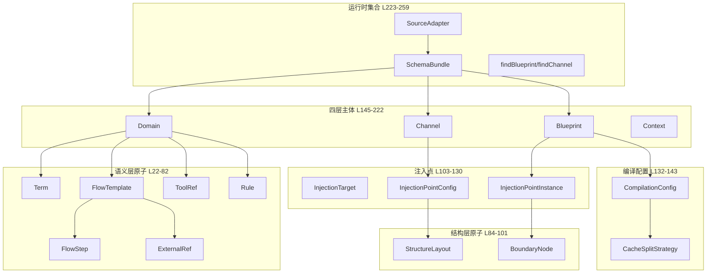
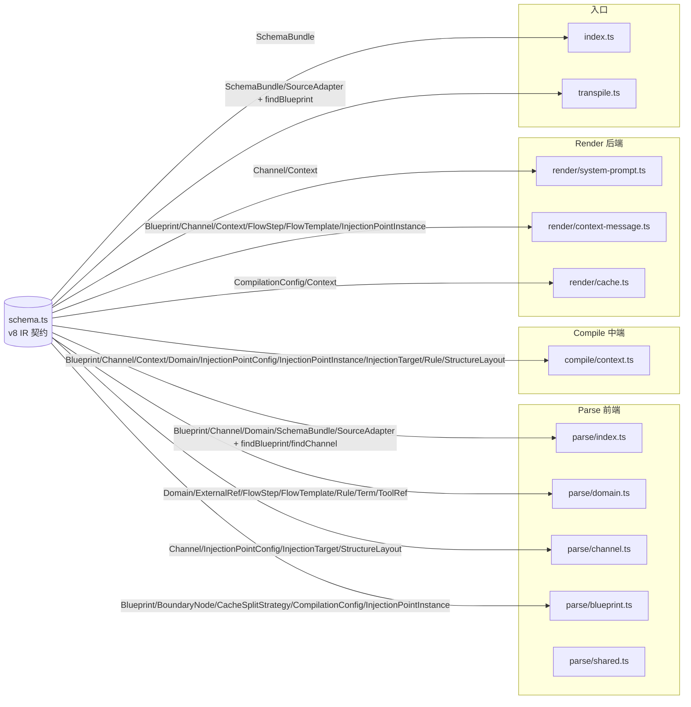

`src/schema.ts` 是 Pt v8 编译架构的**类型中枢**——所有数据在 Parse 前端、Compile 中端、Render 后端之间流转时都必须以本文件定义的 IR 形态出现。它不是工具函数库，而是**四层语义模型（Domain→Channel→Blueprint→Context）的契约**。本文聚焦这一份 259 行的类型文件，回答它"为什么这样设计"、"每种类型服务哪一层"、"v8 相对 v7 在数据结构上做了哪些关键改动"。

> 阅读前提：建议先建立对 [v8 四层模型](7-v8-si-ceng-mo-xing-domain-channel-blueprint-context) 的整体认知，并理解 [三段式编译架构（parse→compile→render）](8-san-duan-shi-bian-yi-jia-gou-parse-compile-render) 的边界划分。本文不会重复这两篇的架构叙述，只深入 schema.ts 内部的类型细节。

Sources: [schema.ts](src/schema.ts#L1-L13)

## 设计原则：为什么 schema.ts 是"无格式痕迹"的

文件头部的三条原则是理解整个文件的钥匙。**[schema.ts](src/schema.ts#L1-L13)** 明确写道：

1. **Schema 是语义化的，不带任何格式痕迹**——不会出现 `Section / Item / raw / heading` 这类与 OXN Markdown 词法绑定的字段。所有 OXN/Markdown 解析产物在穿过 Parse 前端后必须被"消化"成本文件定义的标准形态。
2. **Pt 定义契约，来源（OXN/YAML/...）实现 SourceAdapter**——依赖反转。Pt 核心只 import schema.ts，不直接知道资产来自哪。任何新的来源格式只需新增一个 `SourceAdapter` 实现，不需要改 Pt 核心。
3. **三段式编译架构**——Parse → Compile → Render 三个阶段共享同一份 IR 形态，让中间产物可缓存、可独立替换实现。

这三条原则的总和，使得 schema.ts 成为**Pt 内部所有模块共享的、且仅依赖语义概念的稳定接口**。任何关于"数据长什么样"的问题，答案是"看 schema.ts"。

Sources: [schema.ts](src/schema.ts#L1-L13)

## 类型总览：六组语义分类

schema.ts 的 259 行可按"语义角色"拆成六组：语义层原子、结构层原子、注入点共享基础、编译配置、四层主体 IR、运行时集合与适配器接口。下图给出从原子到产物的类型派生关系。



这张图同时揭示了 v8 的一个核心设计：**Channel 与 Blueprint 共用注入点抽象（IPC / IPI）**——前者声明注入点的结构，后者声明实例的 Domain 选取与流程边界。这两份结构是 v8 重写的支点，下文会详细解读。

Sources: [schema.ts](src/schema.ts#L22-L82), [schema.ts](src/schema.ts#L84-L101), [schema.ts](src/schema.ts#L103-L130), [schema.ts](src/schema.ts#L132-L143), [schema.ts](src/schema.ts#L145-L222), [schema.ts](src/schema.ts#L223-L259)

## 语义层原子：Domain 内部的"积木"

术语、外部引用、规则、流程步骤、流程模板、工具引用这六类原子，是 Domain 内部 H2 段（如 `## Scene`、`## Manual`）的内容载体。它们各自承担语义层中一个不可再分的事实表述。

| 接口 | 行号 | 角色 | 典型宿主 |
|---|---|---|---|
| `Term` | [L25-L31](src/schema.ts#L25-L31) | 业务术语原子（name/desc/level） | `term`-Domain 的 `## Scene` / `## Term` 段 |
| `ExternalRef` | [L33-L37](src/schema.ts#L33-L37) | 外部数据源声明（name/path/protocol） | `workflow`-Domain 段、FlowStep.dataSource |
| `Rule` | [L40-L50](src/schema.ts#L40-L50) | 业务规则（ban/invariant，挂在 step 或 global） | `term`-Domain 的 `## Manual` 段 |
| `FlowStep` | [L52-L62](src/schema.ts#L52-L62) | 手册步骤（desc/dataSource/rule/output） | FlowTemplate.steps[] |
| `FlowTemplate` | [L64-L76](src/schema.ts#L64-L76) | 手册模板（`/name` 触发，含 steps + externals） | `workflow`-Domain 的 `## Manual` 段 |
| `ToolRef` | [L78-L82](src/schema.ts#L78-L82) | 工具引用（name/role/operations） | `stack`-Domain 的 `## Scene` 段 |

设计细节有三点值得强调：

- **`Term.level` 是可选的"非强制标签"**——它（`axiom` / `theorem`）是作者的判断标记，不参与编译决策，因此 Pt 不依赖该字段。
- **`Rule.slot: "global"` 是一种特殊值**——表示跨模块聚合（如 hybrid 模式抽到全局段）；其余值为具体步骤 slot 名。
- **`FlowTemplate.argumentHint`** 采用人类可读的参数描述（如 `<客户ID> <金额>`），[render/context-message.ts](src/render/context-message.ts) 在 binder 展开时会从 `_vars` / `argumentHint` 推导变量规格。

Sources: [schema.ts](src/schema.ts#L25-L82)

## 结构层原子：编排与流程节点

两枚结构层原子的存在，是为了**让注入点的"如何聚合"和"流程边界"也是一等公民**，而不是散落在 Channel/Blueprint 的私有字段里。

- **`StructureLayout`**（[L87-L92](src/schema.ts#L87-L92)）定义段落拼接顺序。`mode` 三选一：`byDomain`（按 Domain 顺序聚合）/ `byType`（按内容性质分组）/ `hybrid`（混合）。`domainOrder` 用于前两种 mode 的显式排序，未指定时按原序。**该字段挂在 `InjectionPointConfig.mode` 上**，因此同一 Channel 内不同注入点可使用不同 mode。
- **`BoundaryNode`**（[L94-L101](src/schema.ts#L94-L101)）是流程节点 DAG 的语义化形态：`slot` 是步骤名，`deps` 是前置 slot 名列表，`desc` 是步骤描述。**它挂在 `InjectionPointInstance.boundaries` 上**，因此 Blueprint 的不同注入点可以拥有各自独立的流程边界图。

把"编排策略"与"流程节点"提升为独立类型的好处：**当未来出现更复杂的 mode（如 byTag、byTypeWithOrder）时，只需在 `StructureLayout.mode` 联合类型中追加字面量**，不需要改任何下游消费代码。

Sources: [schema.ts](src/schema.ts#L84-L101)

## v8 注入点：Channel 与 Blueprint 的共用基础

这是 v8 相对 v7 的**核心数据结构变化**。**[schema.ts L103-L130](src/schema.ts#L103-L130)** 定义了 Channel 与 Blueprint 共用的注入点抽象层：

```ts
type InjectionTarget = "system_prompt" | "context_message" | string;
interface InjectionPointConfig {
  name: string;
  target: InjectionTarget;
  modules: string[];     // 聚合点：参与的 Domain H2 段名
  mode?: StructureLayout["mode"];
}
interface InjectionPointInstance {
  name: string;          // 跟 Channel 的 InjectionPointConfig.name 对应
  domains: string[];     // 参与本注入点的 Domain 名列表
  trigger?: string;
  boundaries?: BoundaryNode[];
}
```

三个关键观察：

1. **`InjectionTarget` 是开放字符串联合**——`"system_prompt"` 与 `"context_message"` 是 Pi 已知的两个内置注入位置，但保留 `string` 兜底，意味着未来增加 Pi 注入点（如 tool_schema、subagent_prompt）无需修改 schema.ts。
2. **`InjectionPointConfig.modules` 与 `InjectionPointInstance.domains` 的字段名差异**——前者是"参与本注入点的 Domain H2 段名"（供给侧语义），后者是"参与本注入点的 Domain 名"（实例级语义）。两者通过 [compile/context.ts](src/compile/context.ts) 中的同名匹配（`name`）建立连接。
3. **`name` 是 Channel 与 Blueprint 的"绑定键"**——[parse/index.ts](src/parse/index.ts) 与 [compile/context.ts](src/compile/context.ts) 均依赖此键查找。这把 v7 隐式的"按数组下标对齐"变成了 v8 显式的"按名绑定"，大幅降低了配置漂移风险。

Sources: [schema.ts](src/schema.ts#L103-L130)

## v8 Compilation：从硬编码到配置化的关键

**[schema.ts L132-L143](src/schema.ts#L132-L143)** 定义了缓存拆分策略与编译配置：

```ts
type CacheSplitStrategy = "single-file" | "by-injection-point";
interface CompilationConfig {
  cacheDir: string;        // 缓存目录（默认 .pt/contexts/cache/）
  split: CacheSplitStrategy; // 拆分策略（默认 single-file）
}
```

这一对类型的作用是把 v7 中硬编码在 [render/cache.ts](src/render/cache.ts) 里的 `.pt/contexts/cache/` 提升为 Blueprint 上的配置字段。**直接收益**：不同 Blueprint 可输出到不同目录，方便多环境隔离（如 dev/staging/prod）；未来新增 `by-injection-point` 策略时，所有 Blueprint 可选用更细粒度的缓存粒度。

> 当前实现注意：[render/cache.ts](src/render/cache.ts) 对 `by-injection-point` 留了 TODO，**该策略目前走 single-file fallback**——但 IR 形态已就位，扩展点是清晰的。

Sources: [schema.ts](src/schema.ts#L132-L143), [cache.ts](src/render/cache.ts#L1-L40)

## 四层主体 IR：Domain / Channel / Blueprint / Context

四层主体 IR 是 schema.ts 的"主菜"，也是 Pt 整个编译管线的数据载体。下表汇总了它们的字段与语义定位。

| 类型 | 行号 | 层级 | 关键字段 | 与下一层的关系 |
|---|---|---|---|---|
| `Domain` | [L155-L161](src/schema.ts#L155-L161) | 内容层 | `name`、`type`、`modules: Record<H2名, 内容>` | 提供 H2 段供 Channel 聚合 |
| `Channel` | [L174-L179](src/schema.ts#L174-L179) | 结构层 | `name`、`injectionPoints: InjectionPointConfig[]` | 被 Blueprint 引用（结构复用） |
| `Blueprint` | [L192-L200](src/schema.ts#L192-L200) | 配置层 | `name`、`channel`、`injectionPoints: InjectionPointInstance[]`、`compilation: CompilationConfig` | 编译输出 Context |
| `Context` | [L214-L222](src/schema.ts#L214-L222) | 产物层 | `name`、`sourceHash`、`modules: Record<注入点名, markdown>` | 缓存文件 `.pt/contexts/cache/*.context.md` |

逐条展开：

**`Domain` 是开放键容器**——`modules: Record<string, unknown>` 意味着 H2 段名是开放键（`Scene` / `Manual` / `Term` / `Glossary` / 任意扩展名）。`type` 只决定 H2 段**内部内容**的解析方式（term 走 Term[]、workflow 走 FlowTemplate[]、stack 走 ToolRef[]），与段名解耦。这一设计实现了"加新模块类型 = 加新 H2 段名 + Channel 声明该模块"的两步独立扩展。

**`Channel` 是结构层抽象**——它**只管结构**，不含具体 Domain、不含触发条件。"按注入点选 Domain"这一实例化职责被完整地下放给 Blueprint。这是 v8 "Channel 可跨项目复用"语义的基础：一个 Channel 文件描述的是"这个通道有几个注入点、每个注入点聚合什么 H2 段、目标是什么"，与具体项目无关。

**`Blueprint` 是配置层落地**——它做三件事：(a) 引用一个 Channel 名（结构复用）；(b) 按同名注入点填入 Domain 选取、Trigger 条件、Boundaries DAG；(c) 声明 Compilation 方式。**v7→v8 的关键转换**：v7 的 `domains: string[]`（粗粒度全量引用）+ `trigger` + `boundaries`（顶级字段）被合并进每个 `InjectionPointInstance` 内部，新增 `compilation` 字段。

**`Context` 是物理缓存形态**——`modules: Record<注入点名, markdown>` 取代了 v7 的 `Record<模块名, markdown>`（即 `Scene`/`Manual` → `会话知识`/`对话记忆`）。`sourceHash` 是 `hash(Domains + Channel + Blueprint)` 的组合——三者任一变化即失效重编译。**Context 跟 Blueprint 一对一**，因此文件名就是 `<blueprint.name>.context.md`。

Sources: [schema.ts](src/schema.ts#L145-L161), [schema.ts](src/schema.ts#L163-L179), [schema.ts](src/schema.ts#L180-L200), [schema.ts](src/schema.ts#L202-L222)

## SchemaBundle 与 SourceAdapter：运行时集合与依赖反转

**[schema.ts L223-L248](src/schema.ts#L223-L248)** 提供了"运行时视图"——SchemaBundle 把同一进程内所有加载到的 IR 打包：

```ts
interface SchemaBundle {
  domains: Domain[];
  channels: Channel[];
  blueprints: Blueprint[];
  activeBlueprint: string;   // 当前激活的 Blueprint 名
}
```

`activeBlueprint` 是"当前产物走哪个组合"的入口。**[transpile.ts](src/transpile.ts#L36-L66)** 在三段式编译中就是用这个字段定位 Blueprint，再通过 `Blueprint.channel` 反查 Channel，最终驱动 compile → cache → render 的链式调用。

**`SourceAdapter` 是依赖反转的接缝点**：

```ts
interface SourceAdapter {
  name: string;
  load(cwd: string, blueprintName: string): Promise<SchemaBundle>;
}
```

它的 `load()` 直接返回 SchemaBundle 而不是字符串——**这意味着 Pt 核心不需要知道任何来源格式**。当前实现 [parse/index.ts](src/parse/index.ts) 注册了 `oxnAdapter`（按 `domains/`、`channels/`、`blueprints/` 目录位置分发到对应适配器），未来扩展 yamlAdapter / dbAdapter 只需新增一个实现并 push 到 [transpile.ts L26-L29](src/transpile.ts#L26-L29) 的 `sourceAdapters` 数组即可。

Sources: [schema.ts](src/schema.ts#L223-L248), [transpile.ts](src/transpile.ts#L26-L66), [parse/index.ts](src/parse/index.ts#L10-L75)

## 辅助函数：findBlueprint / findChannel

**[schema.ts L249-L259](src/schema.ts#L249-L259)** 暴露了两个极简的查找辅助：

```ts
function findBlueprint(blueprints: Blueprint[], name: string): Blueprint | undefined
function findChannel(channels: Channel[], name: string): Channel | undefined
```

它们的存在感虽小，但作用关键：[parse/index.ts](src/parse/index.ts) 用 `findBlueprint` 定位 `activeBlueprint`；[transpile.ts](src/transpile.ts) 用 `findBlueprint` 把 `bp.channel` 反查为 Channel IR。**没有这两个函数，几乎每处调用点都得内联 `blueprints.find(...)`**，类型契约就会在消费者那里"漏出"。把它们放在 schema.ts 而非散落在消费者文件，是为了**让"按名查找 IR"这一稳定模式也成为契约的一部分**。

Sources: [schema.ts](src/schema.ts#L249-L259), [parse/index.ts](src/parse/index.ts#L40-L55), [transpile.ts](src/transpile.ts#L40-L55)

## 类型消费地图：schema.ts 在三段式管线中的"被使用形态"

理解 schema.ts 不能只看它定义了什么，还要看它在每个阶段如何被消费。下图按"Parse → Compile → Render"三阶段梳理 import 关系与使用模式。



可以读出三条规律：

1. **Parse 阶段是 schema.ts 的"产出侧"**——每个解析器都从 schema.ts 导入自己负责的接口，把 OXN Markdown 翻译成标准 IR。
2. **Compile 阶段是 schema.ts 的"消费侧"**——[compile/context.ts](src/compile/context.ts) 一次性导入 9 个类型，是 schema.ts 在 Pi 内部的最大消费者。
3. **Render 阶段是 schema.ts 的"末端消费"**——`system-prompt.ts` 只关心 `Channel` 与 `Context`，`cache.ts` 只关心 `CompilationConfig` 与 `Context`。这是依赖反转的产物：每个 Render 子模块只依赖它真正需要的最小类型集。

Sources: [schema.ts](src/schema.ts#L1-L259), [parse/index.ts](src/parse/index.ts#L8-L9), [compile/context.ts](src/compile/context.ts#L11-L29), [render/system-prompt.ts](src/render/system-prompt.ts#L9), [render/context-message.ts](src/render/context-message.ts#L11), [render/cache.ts](src/render/cache.ts#L12), [transpile.ts](src/transpile.ts#L17-L18), [index.ts](src/index.ts#L14)

## v7 → v8 字段级迁移对照

理解 schema.ts 不能脱离它的演进背景。下表把 v7 与 v8 的字段级变化列出来——这是评估现有资产是否需要升级为 v8 形态时最常查的对照。

| 类型 | v7 字段 | v8 字段 | 语义变化 |
|---|---|---|---|
| `Channel` | `modules` + `layout` | `injectionPoints: InjectionPointConfig[]` | 注入点定义从隐式 Modules 列表 → 显式 H2 |
| `Blueprint` | `domains: string[]` | `injectionPoints: InjectionPointInstance[]` | 按注入点选 Domain（模块级引用），替代粗粒度全量引用 |
| `Blueprint` | `trigger`（顶级字段） | `trigger?`（注入点级） | 触发条件下沉到注入点实例化内部 |
| `Blueprint` | `boundaries`（顶级字段） | `boundaries?: BoundaryNode[]`（注入点级） | 流程边界下沉到注入点实例化内部 |
| `Blueprint` | —（v7 无此字段） | `compilation: CompilationConfig` | 新增：缓存目录 + 拆分策略 |
| `Context` | `modules: Record<模块名, markdown>` | `modules: Record<注入点名, markdown>` | key 从模块名（Scene/Manual）变为注入点名（会话知识/对话记忆），结构不变 |
| `Domain` | `modules: Record<H2名, 内容>` | 不变 | H2 段名继续作为开放键，type 决定内部格式 |

这份对照的核心信息：**所有"按注入点组织"的重组都是 v8 的关键收益**——配置粒度更细、复用性更强、缓存策略可配置。

Sources: [schema.ts](src/schema.ts#L1-L13), [schema.ts](src/schema.ts#L145-L222), [docs/pt-asset-layering.md](docs/pt-asset-layering.md#L1-L60)

## 实战指引：在哪里扩展 schema.ts

新功能落地时，schema.ts 经常需要扩展。下面给出三类典型场景的修改路径。

**场景 A：新增一个注入位置（如 subagent_prompt）。** 
不需要改 schema.ts——`InjectionTarget` 是 `"system_prompt" | "context_message" | string`，任意新字符串都被接受。然后只需：(a) 在 Channel md 中用 `target: subagent_prompt` 声明；(b) 在 [compile/context.ts](src/compile/context.ts) 与 [render/](src/render/) 中新增对应 target 的编译/渲染分支。

**场景 B：新增一种 Domain 内容性质（如 schema-Domain）。** 
不需要改 schema.ts——`Domain.type: string` 本就是开放的。只需：(a) 在 [parse/domain.ts](src/parse/domain.ts) 的 `parseDomainSection` switch 中追加新 case；(b) 复用 `FlowTemplate` / `ToolRef` 等现有原子，或者为该 type 新增专用接口。

**场景 C：新增一种缓存拆分策略（如按 Blueprint 版本）。** 
需要修改 schema.ts：在 `CacheSplitStrategy` 联合类型追加字面量，再在 [render/cache.ts](src/render/cache.ts) 的 `saveContext` / `loadContext` 实现对应分支。

**核心判断原则**：如果扩展点属于"语义边界变化"（如新的注入位置语义），应通过开放字符串联合接纳；如果属于"已知枚举扩展"（如缓存策略），应通过字面量联合显式列举。schema.ts 在这两类扩展之间保持了清晰的接缝。

Sources: [schema.ts](src/schema.ts#L103-L143)

## 关键设计权衡：为什么 schema.ts 不持有"运行时状态"

`schema.ts` 只定义类型与两个纯查找函数。**它不持有任何全局缓存、模块单例、文件句柄或全局状态**——这些都是运行时的事，由 [transpile.ts](src/transpile.ts) 与 [index.ts](src/index.ts) 在 per-session 内存态中管理。

这一选择背后的权衡：**类型文件应该是无副作用的纯契约**。如果 schema.ts 中混入运行时逻辑，会让它难以在测试中替换、难以在 worker 线程中复用、难以被不同的 SourceAdapter 实现反复 import 而不出问题。当前架构把"schema 是契约"与"运行时有状态"切成两个世界：[index.ts](src/index.ts) 的模块顶层变量（`activeBlueprint`、`cachedSegment` 等）才是运行时的家，schema.ts 始终是无状态。

Sources: [schema.ts](src/schema.ts#L249-L259), [index.ts](src/index.ts#L18-L28), [docs/pt-asset-layering.md](docs/pt-asset-layering.md)

## 阅读路线建议

schema.ts 不是孤立文件，建议按以下顺序深入：

1. **架构基础**：[v8 四层模型](7-v8-si-ceng-mo-xing-domain-channel-blueprint-context) → 理解 Domain/Channel/Blueprint/Context 的语义定位。
2. **管线流程**：[三段式编译架构](8-san-duan-shi-bian-yi-jia-gou-parse-compile-render) → 理解 Parse/Compile/Render 三阶段如何消费 schema.ts 的不同接口子集。
3. **依赖反转**：[Source Adapter 注册表与依赖反转设计](11-source-adapter-zhu-ce-biao-yu-yi-lai-fan-zhuan-she-ji) → 理解 SourceAdapter 接口如何让 schema.ts 与来源格式解耦。
4. **下游实现**：[解析前端：MD 词法与 H2/H3 切分](13-jie-xi-qian-duan-md-ci-fa-yu-h2-h3-qie-fen) → 看 schema.ts 的接口如何被 OXN 词法落地。
5. **中端消费**：[中端编译：按注入点聚合与 mode 渲染](14-zhong-duan-bian-yi-an-zhu-ru-dian-ju-he-yu-mode-xuan-ran) → 看 [compile/context.ts](src/compile/context.ts) 如何消费 `InjectionPointConfig` / `InjectionPointInstance`。
6. **缓存落地**：[Context 缓存序列化与 sourceHash 失效策略](16-context-huan-cun-xu-lie-hua-yu-sourcehash-shi-xiao-ce-lue) → 看 `CompilationConfig` 与 `sourceHash` 如何驱动 .pt/contexts/cache/ 下的物理文件。

当你想自己动手扩展时：[注册新的 Domain Type 渲染器](18-zhu-ce-xin-de-domain-type-xuan-ran-qi) 与 [接入新的 Source Adapter](19-jie-ru-xin-de-source-adapter-duo-lai-yuan-zhuan-yi) 会带你在不破坏 schema.ts 契约的前提下扩展 Pt。