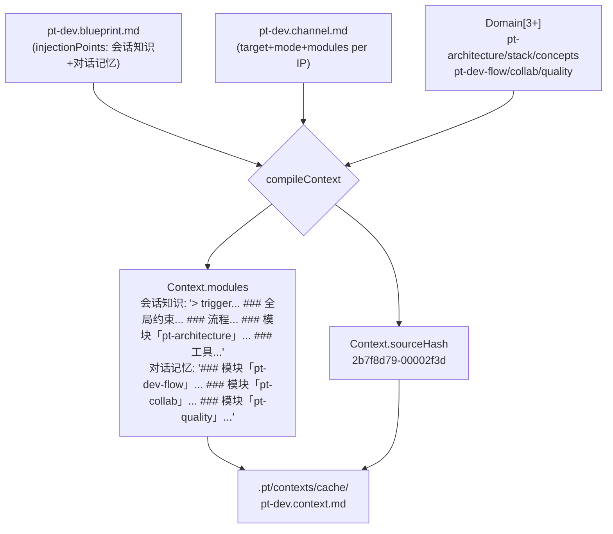

中端是 Pt 三段式编译架构（parse → compile → render）的核心接力层。它消费前端产出的 `IR (SchemaBundle)`，按 **Channel 注入点** 调度聚合算法，把每个注入点挂上的多个 Domain 内容编排成一段 markdown 字符串，落到 `Context.modules` 里。它**没有任何文件读写**——只做 IR → IR 的纯变换；落盘与挂载交给后端 [后端渲染：System Prompt 与 Context Message 输出](15-hou-duan-xuan-ran-system-prompt-yu-context-message-shu-chu)。中端的内部唯一入口是 `compileContext(blueprint, channel, domains)`，文件体仅 539 行，物理上拆为 `src/compile/index.ts`（4 行 barrel）+ `src/compile/context.ts`（核心实现）。整个层的设计原则是"**注入点驱动聚合、type 决定段内渲染、mode 决定段落拓扑**"。

## Context 编译入口：按 Channel 注入点遍历

`compileContext` 接收三个 IR 参数，**按 Channel 的注入点列表为外层循环**：每个循环迭代中，先按名字查 Blueprint 里同名 `InjectionPointInstance`，再按实例里的 `domains` 名去 `domainByName: Map` 里取出 Domain 实体，然后按 `ipConfig.target` 分发到三个并列的私有编译器——分别对应 Pi Extension 的 `system_prompt` / `context_message` / 扩展 target。整个流程是**单向、不可重入、纯函数**（除了一次 `sourceHash` 计算）：

```ts
// 入口伪代码（src/compile/context.ts#L54-L86）
export function compileContext(
  blueprint: Blueprint,
  channel: Channel,
  domains: Domain[],
): ContextIR {
  const domainByName = new Map(domains.map((d) => [d.name, d]));
  const modules: Record<string, string> = {};
  for (const ipConfig of channel.injectionPoints) {
    const ipInstance = blueprint.injectionPoints.find((i) => i.name === ipConfig.name);
    if (!ipInstance) continue;
    const refDomains = ipInstance.domains
      .map((n) => domainByName.get(n))
      .filter((d): d is Domain => !!d);
    modules[ipConfig.name] = dispatchInjectionPoint(ipInstance, ipConfig, refDomains);
  }
  const sourceHash = computeSourceHash(blueprint, channel, domains);
  return { name: blueprint.name, sourceHash, modules };
}
```

三个关键约束隐含在这里：

1. **遍历顺序 = Channel 注入点顺序**：产物 `modules` 的 key 顺序与 Channel H2 顺序一致，即 `.pt/contexts/cache/pt-dev.context.md` 里 `## 会话知识` 一定在 `## 对话记忆` 之前。
2. **同名同源**：`InjectionPointConfig.name` 与 `InjectionPointInstance.name` 是同一字符串（来自 Channel H2 名与 Blueprint 同名 H2 名）；这个约定是 v8 把"模块级 Domain 引用"挂到注入点上的根基。
3. **target = 分发键**：`dispatchInjectionPoint` 内是一个三分支 `if/else`，未知 target 走 `compileGenericInjectionPoint`（扩展位），这是 Pi 自定义注入位置（如 `before_user_message`、`tool_result`）的预留口。

Sources: [context.ts](src/compile/context.ts#L48-L101)

## dispatchInjectionPoint：target 驱动的三路分发

`dispatchInjectionPoint` 是中端**唯一的路由表**。读起来很像 React Router 的 `<Routes>`——target 字段决定走哪条渲染管线：

| target 值 | 编译器 | 用途 | 模块渲染策略 |
|---|---|---|---|
| `system_prompt` | `compileSystemPromptModule` | Pi `before_agent_start` 事件触发 | 按 `mode` 决定 byDomain / byType / hybrid 拓扑 |
| `context_message` | `compileContextMessageModule` | Pi `input` 事件逐轮注入 | 按 Domain 段聚合 checklist / 手册 |
| 扩展（任意字符串） | `compileGenericInjectionPoint` | 自定义注入位置 | 通用 `- **name**：desc` 列表 |

```ts
function dispatchInjectionPoint(
  ipInstance: InjectionPointInstance,
  ipConfig: InjectionPointConfig,
  refDomains: Domain[],
): string {
  const target: InjectionTarget = ipConfig.target;
  if (target === "system_prompt") {
    return compileSystemPromptModule(ipInstance, ipConfig, refDomains);
  }
  if (target === "context_message") {
    return compileContextMessageModule(ipInstance, ipConfig, refDomains);
  }
  return compileGenericInjectionPoint(ipInstance, ipConfig, refDomains);
}
```

**架构意义**：中端不关心 Pi 怎么 inject，只关心"被 inject 的字符串长什么样"。target 是**语义抽象层**——底层映射由 [后端渲染](15-hou-duan-xuan-ran-system-prompt-yu-context-message-shu-chu) 处理。这意味着 pt-dev 的"会话知识"未来要换注入位置（比如改挂到某个 session_start hook），只需 Channel 改 `target:` 字段，**中端零改动**。

Sources: [context.ts](src/compile/context.ts#L88-L101)

## System Prompt 模块：六段拼装 + mode 分流

`compileSystemPromptModule` 是中端最复杂的函数，产物是 Pi `system_prompt` 注入字符串。它按固定顺序拼装**六类段**（缺则跳过），其中第四类段在 `byType` 模式下走聚合分支，其余走 byDomain 分支：

| 顺序 | 段名 | 内容来源 | 是否依赖 mode |
|---|---|---|---|
| 1 | `> trigger` | `ipInstance.trigger` | 否 |
| 2 | `### 全局约束` | 所有 Domain 的 `slot=global` Rules | 仅 hybrid |
| 3 | `### 流程` | `ipInstance.boundaries` DAG + stepRules + externals | 否 |
| 4 | `### 模块「xxx」` 或 `### 业务术语/业务规则` | `ipConfig.modules` 列出的 H2 段 | **是**（byDomain vs byType） |
| 5 | `### 工具` | stack-Domain 提供的 ToolRef[] | 仅 byDomain/hybrid |
| 6 | `### 可用手册` | workflow-Domain 的 Manual 段 FlowTemplate | 否 |

```ts
// 关键节选（src/compile/context.ts#L105-L155）
const mode: StructureLayout["mode"] = ipConfig.mode ?? "hybrid";
const parts: string[] = [];

// 1. trigger
parts.push(`> ${trigger}`);

// 2. global rules（hybrid only）
if (mode === "hybrid") {
  const globals = refDomains.flatMap(extractRules).filter((r) => r.slot === "global");
  if (globals.length > 0) parts.push(renderGlobalRules(globals));
}

// 3. flow
const flowText = compileFlow(ipInstance, refDomains);
if (flowText) parts.push(flowText);

// 4. mode 分流
const modulesToRender = ipConfig.modules.length > 0 ? ipConfig.modules : ["Scene"];
const domainsToRender = refDomains.filter((d) =>
  modulesToRender.some((m) => d.modules[m] !== undefined),
);
if (mode === "byType") {
  /* 聚合跨 Domain 的术语与规则 */
} else {
  for (const d of domainsToRender) {
    const sec = formatDomainSceneSection(d, mode, modulesToRender);
    if (sec) parts.push(sec);
  }
}

// 5. tools（byType 下不输出）
if (mode !== "byType") parts.push(renderAggregatedTools(refDomains));

// 6. flows catalog
parts.push(renderFlowsCatalog(refDomains));
```

**mode 默认值策略**：当 `ipConfig.mode` 未指定时回落 `hybrid`——这是**保守的"既给全局也分段"行为**，对应 v7 的默认行为。`byType` 则意味着"**完全扁平化**"，所有 Domain 段落消失，统一归入 `### 业务术语` / `### 业务规则` 聚合桶。

**`modulesToRender` 的回落**：`ipConfig.modules` 空数组时默认聚合 `["Scene"]`——这是 v7 的"只取 Scene 段"行为兜底，确保老 Channel 升级到 v8 后不退化。

Sources: [context.ts](src/compile/context.ts#L105-L155)

## compileFlow：DAG 渲染 + 全局 externals 挂载

第三段 `### 流程` 由 `compileFlow` 单独实现，它把 `InjectionPointInstance.boundaries`（一个 DAG 节点数组）转成 markdown 列表。一个关键设计：**首步一次性挂载所有 workflow-Domain 的 externals**，而非每个 step 单独引用——这是把"数据源存在性检查"集中在流程入口的策略：

```ts
// 关键节选（src/compile/context.ts#L283-L309）
const lines: string[] = ["### 流程"];
boundaries.forEach((bd, i) => {
  const depSuffix = bd.deps.length > 0
    ? ` ← 依赖 ${bd.deps.map((d) => CIRCLED[idxMap.get(d) ?? 0] ?? d).join(" ")}`
    : "";
  lines.push(`${CIRCLED[i] ?? i + 1} **${bd.slot}** — ${bd.desc || "（未指定）"}${depSuffix}`);

  // 关键：只在第 0 步后挂所有 externals
  if (i === 0 && allExts.length > 0) {
    for (const ext of allExts) {
      lines.push(`   数据：读 \`${ext.path}\`。`);
    }
  }
  // 步骤专属 rules（slot == stepName）
  const rules = stepRules.get(bd.slot);
  if (rules) {
    for (const r of rules.filter((x) => x.type === "invariant")) lines.push(`   - [ ] ${r.check}`);
    for (const r of rules.filter((x) => x.type === "ban")) {
      if (r.items && r.items.length > 0) lines.push(`   - [ ] ${r.check}：${r.items.join(" / ")}`);
    }
  }
});
```

**圆圈数字 `CIRCLED`** 表用 `①`-`⑩`（Unicode 字符）渲染步骤序号，使依赖链 `← 依赖 ①` 这样的链接在 markdown 里也能被一眼扫描。这是一种**视觉降熵**——纯文本也能变成可读流程图。超过 10 步的流程回落成阿拉伯数字（`i + 1`），是边界处理。

Sources: [context.ts](src/compile/context.ts#L257-L309)

## Domain Scene 渲染器注册表：type 决定段内格式

第四段 `### 模块「xxx」` 是**整个中端可扩展性的核心枢纽**。它通过 `domainSceneRenderers: Record<type, fn>` 注册表做 type-driven dispatch——加新 Domain type 只需一行注册，**不动主循环**。这是项目"加新资产类型不动核心代码"原则的具体落点：

```ts
const domainSceneRenderers: Record<string, DomainSceneRenderer> = {
  term: renderTermSceneSection,
  workflow: renderWorkflowSceneSection,
  stack: renderStackSceneSection,
  glossary: renderGlossarySceneSection,
};

/** 扩展接口：加新 Domain type 只加一行注册 + 一个 renderer 函数。 */
export function registerDomainSceneRenderer(type: string, fn: DomainSceneRenderer): void {
  domainSceneRenderers[type] = fn;
}

function formatDomainSceneSection(d: Domain, mode, modules): string {
  const fn = domainSceneRenderers[d.type];
  if (!fn) return "";  // 未注册 type：不输出（不抛错）
  return fn(d, mode, modules);
}
```

**未注册 type 的行为**——直接返回空字符串。这意味着自定义 type 的 Domain 在主循环里**静默跳过**，但**不报错**；v7 的"未识别 type 抛错"行为被替换为"显式 opt-in"。下面表格对比 4 个内置 renderer 的差异：

| renderer | 输入依赖 | 输出段落结构 | 段贡献 |
|---|---|---|---|
| `renderTermSceneSection` | `d.modules.Scene` (Term[]) + `d.modules.Manual` (Rule[]) | `### 模块「xxx」` + `**术语**` + `- **name**：desc` | 术语词典 + 步骤规则清单 |
| `renderWorkflowSceneSection` | `d.modules.Scene.externals` | `### 模块「xxx」` + `**外部数据**` | 外部数据源声明 |
| `renderStackSceneSection` | 无（const 空） | 空字符串 | tools 走聚合段而非 Domain 段 |
| `renderGlossarySceneSection` | 任何 modules 的数组项含 `name`/`desc` | `### 术语表「xxx」` + `- **name**` | 通用术语表 |

两个关键观察：

- **`renderStackSceneSection` 故意返回空**——stack-type 的工具列表**不进入"### 模块「xxx」"段**，而是由后段 `renderAggregatedTools` **全局聚合**输出。这意味着 `场景内工具 vs 全局工具目录**是两种语义，前者不存在（按需查找），后者是 System Prompt 的固定段。
- **`renderTermSceneSection` 在 hybrid 模式下隐藏非全局 Rule**：因为 Rules 在 hybrid 模式下已被前置到 `### 全局约束`，再列一遍就是冗余。这是**幂等保护**——同一个 Rule 不出现在两处。

Sources: [context.ts](src/compile/context.ts#L311-L420)

## 三种 mode 的产物对比

以 pt-dev 的"会话知识"注入点为例，三种 mode 给出完全不同的产物结构。Channel 里 `mode: hybrid` 切换为 `byDomain` 或 `byType` 时，`compileSystemPromptModule` 走不同分支：

| mode | 全局约束段 | 域段落 | 工具段 | 适用场景 |
|---|---|---|---|---|
| **hybrid**（默认） | 存在（聚合所有 `slot=global` 的 Rule） | 每个 Domain 单独 `### 模块「xxx」` 段 | 存在（聚合 stack-Domain） | **单一项目独有知识**：既要全员约束，也要分 Domain 答疑 |
| **byDomain** | 缺失 | 每个 Domain 单独 `### 模块「xxx」` 段 | 存在 | **多 Domain 拼接**：靠 Domain 标题划分责任，无需全局抽象 |
| **byType** | 缺失 | 缺失（替代为 `### 业务术语` + `### 业务规则` 聚合桶） | 缺失 | **跨项目复用**：池化所有术语/规则，原 Domain 抽象抹平 |

**`byType` 的核心设计**：抹平 Domain 边界后，每一个 Rule / Term 都附 `(来自：xxx)` 后缀标注归属——这是"**扁平化的可追溯性**"设计，避免"为什么这条规则在这里"的疑问变成黑盒。

```ts
// renderAggregatedTerms（src/compile/context.ts#L437-L451）
const lines: string[] = ["### 业务术语"];
let any = false;
for (const d of refDomains) {
  if (d.type !== "term") continue;
  const terms = (d.modules["Scene"] as Array<{ name: string; desc: string }> | undefined) ?? [];
  for (const t of terms) {
    const text = t.desc ? `- **${t.name}**：${t.desc}` : `- **${t.name}**`;
    lines.push(`${text}（来自：${d.name}）`);
    any = true;
  }
}
return any ? lines.join("\n") : "";
```

`.pt/contexts/cache/pt-dev.context.md` 头几行就是 hybrid 模式的典型产物——`### 全局约束` 在前，`### 流程` 居中，各 Domain `### 模块「xxx」` 紧随其后，`### 工具` 在尾部聚合。

Sources: [context.ts](src/compile/context.ts#L134-L154#L437-L467)

## Context Message 模块：按 type 分支的 checklist 聚合

`compileContextMessageModule` 对应 Pi `input` 事件的逐轮注入内容（用户每发一条消息都重新注入）。它的特点是**按 `Domain.type` 分支**——区别于系统提示的"按 H2 段名聚合"：

| 类型 | Manual 段内容 | 渲染形式 |
|---|---|---|
| `workflow` | `FlowTemplate[]` | `- **/<name>** <hint>` 手册触发列表 |
| `term` | `Rule[]` | `- [ ] <check>` 或 `- [ ] <check>：禁止 A / B` 复选框清单 |
| 其他（H2 段含 `name`/`desc` 数组项） | 任意数组 | `- **<name>**：<desc>` 通用列表 |

```ts
// 关键节选（src/compile/context.ts#L167-L223）
for (const d of refDomains) {
  const parts: string[] = [];
  for (const modName of modulesToRender) {
    const content = d.modules[modName];
    if (content === undefined) continue;

    if (modName === "Manual") {
      if (d.type === "workflow") {
        // FlowTemplate 列表
        for (const t of tpls) parts.push(`- **/${t.name}**${t.argumentHint ? ` ${t.argumentHint}` : ""}`);
      } else if (d.type === "term") {
        // Rule 列表（v7 死代码，v8 修复）
        for (const r of rules) {
          if (r.type === "invariant") parts.push(`- [ ] ${r.check}`);
          else if (r.type === "ban" && r.items?.length) parts.push(`- [ ] ${r.check}：${r.items.join(" / ")}`);
        }
      }
    } else {
      // 通用回退（name/desc 数组项）
      if (Array.isArray(content)) {
        for (const item of content) {
          if (item && typeof item === "object" && "name" in item && "desc" in item) {
            parts.push(item.desc ? `- **${item.name}**：${item.desc}` : `- **${item.name}**`);
          }
        }
      }
    }
  }
  if (parts.length > 0) {
    lines.push(`### 模块「${d.name}」`);
    lines.push("", ...parts, "");
  }
}
```

**v7 → v8 的"死代码"修复**：v7 的 `term`-Domain 的 `Manual` 段 Rule[] 永远不会被 `compileContextMessageModule` 消费（v7 只对 workflow 的 FlowTemplate 列表生效），等价于死代码。v8 显式加了 `else if (d.type === "term")` 分支——让 term-Domain 的 invariant 规则进入对话记忆注入点，变成"每轮提醒的"工作流纪律。这就是 pt-dev 的 `## 对话记忆` 下能看到 `pt-collab` / `pt-quality` 的 `[ ]` 复选框的来源。

Sources: [context.ts](src/compile/context.ts#L157-L223)

## 通用扩展注入点：未知 target 的兜底

`compileGenericInjectionPoint` 是给**任何 target 字符串**（非 `system_prompt` / `context_message`）准备的回退。它的策略**最朴素**——只按 `ipConfig.modules` 列出的 H2 名遍历，把每个含 `name`+`desc` 字段的对象渲染为列表项：

```ts
function compileGenericInjectionPoint(
  _ipInstance: InjectionPointInstance,
  ipConfig: InjectionPointConfig,
  refDomains: Domain[],
): string {
  const lines: string[] = [];
  const modulesToRender = ipConfig.modules.length > 0 ? ipConfig.modules : [];
  for (const d of refDomains) {
    for (const modName of modulesToRender) {
      const content = d.modules[modName];
      if (!content) continue;
      if (Array.isArray(content)) {
        for (const item of content) {
          if (item && typeof item === "object" && "name" in item && "desc" in item) {
            const t = item as { name: string; desc: string };
            lines.push(t.desc ? `- **${t.name}**：${t.desc}` : `- **${t.name}**`);
          }
        }
      }
    }
  }
  return lines.join("\n").trimEnd();
}
```

**架构意义**：当未来 Pi 提供新钩子（如 `before_user_message`、`after_tool_call`），不需要改中端——只需要 Channel 把 `target: before_user_message` 写上，**通用渲染器立刻接管**。具体到该 target 怎么"挂"到 Pi Extension，是后端的事情。这是 v8 把 type 抽象留在注入点 target 层的**扩展红利**。

Sources: [context.ts](src/compile/context.ts#L225-L252)

## 公共段渲染器：跨 Domain 的池化输出

四类**不挂在特定 Domain 下**的辅助渲染器，它们负责把"重复出现的元素"聚合输出，避免重复出现在每个 `### 模块` 里：

### renderGlobalRules：从 Rule.slot === "global" 池化

`renderGlobalRules` 只在 hybrid mode 下被调用。它把"所有 Domain 的 `slot === 'global'` Rules"抽到一个统一段：

```ts
function renderGlobalRules(rules: Rule[]): string {
  const lines: string[] = ["### 全局约束"];
  for (const r of rules.filter((x) => x.type === "invariant")) lines.push(`- [ ] ${r.check}`);
  for (const r of rules.filter((x) => x.type === "ban")) {
    if (r.items && r.items.length > 0) lines.push(`- [ ] ${r.check}：${r.items.join(" / ")}`);
  }
  return lines.join("\n");
}
```

**关键点**：Rule 的 `slot` 字段决定它属于哪一段——`"global"` 表示"跨 Domain 都该被提醒"的纪律，`stepName` 则挂到 `compileFlow` 的步骤子项里。这是**配置驱动的语义归类**：同一个 Rule 类型（invariant/ban），挂载点决定它进入哪个段。

### renderAggregatedTools：只聚合 stack-Domain

```ts
function renderAggregatedTools(refDomains: Domain[]): string {
  const allTools = refDomains.flatMap<ToolLite>((d) => {
    if (d.type !== "stack") return [];
    return (d.modules["Scene"] as Array<ToolLite> | undefined) ?? [];
  });
  if (allTools.length === 0) return "";
  const lines: string[] = ["### 工具"];
  for (const t of allTools) {
    if (t.role) lines.push(`- ${t.name}：${t.role}`);
    else if (t.operations?.length) lines.push(`- ${t.name}：${t.operations.join(" / ")}`);
    else lines.push(`- ${t.name}`);
  }
  return lines.join("\n").trimEnd();
}
```

工具卡片的语义优先级是 `role > operations > name`——最丰富的描述先出。这构成 `.pt/contexts/cache/pt-dev.context.md` 第 45-50 行的工具段：

```
### 工具
- typescript：Pt 全部源码用 TypeScript（...）
- pi-extension-api：Pi 提供的 ExtensionAPI（...）
- tsx：验证脚本运行器（...）
- md-asset-format：Domain / Channel / Blueprint 都是 markdown + YAML frontmatter（...）
- git：版本控制；每 Phase 一个 commit（...）
```

### renderFlowsCatalog：手册索引

```ts
function renderFlowsCatalog(refDomains: Domain[]): string {
  const allTpls = refDomains.flatMap<FlowTemplateLite>((d) => {
    if (d.type !== "workflow") return [];
    return (d.modules["Manual"] as Array<FlowTemplateLite> | undefined) ?? [];
  });
  if (allTpls.length === 0) return "";
  const lines: string[] = ["### 可用手册"];
  for (const t of allTpls) {
    const hint = t.argumentHint ? ` ${t.argumentHint}` : "";
    lines.push(`- **/${t.name}**${hint}`);
  }
  return lines.join("\n");
}
```

**注意**：这一段出现在 system_prompt 注入点的尾部，跟 `## 对话记忆` 注入点里"对同名 FlowTemplate 的展开"是**两份独立内容**——前者是"`/name` 是什么命令"的索引，后者是"我手上能用哪些手册模板"的索引。它们的产出时机也不同：前者注入一次常驻，后者每轮 input 事件重新注入。

### extractRules：手工 helper

```ts
function extractRules(d: Domain): Rule[] {
  const val = d.modules["Manual"];
  if (Array.isArray(val)) return val as Rule[];
  return [];
}
```

极薄一层：把 `Domain.modules["Manual"]` 强转回 `Rule[]`。它存在的意义是**集中类型断言**——所有读到 Rule 的地方（hybrid 分支 + 步骤级 Rules）都走这条路径，未来 Rule 存储格式变化时（譬如改成 `{rules: [...]}` 嵌套结构）只改这一行。

Sources: [context.ts](src/compile/context.ts#L422-L505)

## sourceHash：缓存失效的唯一指纹

`computeSourceHash` 给 Context 一个 16 位 hex 字符串指纹，作为 [Context 缓存序列化与 sourceHash 失效策略](16-context-huan-cun-xu-lie-hua-yu-sourcehash-shi-xiao-ce-lue) 的失效判定标准。它的策略是：

1. **稳定序列化**：`stableStringify` 把对象按 key 字母序递归 JSON 化——避免 `{a:1, b:2}` vs `{b:2, a:1}` 因顺序不同算出不同 hash。
2. **三段拼接**：`JSON.stringify({blueprint, channel, domains})`——三层任一变化都体现在 payload 长度上。
3. **FNV-1a 32 位 + 长度后缀**：`hash >>> 0` 转无符号 32 位 hex，再补 8 位 payload 长度。**不依赖 crypto 模块**——FNV-1a 足够唯一（碰撞概率对资产量级而言可忽略），同时纯 JS 即可运行。

```ts
// src/compile/context.ts#L509-L538
export function computeSourceHash(
  blueprint: Blueprint,
  channel: Channel,
  domains: Domain[],
): string {
  const payload = JSON.stringify({
    blueprint: stableStringify(blueprint),
    channel: stableStringify(channel),
    domains: domains.map((d) => stableStringify(d)),
  });
  return simpleHash(payload);
}

function simpleHash(s: string): string {
  let hash = 0x811c9dc5;
  for (let i = 0; i < s.length; i++) {
    hash ^= s.charCodeAt(i);
    hash = Math.imul(hash, 0x01000193);
  }
  return (hash >>> 0).toString(16).padStart(8, "0") + "-" + s.length.toString(16).padStart(8, "0");
}
```

**`s.length` 后缀的设计意图**：FNV-1a 32 位理论上会碰撞（4G 输入空间），但加上 payload 长度后缀后，**碰撞需要"长度相同 + FNV 值相同"**——这在 Pt 这种每个 payload 长度都不同的场景下几乎不可能。即便真碰撞，重编译比错用缓存的代价小。

Sources: [context.ts](src/compile/context.ts#L507-L538)

## 端到端示意：编译的产物长什么样

把 `compileContext(blueprint=pt-dev, channel=pt-dev, domains=[...])` 调用铺开看，产物结构对应 `.pt/contexts/cache/pt-dev.context.md`，验证脚本 `tests/verify/verify-phase77.ts` 是事实上的契约断言器：



`tests/verify/verify-phase77.ts` 的 §7 直接对三种 mode 的产物结构差异做断言：

```ts
// 测试脚本源码（tests/verify/verify-phase77.ts#L128-L150）
const modes = ["byDomain", "byType", "hybrid"] as const;
// 临时改写 channel file 的 mode 字段，强制重编译...
const byDomainHasModule = modeResults.byDomain.includes("模块「");
const byTypeHasAggregated = modeResults.byType.includes("业务术语") || modeResults.byType.includes("业务规则");
const hybridHasGlobal = modeResults.hybrid.includes("全局约束");
check("byDomain 含 ### 模块 段", byDomainHasModule, "byDomain 段存在");
check("byType 含 ### 业务术语/业务规则", byTypeHasAggregated, "byType 聚合段存在");
check("hybrid 含 ### 全局约束 段", hybridHasGlobal, "hybrid 全局段存在");
```

**可见，模式行为不是约定，而是被测试脚本固化的契约**——这是 mid-end 编译的"运行时规约"。

Sources: [transpile.ts](src/transpile.ts#L36-L78), [verify-phase77.ts](tests/verify/verify-phase77.ts#L128-L150), [pt-dev.context.md](.pt/contexts/cache/pt-dev.context.md#L1-L76)

## 扩展接口清单与建议阅读路径

中端编译的**两个公开扩展点**是系统进化的钥匙，掌握它们就能在不破坏主循环的前提下扩展能力：

| 扩展点 | 签名 | 用途 |
|---|---|---|
| `registerDomainSceneRenderer(type, fn)` | `(string, (Domain, mode, modules) => string) => void` | 注册新的 Domain type 渲染器，扩展 system_prompt 注入点 |
| 任意字符串 target | 在 Channel 里写 `target: before_user_message` | 自动走 `compileGenericInjectionPoint`，零代码 |
| 任意 H2 段名 | 在 Channel 里 `### Modules` 列表里写新名字 | 自动被中端遍历，加新模块零代码 |

根据项目目录约定，**下游必读页面**：

- **[后端渲染：System Prompt 与 Context Message 输出](15-hou-duan-xuan-ran-system-prompt-yu-context-message-shu-chu)**：Context IR 怎么被切成 System Prompt 段 + Context Message 段，注入 Pi 钩子。
- **[Context 缓存序列化与 sourceHash 失效策略](16-context-huan-cun-xu-lie-hua-yu-sourcehash-shi-xiao-ce-lue)**：本节`computeSourceHash` 的缓存命中语义、`single-file` vs `by-injection-point` 拆分策略、`saveContext` / `loadContext` 落盘行为。
- **[FlowTemplate 展开与变量绑定（手册机制）](17-flowtemplate-zhan-kai-yu-bian-liang-bang-ding-shou-ce-ji-zhi)**：`compileSystemPromptModule` 第六段输出的 `### 可用手册` 索引只是入口，真正的 `{{argument}}` 占位符展开与步骤渲染在 input 事件钩子里。
- **[注册新的 Domain Type 渲染器](18-zhu-ce-xin-de-domain-type-xuan-ran-qi)**：本节的核心扩展接口，分步指引怎么写 `renderXxxSceneSection` + 一行注册 + 验证脚本里的 `### 验收判据` 段。

`tests/verify/verify-flows.ts` 与 `tests/verify/verify-phase77.ts` 共同构成中端的**契约层**——任何对 `compile/context.ts` 的修改都应让这两份脚本绿灯，否则视为破坏性变更。