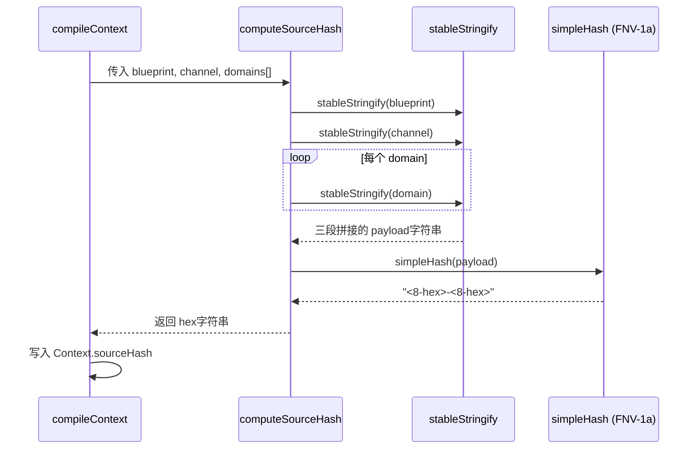
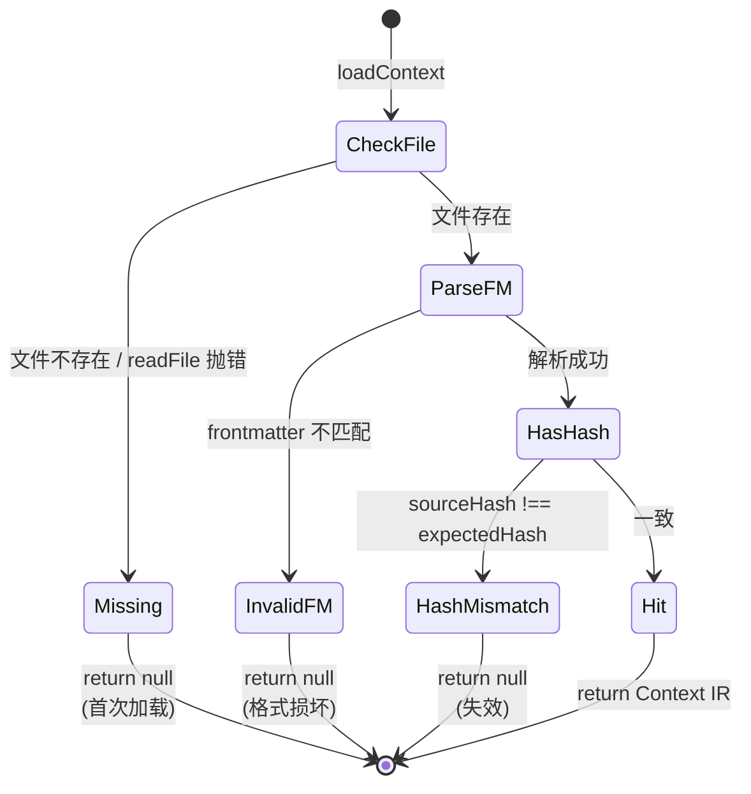
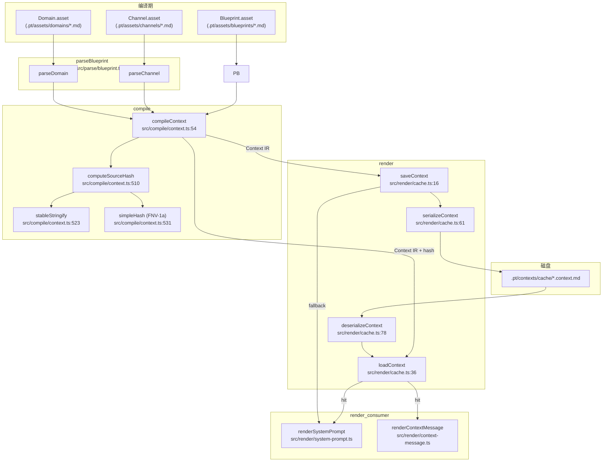
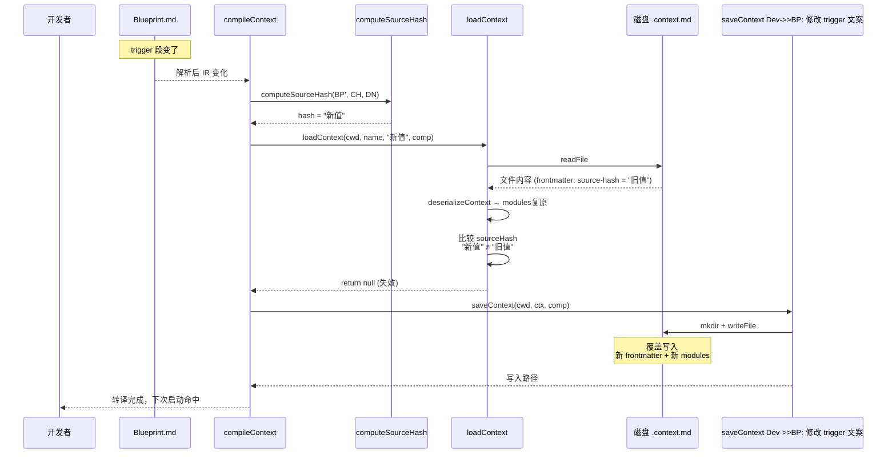

Context 是 v8 三段式架构的产物层（parse → compile → render），它把 Blueprint编译出的"按注入点聚合的 markdown"落盘成物理文件，供下游 render 阶段反复复用。本页深入解析 Context 缓存的序列化格式、sourceHash 失效判定、以及 save/load 两端的契约。理解本节内容前，建议先阅读 [v8 四层模型：Domain→Channel→Blueprint→Context](7-v8-si-ceng-mo-xing-domain-channel-blueprint-context) 与 [中端编译：按注入点聚合与 mode 渲染](14-zhong-duan-bian-yi-an-zhu-ru-dian-ju-he-yu-mode-xuan-ran)——前者定义 Context 在四层模型中的语义位置，后者说明 modules 字典是如何被填充出来的。

> 一句话总结：**sourceHash = hash(Domains + Channel + Blueprint) 组合，三者任一变化即失效重编译**（`src/render/cache.ts:7-8`、`src/schema.ts:206`）。

## Context IR 与物理文件的对应关系

Context 在内存中是 IR 对象，在磁盘上是 frontmatter + H2 段结构的 markdown 文件。两者通过固定的序列化协议互相转换。

| 维度 | Context IR（内存态） | 物理文件（磁盘态） |
| --- | --- | --- |
| 容器类型 | `Context` interface（`src/schema.ts:214-221`） | `<cacheDir>/<name>.context.md`（`src/render/cache.ts:26`） |
| 元数据字段 | `name`、`sourceHash` | frontmatter `name:`、`source-hash:`（`src/render/cache.ts:63-66`） |
| 内容字段 | `modules: Record<注入点名, string>` | 文件正文 `## <注入点名>` 段（`src/render/cache.ts:68-73`） |
| 写入者 | `compileContext` 产出（`src/compile/context.ts:81-85`） | `saveContext` 落盘（`src/render/cache.ts:16-30`） |
| 读取者 | render 阶段消费 | `loadContext` 反序列化（`src/render/cache.ts:36-56`） |
| 缓存目录 | 由 `Blueprint.compilation.cacheDir` 决定，默认 `.pt/contexts/cache/`（`src/parse/blueprint.ts:220`） | 同左 |

```mermaid
flowchart LR subgraph内存态
        IR["Context IR<br/>{name, sourceHash, modules}"]
    end
    subgraph 磁盘态
        FM["frontmatter<br/>---<br/>source-hash: ...<br/>name: ...<br/>---"]
        H2["## 注入点名<br/>... markdown ...<br/><br/>## 注入点名<br/>..."]
    end
    SER["serializeContext<br/>(src/render/cache.ts:61)"]
    DES["deserializeContext<br/>(src/render/cache.ts:78)"]
    IR --> SER --> FM
    SER --> H2
    FM --> DES
    H2 --> DES --> IR
```

序列化函数 `serializeContext` 把 IR 线性化为 frontmatter + H2 段，反序列化 `deserializeContext` 通过 `^## (.+)$` 正则扫描 H2 标题位点，按标题切分 module段（`src/render/cache.ts:79-107`）。每段 `body.slice(sec.start, sec.end).trim()` 精确还原注入点内容。
Sources: [render/cache.ts](src/render/cache.ts#L1-L110), [schema.ts](src/schema.ts#L202-L221), [parse/blueprint.ts](src/parse/blueprint.ts#L215-L226)

## sourceHash 计算：FNV-1a + stable stringify

sourceHash 是 Context 缓存失效的唯一判据，它必须**对 Blueprint/Channel/Domains 任何字段的修改敏感，同时对字段顺序无关**——这就是 stable stringify 的价值。

### 算法链



###关键代码片段（`src/compile/context.ts:510-538`）

```ts
export function computeSourceHash(blueprint, channel, domains): string {
  const payload = JSON.stringify({
    blueprint: stableStringify(blueprint),
    channel: stableStringify(channel),
    domains: domains.map((d) => stableStringify(d)),
  });
  return simpleHash(payload);
}

function stableStringify(obj) {
  // 数组：按顺序；对象：键排序后拼接
  // 这保证 {a:1,b:2} 与 {b:2,a:1} 产生相同哈希
}

function simpleHash(s) {
  // FNV-1a 32-bit：起始常量 0x811c9dc5，prime 0x01000193
  // 输出格式: "<hex>-<lengthHex>" 共 17 字符
}
```

### stableStringify 的语义保证

| 输入形态 | `JSON.stringify` | `stableStringify` | 哈希一致性 |
| --- | --- | --- | --- |
| 对象键顺序不同 | 产生不同字符串 | 先 sort 再拼接，相同 | ✅ |
| 数组顺序不同 | 保留原序 | 保留原序（数组不排序） | ⚠️ 不同 → 视为不同输入 |
| 嵌套对象 | 递归不稳定 | 递归稳定 | ✅ |
| `null`/原始类型 | 标准序列化 | 标准序列化 | ✅ |

> **关键不变量**：数组顺序保持敏感——因为 Blueprint.injectionPoints、Channel.injectionPoints 的顺序本身就是语义（决定聚合顺序与 mode 渲染）。如果两个 Blueprint 的 injectionPoints 顺序互换，sourceHash 必须不同，缓存必须失效。

### simpleHash 的输出格式

| 段 | 来源 | 长度 | 示例 |
| --- | --- | --- | --- |
| FNV-1a 32-bit hex | `hash >>> 0` |8 字符（不足补 0） | `2b7f8d79` |
| 分隔符 | 字面量 | 1 | `-` |
| payload 长度 hex | `s.length` | 8 字符（不足补 0） | `00002f3d` |

实际产物 `.pt/contexts/cache/pt-dev.context.md` 的 frontmatter 为 `source-hash: 2b7f8d79-00002f3d`（实测值）。

> 选择 FNV-1a 而非 SHA-256 是有意为之：缓存标识不要求密码学强度，FNV-1a 足够区分编译产物，且速度更快、依赖更少（无需引入 `crypto` 子进程）。
Sources: [compile/context.ts](src/compile/context.ts#L507-L538)

## 序列化文件格式：frontmatter + H2 段

实际写入 `.pt/contexts/cache/<name>.context.md` 的格式如下（节选自 `.pt/contexts/cache/glossary-test.context.md`）：

```markdown
---
source-hash: 46af1e6e-00002d38
name: glossary-test
---

## 会话知识

> 扩展性测试 Blueprint。仅引用 glossary-test Domain...

### 流程
① **show-glossary** — 渲染 glossary-test Domain 的 Scene 段...

### 术语表「glossary-test」
- **GlossaryEntry**：Phase 5.5 扩展性测试 — ...
```

### 格式约束

| 元素 | 规则 | 代码位置 |
| --- | --- | --- |
| frontmatter 起止符 | `---` 行开头/结尾 | `src/render/cache.ts:63,79` |
| 元数据键名 | 匹配 `^[a-zA-Z_-]+$` | `src/render/cache.ts:83` |
| `source-hash` 必填 | 缺失则 `deserializeContext` 返回 null（强制重编译） | `src/render/cache.ts:88` |
| `name` 可省 | 缺省 fallback 到 load 时的 `name` 参数 | `src/render/cache.ts:87` |
| H2 切分正则 | `^## (.+)$` 多行模式（`m` flag） | `src/render/cache.ts:93` |
| 模块段边界 | `cur.end = next.start - "## " + next.name`.length - 2` | `src/render/cache.ts:103` |
| 段内容清理 | `body.slice(sec.start, sec.end).trim()` | `src/render/cache.ts:106` |

> H2 标题作为段名直接对应 Context.modules 的 key——这意味着注入点语义名（"会话知识"/"对话记忆"）就是磁盘文件里的 H2 标题。改注入点名 → sourceHash 不变（因为注入点定义在 Channel/Blueprint 中），但段结构会变 → 仍需走重新编译流程。
Sources: [render/cache.ts](src/render/cache.ts#L60-L110), [.pt/contexts/cache/glossary-test.context.md](.pt/contexts/cache/glossary-test.context.md)

## save 与 load 的契约对比

`saveContext` 与 `loadContext` 是缓存的两端接口，理解它们的契约差异是把握失效策略的关键。

| 维度 | `saveContext` | `loadContext` |
| --- | --- | --- |
| 函数签名 | `(cwd, ctx, compilation) → Promise<string>` | `(cwd, name, expectedHash, compilation) → Promise<Context \| null>` |
| 文件存在性 | 总是写入（`writeFile`） | 缺失则 `catch → null` |
| 目录创建 | `mkdir(dir, { recursive: true })` | 无（依赖 save 端预创建） |
| 拆分发散 | `split === "by-injection-point"` 留 TODO |忽略 split，按 single-file fallback |
| Hash 校验 | 不校验（信任输入 ctx） | `ctx.sourceHash !== expectedHash` → null |
| 格式校验 | 无（信任序列化器） | frontmatter 不匹配 → null；缺 `source-hash` → null |
| 返回值 | 写入的文件绝对路径 | Context IR 或 null（命中语义） |
| 文件名规则 | `${ctx.name}.context.md` | 同左 |



`expectedHash` 参数来自调用方重新计算的 `compileContext → computeSourceHash`，这是"运行时算出的应当哈希值"。文件里存的是"上一次编译产物落盘时的快照值"。二者必须一致——这就是失效判定的本质。
Sources: [render/cache.ts](src/render/cache.ts#L16-L56), [compile/index.ts](src/compile/index.ts#L1-L4), [transpile.ts](src/transpile.ts#L62-L73)

## 在转译链路中的调度位置

`src/transpile.ts` 的 `loadAndTranspile` 是缓存调度的实际入口（`src/transpile.ts:36-78`）。它把 compile 与 cache 串成一个典型"读穿透"流程：

```ts
const ctx = compileContext(bp, ch, bundle.domains);          // 1. 编译得新 IR
const cached = await loadContext(cwd, ctx.name, ctx.sourceHash, bp.compilation);
if (cached) {
  anyHit = true;
  segments.push(renderSystemPrompt(cached, ch));              // 2a. 命中：用 cached渲染
} else {
  await saveContext(cwd, ctx, bp.compilation);                // 2b. 未命中：写新缓存
  segments.push(renderSystemPrompt(ctx, ch)); //     用新 ctx 渲染
}
```

> **注意：即使缓存命中，compileContext 仍然会执行一次**——这是当前实现的设计权衡：compile 是纯函数（输入 IR → 输出 IR），代价可控；而 sourceHash 计算是它的副产物，刚好用于 cache 校验。这种"先编译再校验"换来的是"无需在 cache 路径里复刻 compile 的副作用"。
> 
> 如果将来 compile 变重（例如多文件 sourceHash 计算成本上升），可以把 `computeSourceHash` 抽出来先算 hash，再决定要不要触发 `compileContext`——这属于缓存策略的演进路径，不在当前 v8.5 范围内。

缓存命中信息通过 `TranspileResult.cacheHit` 上报，最终在 `/pt status` 命令里显示（`src/index.ts:185`）以及 `/pt-context` 切换通知里提示用户（`src/index.ts:50`）。
Sources: [transpile.ts](src/transpile.ts#L36-L78), [index.ts](src/index.ts#L37-L53), [render/index.ts](src/render/index.ts#L1-L11)

## 失效判定的边界场景

sourceHash = `hash(Domains + Channel + Blueprint)` 的等号两侧都参与判定。下面是若干典型边界场景及其后果：

| 场景 | 等号左侧（IR 输入） | 等号右侧（缓存值） | 判定 |备注 |
| --- | --- | --- | --- | --- |
| **首次编译** |全新 IR | 文件不存在 | miss → save | loadContext 走 `catch → null` 分支 |
| **资产未变，二次启动** | 重算 hash A | 文件存 hash A | hit | 跳过 save，直接复用 |
| **Domain增删 term** | hash B（含新内容） | 文件存 hash A | miss → save | sourceHash 已变 |
| **Blueprint 改 trigger 文案** | hash C | 文件存 hash A | miss → save | trigger 注入到 sourceHash |
| **仅修改无关 frontmatter（如加 tag）** | hash D（若 field 计入） | 文件存 hash A | miss | 注意：stableStringify 递归所有键，新增字段必影响 hash |
| **注入点顺序变化** | hash E | 文件存 hash A | miss → save | 数组顺序敏感 |
| **磁盘文件被人手改 frontmatter** | hash F | 文件存 hash X | miss → save | hash 不匹配即重写 |
| **frontmatter 缺 source-hash** | hash G | deserialize返 null | miss → save | deserializeContext 强制要求 |
| **磁盘文件损坏 / 部分写入** | hash H | readFile 抛错 或 反序列化返 null | miss → save | 自我修复路径 |
| **多源 adapter 并行解析** | 各 bundle 独立 hash | 各文件独立 cache | N/A | 每个 Blueprint 名独立缓存，互不干扰 |

> **场景5 的微妙点**：stableStringify 把对象所有键纳入哈希。如果有人给 Domain frontmatter 加了一个"作者署名"字段，sourceHash 会随之变化——这是符合预期的（内容确实变了）。如果想保留"无关字段不触发失效"的语义，需要在 stableStringify 之前做字段白名单过滤——但当前实现刻意不做，因为这会让"是否失效"取决于策略而非"内容是否变化"，带来难以调试的边界。
Sources: [render/cache.ts](src/render/cache.ts#L36-L56), [compile/context.ts](src/compile/context.ts#L510-L538)

## 缓存拆分策略：single-file vs by-injection-point

`Blueprint.compilation.split` 是 v8 引入的扩展字段（`src/schema.ts:135-143`），但当前 v8.5 仅落地 single-file 路径：

```ts
// src/render/cache.ts:20-23
if (compilation.split === "by-injection-point") {
  // TODO：v8.5 留作扩展——按注入点拆多文件，本步先实现 single-file
  // 实现要点：每个注入点一个 <name>.<ipName>.md，frontmatter 含 ipName 标记
}
```

| 策略 | 当前实现 | 文件命名 | 适用场景 |
| --- | --- | --- | --- |
| `single-file` | ✅ 已实现（`src/render/cache.ts:25-29`） | `<name>.context.md` | 默认；适合中小项目（单 Blueprint < 几十 KB） |
| `by-injection-point` | ❌ TODO（`src/render/cache.ts:21`） | `<name>.<ipName>.md`（规划中） | 大体量 Blueprint；按注入点独立失效（粒度更细） |

> 当前 `loadContext` 走的是 single-file 路径，即使 Blueprint声明 `split: by-injection-point` 也会被忽略（`src/render/cache.ts:42-44` 注释明确说明）。要启用 by-injection-point，需要实现 save 端的多文件写入、load 端的多文件重组、sourceHash 的逐文件校验——这是一个独立的扩展工作。
Sources: [render/cache.ts](src/render/cache.ts#L16-L30), [schema.ts](src/schema.ts#L132-L143)

## 模块/类交互图

下图给出 Context 缓存机制涉及的所有模块及其交互关系，标注了关键的函数与契约：



### 关键契约总结

| 角色 | 输入 | 输出 | 失败模式 |
| --- | --- | --- | --- |
| `compileContext` | Blueprint + Channel + Domain[] | Context IR（含 sourceHash） | 编译错误向上抛 |
| `computeSourceHash` | 同上 | hex字符串 | 永不失败（纯计算） |
| `saveContext` | cwd + ctx + compilation | 文件路径字符串 | mkdir/writeFile 抛错 |
| `loadContext` | cwd + name + expectedHash + compilation | Context \| null | 文件不存在 → null；hash 不匹配 → null；格式损坏 → null |
| `serializeContext` | Context IR | markdown 字符串 | 永不失败 |
| `deserializeContext` | name + markdown | Context \| null | frontmatter 缺失 → null；source-hash 缺失 → null |

Sources: [compile/context.ts](src/compile/context.ts#L46-L86), [render/cache.ts](src/render/cache.ts#L16-L110), [transpile.ts](src/transpile.ts#L36-L78)

## 实战示例：一次完整的失效与重建流程

以下时序图描述从 Blueprint改动到缓存重建的完整路径，串联起上文所有概念：



整个过程的"零延迟"来自：compile 是纯函数 →拿 hash 不需要读取磁盘 → 比对失败时同步写覆盖。开发者下次启动 session 时，hash 一致，直接命中，跳过 compile 的代价。
Sources: [transpile.ts](src/transpile.ts#L62-L73), [compile/context.ts](src/compile/context.ts#L77-L86), [render/cache.ts](src/render/cache.ts#L16-L56)

## 与上下游章节的衔接

Context 缓存是产物层的物理形态，它向上承接 compile输出的 IR、向下服务于 render 的字符串构造。理解完本节后，建议按以下顺序继续深入：

1. **[后端渲染：System Prompt 与 Context Message 输出](15-hou-duan-xuan-ran-system-prompt-yu-context-message-shu-chu)**——看 Context.modules 如何被消费为最终注入字符串。
2. **[per-session 内存态、缓存与 provider prompt cache](10-per-session-nei-cun-tai-huan-cun-yu-provider-prompt-cache)**——本章只讲磁盘缓存（`.pt/contexts/cache/`），下一章展开 Session 内存态与 Pi 的 provider prompt cache 联动。
3. **[FlowTemplate 展开与变量绑定（手册机制）](17-flowtemplate-zhan-kai-yu-bian-liang-bang-ding-shou-ce-ji-zhi)**——Context Message 在 input 事件时的二次展开路径。
4. **[端到端验证流程与回归用例](20-duan-dao-duan-yan-zheng-liu-cheng-yu-hui-gui-yong-li)**——如何用 verify脚本检查失效策略是否如期触发。

扩展开发方向可参考 [注册新的 Domain Type 渲染器](18-zhu-ce-xin-de-domain-type-xuan-ran-qi) 与 [接入新的 Source Adapter（多来源转译）](19-jie-ru-xin-de-source-adapter-duo-lai-yuan-zhuan-yi)——这两个扩展点都不会破坏 sourceHash 失效契约（因为它们改的是 IR 的输入端而非缓存键算法本身）。