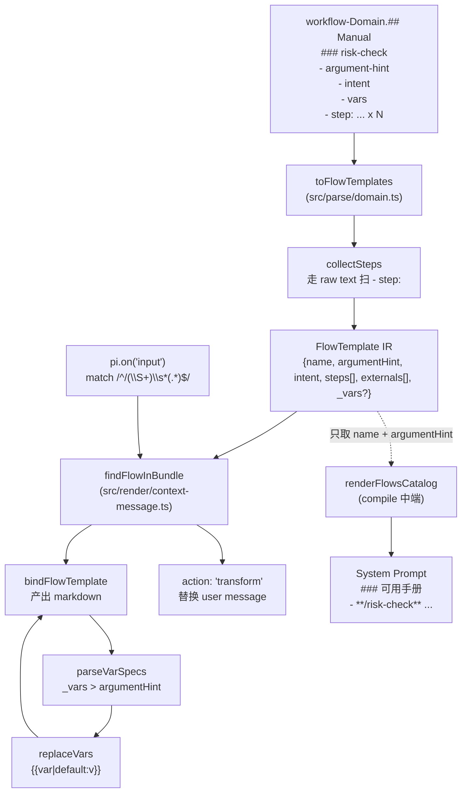

> **本页定位**：解释 Pt 中 **FlowTemplate 从资产解析 → 模板定位 → 变量绑定 → Context Message 注入**的完整链路。读者应已了解 v8 四层模型（Domain→Channel→Blueprint→Context）与三段式编译架构；本页聚焦 workflow-Domain `## Manual` 段携带的"手册模板"如何被 binder 实例化成"手册实例"。

**关键问题**：用户敲 `/risk-check 客户A 5000` 时，Pt 如何决定"这是否该由我接管"、"找哪个 FlowTemplate"、"怎么把 `{{客户ID}}`/`{{金额}}` 替换为 `客户A`/`5000`"、以及"产出什么文本塞回 Pi"。

---

## 一、机制定位：手册实例化是 v8 模型的后端补完

Pt 的产物层分两类：**System Prompt 注入（session 级，before_agent_start）** 与 **Context Message 注入（轮次级，input 事件 transform）**。前者由 `compile/context.ts` 一次产出稳定字符串并拼到 systemPrompt 末尾；后者只在用户敲 `/手册名` 时由 binder 实时展开。

**FlowTemplate 是 workflow-type Domain 在 `## Manual` 段声明的"手册模板"——它是 Pt 接管 template 展开的语义载体**。手册模板 ≠ 手册实例：模板带 `{{var}}` 占位符，实例是把占位符替换为参数后的最终 markdown，进 user message 给 LLM 当轮参照。

```
┌─────────────────────────────┐                    ┌─────────────────────────┐
│ workflow-Domain.## Manual    │  parse/domain.ts   │ FlowTemplate IR         │
│  ### risk-check              │ ──────────────────►│  name / argumentHint /  │
│   - argument-hint: ...       │   toFlowTemplates  │  intent / steps[] /     │
│   - intent: ...              │                    │  externals[] / _vars?   │
│   - step: ...                │                    └─────────────────────────┘
└─────────────────────────────┘                                │
                                                                 │ render/context-message.ts
                                                                 ▼  findFlowInBundle
                                                  ┌─────────────────────────┐
                                                  │ cachedBundles 跨 bundle │
                                                  │ 查找定位 → BoundableTpl │
                                                  └─────────────────────────┘
                                                                 │
                                                                 │ bindFlowTemplate(tpl, args)
                                                                 ▼
                                                  ┌─────────────────────────┐
                                                  │ Context Message 字符串  │
                                                  │  (进 pi input transform)│
                                                  └─────────────────────────┘
```

后端只在 `target=context_message` 的注入点（典型为 `## 对话记忆`）下生效。前端 parse 把 H3 模板解析为 IR；中端 compile 把模板名 + 参数提示聚合到 System Prompt 的 `### 可用手册` 段让 LLM 自选；后端 render 在 input 事件 transform 时按名取出模板并做变量绑定。

Sources: [context-message.ts](src/render/context-message.ts#L1-L11), [schema.ts](src/schema.ts#L51-L75)

---

## 二、IR 契约：FlowStep / FlowTemplate 字段语义

### 2.1 FlowStep（手册步骤）

`FlowStep` 是手册模板内一个原子步骤的 IR 形态。

| 字段 | 类型 | 含义 | MVP 是否使用 |
|---|---|---|---|
| `desc` | `string` | 步骤做什么（人类可读文本，可含 `{{var}}` 占位符） | ✅ binder 主路径 |
| `dataSource` | `ExternalRef?` | 从哪取数据（数据语义层） | ❌ Phase 4+ 启用 |
| `rule` | `string?` | 套哪条 Rule（引用知识库的规则） | ❌ Phase 4+ 启用 |
| `output` | `string?` | 期望产出 | ❌ Phase 4+ 启用 |

binder 主路径只读 `desc`。`dataSource`/`rule`/`output` 是 Schema 预留位——MVP 阶段资产里 `- step: ...` 行只填 desc，Schema 字段留空等待 Phase 4+ 的结构化步骤（数据预绑定、公理标注）。

### 2.2 FlowTemplate（手册模板）

```typescript
interface FlowTemplate {
  name: string;            // /name 触发
  argumentHint?: string;   // "<客户ID> <金额>" — Pi 原生补全 + 变量顺序 fallback
  intent: string;          // 数据语义层：带 {{}} 占位符的前提
  steps: FlowStep[];       // 手册结构层：步骤序列
  externals: ExternalRef[];// 数据语义层：引用知识库的数据源（MVP 默认空）
}
```

`FlowTemplate` 是**纯静态声明**：它描述一本手册"长什么样"与"需要什么参数"，本身**不含实例化时填充的值**。实例化（= 变量绑定）是 render 时由 binder 完成，与 IR 本身解耦。

**关键设计点**：`argumentHint` 兼任三个角色——Pi 原生 `/cmd` 补全提示、变量声明顺序 fallback、System Prompt `### 可用手册` 段的展示字段。这种"一字段多用"避免在 IR 里再加 `varOrder?: string[]`，把变量顺序的优先级解析收敛到 binder 内部。

Sources: [schema.ts](src/schema.ts#L51-L75)

---

## 三、解析层：workflow-Domain 的 Manual 段 → FlowTemplate[]

### 3.1 入口：parse/domain.ts 分发到 toFlowTemplates

`parseDomain()` 对 workflow-type Domain 的 `## Manual` 段调用 `toFlowTemplates(items, sectionRaw)`。这一步把"每个 H3 名 = 一本手册"的 OXN Item 形态收敛为强类型 `FlowTemplate[]`。

```typescript
// src/parse/domain.ts:114-128
function toFlowTemplates(items: Item[], sectionRaw: string): FlowTemplate[] {
  return items.map((item) => {
    const steps = collectSteps(item.name, sectionRaw);
    const tpl: FlowTemplate = {
      name: item.name,
      argumentHint: s(item.fields["argument-hint"]) || undefined,
      intent: s(item.fields.intent),
      steps: steps.map<FlowStep>((desc) => ({ desc })),
      externals: [],
    };
    const vars = sArr(item.fields.vars);
    if (vars.length > 0) (tpl as FlowTemplate & { _vars?: string[] })._vars = vars;
    return tpl;
  });
}
```

注意 `externals: []`——MVP 默认空。v7 把数据源从 Scene 段读取，但 binder 路径暂不消费，保留数组字段为 Phase 4+ 留位。

### 3.2 步骤采集：collectSteps 走 raw text 而非 fields

```typescript
// src/parse/domain.ts:131-148
function collectSteps(itemName: string, sectionRaw: string): string[] {
  const lines = sectionRaw.split(/\r?\n/);
  const steps: string[] = [];
  let inItem = false;
  for (const line of lines) {
    const h3 = line.match(/^###\s+(.+)$/);
    if (h3) {
      const name = h3[1].trim();
      if (inItem) break;
      if (name === itemName) inItem = true;
      continue;
    }
    if (!inItem) continue;
    const stepMatch = line.match(/^\s*-\s+step\s*:\s*(.+)$/);
    if (stepMatch) steps.push(stepMatch[1].trim());
  }
  return steps;
}
```

**这是 parser 输出的唯一调整**：当 `- step:` 重复行出现时，OXN 的 `parseItems` 会把后写键覆盖前写键，fields 里只剩最后一个 step 字符串。所以 `collectSteps` 绕过 fields，直接 regex 扫 `### <itemName>` H3 后的所有 `- step:` 行——这是 binder 链路对 parse 输出的关键补丁。

扫描器在遇到下一个 H3 时立即 break（`if (inItem) break`），保证步骤归属到正确的 H3 名下、不串到下一本手册。

### 3.3 `_vars` 元数据：adapter 附加、binder 优先消费

```typescript
// src/parse/domain.ts:124-125
const vars = sArr(item.fields.vars);
if (vars.length > 0) (tpl as FlowTemplate & { _vars?: string[] })._vars = vars;
```

`_vars` 是下划线前缀的"Pt 核心不感知"内部 metadata：parse 层从 `vars: [客户ID, 金额]` 读出后挂到 FlowTemplate 对象上。binder 通过 `BoundableTemplate = FlowTemplate & { _vars?: string[] }` 类型契约收窄该字段，避免污染 Schema。约定：**下划线前缀 = 内部 metadata，Pt 核心 IR 字段无下划线**。

Sources: [domain.ts](src/parse/domain.ts#L114-L148)

---

## 四、定位层：findFlowInBundle 跨 bundle 找模板

### 4.1 协议：BoundableTemplate

```typescript
// src/render/context-message.ts:13-14
export type BoundableTemplate = FlowTemplate & { _vars?: string[] };
```

binder 入参类型。它显式承认 `_vars` 存在但允许 undefined——适配"资产未声明 vars、走 argumentHint fallback"的兼容路径。

### 4.2 查找策略：按注入点遍历 domains → Manual 模块

```typescript
// src/render/context-message.ts:120-148
export function findFlowInBundle(
  blueprint: Blueprint,
  domains: Array<{ name: string; type: string; modules: Record<string, unknown> }>,
  tplName: string,
): BoundableTemplate | undefined {
  const contextMsgIps: InjectionPointInstance[] = blueprint.injectionPoints.filter(
    (ip) => ip.domains.length > 0,
  );
  for (const ip of contextMsgIps) {
    for (const dn of ip.domains) {
      const d = domains.find((x) => x.name === dn);
      if (!d || d.type !== "workflow") continue;
      const tpls = (d.modules["Manual"] as Array<FlowTemplate> | undefined) ?? [];
      const hit = tpls.find((t) => t.name === tplName);
      if (hit) {
        const bt = hit as FlowTemplate & { _vars?: string[] };
        const vars = (bt as { vars?: unknown }).vars;
        if (Array.isArray(vars)) {
          const strs = vars.filter((x): x is string => typeof x === "string");
          if (strs.length > 0) bt._vars = strs;
        }
        return bt;
      }
    }
  }
  return undefined;
}
```

**关键设计**：**所有 target=context_message 注入点的 domains 都参与查找**——filter 条件是 `ip.domains.length > 0`（兜底"凡是引用了 Domain 的注入点都看"），并未严格按 `ip.target === "context_message"`。这是 v8 重构后的兼容写法，目标是"用户敲 `/name` 时，全 Blueprint 所有 workflow-Domain 的 Manual 段都能被搜到"。

**vars 兼容性补丁**：`(bt as { vars?: unknown }).vars` 兜底读取——某些早期资产可能把 `vars` 字段挂在对象上而非 `_vars`，这里做一次合并。如有则覆盖 `_vars`，让 binder 走 vars 优先路径。

### 4.3 跨 bundle 委托：findFlow 包装

```typescript
// src/index.ts:57-66
function findFlow(name: string) {
  if (!cachedBundles) return undefined;
  for (const b of cachedBundles) {
    const bp = b.blueprints.find((x) => x.name === b.activeBlueprint);
    if (!bp) continue;
    const tpl = findFlowInBundle(bp, b.domains, name);
    if (tpl) return tpl;
  }
  return undefined;
}
```

入口处把"跨 SchemaBundle"的事情包了——多 adapter 场景（未来 YAML/DB adapter）下，每个 bundle 都查一遍直到命中。这是 Source Adapter 注册表带来的副产品：binder 不感知 bundle 数量，统一由 index.ts 兜底。

Sources: [context-message.ts](src/render/context-message.ts#L119-L148), [index.ts](src/index.ts#L57-L66)

---

## 五、绑定层：bindFlowTemplate 核心算法

### 5.1 函数签名与契约

```typescript
// src/render/context-message.ts:52-83
export function bindFlowTemplate(tpl: BoundableTemplate, args: string): string
```

**入参**：`FlowTemplate` 模板 + 参数字符串（`/risk-check 客户A 5000` 去掉命令名后的 `"客户A 5000"`）。
**出参**：变量替换后的完整手册 markdown。
**错误约定**：缺值/错误**不抛异常**——留为字面量 `{{name}}`，让 LLM 在 user message 里看到缺口，由 LLM 主动询问补全。

### 5.2 算法骨架

```
bindFlowTemplate(tpl, args):
  1. tokens = args.trim().split(/\s+/)      // 位置参数化
  2. varSpecs = parseVarSpecs(tpl._vars, tpl.argumentHint)  // 变量声明
  3. bound = zip(varSpecs, tokens) + apply defaults  // 绑定表
  4. 拼 markdown:
     - "# <name>"
     - "_参数：<argumentHint>_"            （如存在）
     - "## 前提（Intent）"
     - replaceVars(tpl.intent, bound)
     - "## 步骤"
     - 1..N. replaceVars(s.desc, bound)    （每步单独 replaceVars）
```

### 5.3 变量声明优先级：_vars > argumentHint > 空

```typescript
// src/render/context-message.ts:87-96
function parseVarSpecs(_vars: string[] | undefined, hint: string | undefined): VarSpec[] {
  if (_vars && _vars.length > 0) {
    return _vars.map(parseVarSpecName);
  }
  if (hint) {
    const matches = [...hint.matchAll(/<([^>]+)>/g)];
    return matches.map((m) => parseVarSpecName(m[1]));
  }
  return [];
}
```

| 优先级 | 来源 | 适用场景 |
|---|---|---|
| 1️⃣ | `vars: [客户ID, 金额]`（经 `_vars` 携带） | 变量声明在 frontmatter，命名不受 `<>` 限制 |
| 2️⃣ | `argument-hint: <客户ID> <金额>`（扫 `<...>`） | 资产未声明 `vars`，用 hint 兜底 |
| 3️⃣ | 空数组 | 模板无变量声明，args 多余部分忽略、占位符留字面量 |

**冲突解决**：`_vars` 非空时**完全压制** `argumentHint`。即 `vars: [客户ID, 金额]` 但 `argument-hint: <金额> <客户ID>` 时，**以 vars 顺序为准**——顺序决定位置参数绑定，命名一致性靠 vars 显式约束。

### 5.4 单变量名解析：name | default:value 语法

```typescript
// src/render/context-message.ts:98-107
function parseVarSpecName(raw: string): VarSpec {
  const trimmed = raw.trim();
  const idx = trimmed.indexOf("|");
  if (idx < 0) return { name: trimmed };
  const name = trimmed.slice(0, idx).trim();
  const defaultPart = trimmed.slice(idx + 1).trim();
  const defaultMatch = defaultPart.match(/^default\s*:\s*(.*)$/);
  if (defaultMatch) return { name, default: defaultMatch[1].trim() };
  return { name, default: defaultPart };
}
```

| 写法 | 解析结果 |
|---|---|
| `客户ID` | `{ name: "客户ID" }`（必填） |
| `金额\|default:0` | `{ name: "金额", default: "0" }`（有缺省值） |
| `金额\|0` | `{ name: "金额", default: "0" }`（裸值也算 default） |

`default:` 前缀可选——更显式的写法是 `<金额\|default:0>`，更简洁是 `<金额\|0>`，binder 两者都接受。MVP 不做类型校验，default 一律按字符串处理。

### 5.5 占位符替换：replaceVars

```typescript
// src/render/context-message.ts:109-117
function replaceVars(text: string, bound: Map<string, string>): string {
  return text.replace(/\{\{([^}]+)\}\}/g, (match, inner: string) => {
    const spec = parseVarSpecName(inner);
    const v = bound.get(spec.name);
    if (v !== undefined) return v;
    if (spec.default !== undefined) return spec.default;
    return match;
  });
}
```

**就地解析**：每个 `{{...}}` 内部再次跑 `parseVarSpecName`——支持在占位符里直接写 `{{金额|default:0}}`，与变量声明级别的 default 语义对齐。**这个能力允许资产编写者"局部声明缺省值"，不必在 `vars` 列表里逐项声明**——降低模板编写的心智负担。

**留字面量策略**：缺值且无 default → 返 `match`（原 `{{...}}` 字符串）。这让 LLM 在 user message 里看到 `{{客户ID}}` 字面量时有机会主动追问用户，而不是被静默替换成 undefined 或抛异常。

### 5.6 输出结构：四段 markdown

```typescript
// src/render/context-message.ts:67-82
const lines: string[] = [];
lines.push(`# ${tpl.name}`);                              // 手册名（与 /name 一致）
lines.push("");
if (tpl.argumentHint) {
  lines.push(`_参数：${tpl.argumentHint}_`);             // 参数提示（人类可读）
  lines.push("");
}
lines.push(`## 前提（Intent）`);                          // 必填段
lines.push(replaceVars(tpl.intent, bound));
lines.push("");
lines.push(`## 步骤`);                                    // 必填段
tpl.steps.forEach((s: FlowStep, i: number) => {
  lines.push(`${i + 1}. ${replaceVars(s.desc, bound)}`);  // 每步单独 replaceVars
});
```

**两段必填**（Intent + 步骤）+ **两段可选**（参数提示 + 手册名）。Intent 段是数据语义层的入口，让 LLM 先理解"这本手册为什么被触发"；步骤段是手册结构层的有序展开。**每步独立调 `replaceVars`** 而非合并后一次替换——保证 `{{var}}` 在 desc 边界正确解析，且失败时只影响该步而非整本手册。

Sources: [context-message.ts](src/render/context-message.ts#L48-L117)

---

## 六、触发链路：input 事件的全栈拼装

```
┌─────────────────────────────────────────────────────────────────┐
│ 用户键入："/risk-check 客户A 5000"                                │
└─────────────────────────────────────────────────────────────────┘
                              │
                              ▼  pi.on("input") 触发
┌─────────────────────────────────────────────────────────────────┐
│ src/index.ts:113-123                                              │
│   match = /^\/(\S+)\s*(.*)$/   → tplName="risk-check" args="客户A 5000"│
└─────────────────────────────────────────────────────────────────┘
                              │
                              ▼  findFlow("risk-check")
┌─────────────────────────────────────────────────────────────────┐
│ src/index.ts:57-66  →  findFlowInBundle(bp, b.domains, name)    │
│   遍历 blueprint.injectionPoints[domains.length>0]              │
│     → 找 type==="workflow" 的 Domain                             │
│       → d.modules["Manual"] 里的 tpls                          │
│         → tpls.find(t => t.name === "risk-check")               │
└─────────────────────────────────────────────────────────────────┘
                              │
                              ▼  bindFlowTemplate(tpl, "客户A 5000")
┌─────────────────────────────────────────────────────────────────┐
│ src/render/context-message.ts:52-83                              │
│   tokens=["客户A","5000"]                                        │
│   varSpecs=[{name:"客户ID"}, {name:"金额",default:"0"}]          │
│   bound={客户ID→"客户A", 金额→"5000"}                            │
│   拼 markdown 四段                                               │
└─────────────────────────────────────────────────────────────────┘
                              │
                              ▼  return { action: "transform", text }
┌─────────────────────────────────────────────────────────────────┐
│ Pi 把 expanded 替换为 user message,继续后续 LLM 流程              │
└─────────────────────────────────────────────────────────────────┘
```

### 6.1 Pi 原生 /cmd 与 Pt 接管并存

```typescript
// src/index.ts:113-123
pi.on("input", async (event) => {
  const match = event.text.match(/^\/(\S+)\s*(.*)$/);
  if (!match) return { action: "continue" };        // 不以 / 开头 → 放行
  const [, tplName, args] = match;
  const tpl = findFlow(tplName);
  if (!tpl) return { action: "continue" };           // Pt 未声明 → 放行 Pi 原生
  const expanded = bindFlowTemplate(tpl, args);
  return { action: "transform", text: expanded };    // 接管 → 替换 user message
});
```

**两处放行**：(a) 不匹配 `/<cmd>` 形态（普通文本输入）→ 走 Pi 原生消息流；(b) 匹配 `/<cmd>` 但 `findFlow` 未命中（Pt 未声明该模板）→ 走 Pi 原生 template 机制（`$1 $2` 展开）。这保证 `/help` `/commit` 等 Pi 原生命令完全不受 Pt 干扰。

`action: "transform"` 是关键——它告诉 Pi 把返回的 `text` 作为这一轮的实际 user message 内容，**完全替换原 `/<cmd>...` 文本**。Pi 原生 template expansion 看到非 `/cmd` 形态就跳过。

Sources: [index.ts](src/index.ts#L111-L123)

---

## 七、Discoverability：System Prompt 里的 `### 可用手册`

binder 是触发时实时展开的，但用户/agent 需要**先看到有哪些手册可用**——这部分由中端 compile 在 System Prompt 模块里固定产出。

```typescript
// src/compile/context.ts:485-497
function renderFlowsCatalog(refDomains: Domain[]): string {
  const allTpls = refDomains.flatMap<FlowTemplateLite>((d) => {
    if (d.type !== "workflow") return [];
    return (d.modules["Manual"] as Array<FlowTemplateLite> | undefined) ?? [];
  });
  if (allTpls.length === 0) return "";
  const lines: string[] = ["### 可用手册"];
  for (const t of allTpls) {
    const hint = t.argumentHint ? ` ${t.argumentHint}` : "";
    lines.push(`- **/${t.name}**${hint}`);
  }
  return lines.join("\n");
}
```

`renderFlowsCatalog` 在 `compileSystemPromptModule` 的第 6 步被调用（`src/compile/context.ts:151`），与 Trigger / Boundaries / 全局约束 / Scene 段 / 工具段一起拼成完整 System Prompt。**`FlowTemplateLite` 是 compile 阶段的简化类型**（只有 `name` + `argumentHint`）——中端不感知 intent/steps，只关心"哪本手册可用 + 怎么调"，避免引入 binder 路径到 compile 阶段。

典型产物：

```
### 可用手册
- **/modify-schema** (无)
- **/modify-asset** (无)
- **/add-domain-type** (无)
- **/transpile** <blueprint-name>
```

`(无)` 是占位符——`argument-hint` 字段在资产里写 `(无)` 表示"该手册无参数"。这种写法让 `argument-hint` 字段始终非空，便于补全与 discoverability 展示保持一致。

Sources: [context-message.ts](src/compile/context.ts#L485-L497), [context-message.ts](src/compile/context.ts#L150-L152)

---

## 八、空缺策略：为何不抛异常

| 情况 | 处理 | 理由 |
|---|---|---|
| `args` 不足且变量无 default | 占位符留字面量 `{{name}}` | LLM 看到字面量会主动追问用户 |
| `args` 不足且变量有 default | 用 default 替换 | 部分参数可选的模板常见 |
| `args` 完全为空（`/name` 后无内容） | 所有变量走 default 或留字面量 | 模板可能不需要参数 |
| 模板出现未声明的 `{{var}}`（不在 varSpecs 中） | 留为字面量 | 静默忽略，便于模板编写者调试 |
| `vars: []` 且 `argument-hint` 为空 | varSpecs 为空，args 多余 token 全部忽略 | 模板无参数声明 |

**核心原则**：**MVP 优先简单 + LLM 容错**。错误抛异常会让 Pt 把整个对话流挂掉；留字面量让 LLM 在 user message 里看到缺口有机会主动询问。Phase 4+ 可加 strict 模式供调试用，但默认策略保持宽松。

**对照 Pi 原生 template 的 `${1:-default}` 语法**——Pt 的能力是 Pi 原生的超集：

| 能力 | Pi 原生 | Pt 接管后 |
|---|---|---|
| 位置参数 `$1 $2` | ✅ | ✅ |
| 命名变量 `{{客户ID}}` | ❌ | ✅ |
| 缺省值 / 条件块 | 仅 `${1:-default}` | ✅ `{{var\|default:v}}` |
| 类型校验 | ❌ | ❌（MVP） |
| 数据源预查后替换（L2） | ❌ | ❌（MVP，Phase 4+） |

Sources: [context-message.ts](src/render/context-message.ts#L109-L117), [pt-asset-layering.md](docs/pt-asset-layering.md#L809-L835)

---

## 九、典型调用全景

```typescript
// 输入：用户敲 "/risk-check 客户A 5000"

// 1. parse 阶段已完成，cachedBundles 含：
//    bundle.domains["pt-dev-flow"].modules["Manual"] = [
//      {
//        name: "risk-check",
//        argumentHint: "<客户ID> <金额>",
//        intent: "客户 {{客户ID}} 申请下单，订单金额 {{金额}}",
//        steps: [
//          { desc: "读 ./data/credit-limits.xlsx 查 {{客户ID}} 的信用额度" },
//          { desc: "校验：信用额度 >= {{金额}}；否则拒绝" },
//          { desc: "产出 通过/拒绝 + 理由的业务描述" },
//        ],
//        externals: [],
//        _vars: ["客户ID", "金额"],   // 来自 frontmatter.vars
//      }
//    ]

// 2. pi.on("input") 触发：
//    match → tplName="risk-check", args="客户A 5000"
//    findFlow("risk-check") → BoundableTemplate

// 3. bindFlowTemplate(tpl, "客户A 5000") 执行：
//    tokens = ["客户A", "5000"]
//    varSpecs = parseVarSpecs(["客户ID","金额"], undefined)
//              = [{name:"客户ID"}, {name:"金额"}]
//    bound = {客户ID → "客户A", 金额 → "5000"}

// 4. replaceVars 执行：
//    intent  → "客户 客户A 申请下单，订单金额 5000"
//    step[0] → "读 ./data/credit-limits.xlsx 查 客户A 的信用额度"
//    step[1] → "校验：信用额度 >= 5000；否则拒绝"
//    step[2] → "产出 通过/拒绝 + 理由的业务描述"  （无占位符，原样）

// 5. 拼 markdown：
//    # risk-check
//
//    _参数：<客户ID> <金额>_
//
//    ## 前提（Intent）
//    客户 客户A 申请下单，订单金额 5000
//
//    ## 步骤
//    1. 读 ./data/credit-limits.xlsx 查 客户A 的信用额度
//    2. 校验：信用额度 >= 5000；否则拒绝
//    3. 产出 通过/拒绝 + 理由的业务描述

// 6. return { action: "transform", text: <上 markdown> }
//    Pi 替换 user message，进入后续 LLM 推理
```

---

## 十、机制分层对照与扩展边界

### 10.1 三层职责边界

| 层 | 职责 | 关键文件 | 不应越界做的事 |
|---|---|---|---|
| **parse 前端** | workflow-Domain `## Manual` 段 → `FlowTemplate[]` IR（含 `_vars` metadata） | `src/parse/domain.ts` | 不做变量绑定，不读 args |
| **compile 中端** | `FlowTemplate.name` + `argumentHint` → System Prompt `### 可用手册` | `src/compile/context.ts` | 不展开 intent/steps，不读 args |
| **render 后端** | 跨 bundle 定位模板 + 变量绑定 + 拼 markdown + 触发 input transform | `src/render/context-message.ts` | 不感知 Domain/Channel 加载细节（依赖 cachedBundles） |
| **入口（index.ts）** | Pi 事件路由（input → findFlow → bindFlowTemplate） | `src/index.ts` | 不内联 binder 逻辑 |

**binder 严格在后端**：编译期/缓存期都不触发 binder，避免缓存命中时错误地"预展开"模板（参数上下文是轮次级的，不能跨 turn 复用）。

### 10.2 扩展边界：哪些字段是 MVP 死代码

- `FlowStep.dataSource` / `rule` / `output` —— Schema 预留，binder 不读
- `FlowTemplate.externals` —— parse 写空数组，binder 不读
- `argument-hint` 里写 `(无)` —— 表示"无参数"占位，让 Pi 补全有内容
- L2 数据预绑定（按 External 调数据源预填 `{{客户ID}}` 为实际值）—— MVP 不做，Phase 4+ 评估

加这些能力的正确姿势是 **改 render/context-message.ts 的 binder**（加数据源调用、加类型校验），**不动 parse/compile 与 Schema 主结构**。

### 10.3 与其他页面的衔接

| 关联主题 | 页内位置 | 关联页面 |
|---|---|---|
| 三段式架构总览 | 本页是 render 后端的展开深入 | [三段式编译架构（parse→compile→render）](8-san-duan-shi-bian-yi-jia-gou-parse-compile-render) |
| Schema 与 IR 契约 | `FlowStep` / `FlowTemplate` 字段来源 | [Schema 与 IR 契约（src/schema.ts）](12-schema-yu-ir-qi-yue-src-schema-ts) |
| 注入点机制 | `target=context_message` 注入点决定 binder 触发 | [注入点机制与 Pi Extension 生命周期集成](9-zhu-ru-dian-ji-zhi-yu-pi-extension-sheng-ming-zhou-qi-ji-cheng) |
| v8 四层模型 | FlowTemplate 归属 workflow-Domain 的 `## Manual` 段 | [v8 四层模型：Domain→Channel→Blueprint→Context](7-v8-si-ceng-mo-xing-domain-channel-blueprint-context) |
| 后端渲染总览 | 本页是 Context Message 输出路径 | [后端渲染：System Prompt 与 Context Message 输出](15-hou-duan-xuan-ran-system-prompt-yu-context-message-shu-chu) |
| 注册新 Domain Type | workflow 已是内置 type，新 type 加 renderer 一行注册 | [注册新的 Domain Type 渲染器](18-zhu-ce-xin-de-domain-type-xuan-ran-qi) |
| 端到端验证 | 验证脚本跑遍所有 Blueprint 的可用手册 | [端到端验证流程与回归用例](20-duan-dao-duan-yan-zheng-liu-cheng-yu-hui-gui-yong-li) |

Sources: [schema.ts](src/schema.ts#L51-L75), [domain.ts](src/parse/domain.ts#L114-L148), [context-message.ts](src/render/context-message.ts#L48-L148), [context.ts](src/compile/context.ts#L485-L497), [index.ts](src/index.ts#L111-L123)

---

## 十一、流程速查

### 11.1 用户视角：从敲命令到看到手册

```
用户: "/risk-check 客户A 5000"
  ↓ pi.on("input") 命中
  ↓ regex 提取 tplName="risk-check" args="客户A 5000"
  ↓ findFlow("risk-check") 跨 bundle 查找
  ↓ 命中 BoundableTemplate (_vars=["客户ID","金额"])
  ↓ bindFlowTemplate(tpl, args)
  ↓   tokens=["客户A","5000"]  varSpecs=[客户ID, 金额]
  ↓   bound={客户ID→客户A, 金额→5000}
  ↓   replaceVars 替换 intent + 各 step.desc
  ↓ 拼 # name / 参数 / 前提 / 步骤 markdown
  ↓ action: "transform", text=<展开 markdown>
  ↓ Pi 把展开内容当 user message 继续
```

### 11.2 资产编写者视角：声明一本可触发手册

```markdown
<!-- .pt/assets/domains/<your-workflow>.md -->
---
type: workflow
name: <your-workflow>
---

## Manual

### risk-check
- argument-hint: <客户ID> <金额>     ← Pi 补全 + 变量顺序 fallback
- intent: 客户 {{客户ID}} 申请下单，订单金额 {{金额}}
- vars: [客户ID, 金额]                ← 变量顺序优先（与 hint 冲突时以 vars 为准）
- step: 读 ./data/credit-limits.xlsx 查 {{客户ID}} 的信用额度
- step: 校验：信用额度 >= {{金额}}；否则拒绝（额度不足）
- step: 产出 通过/拒绝 + 理由的业务描述
```

`### <手册名>` 即触发名，`argument-hint` 与 `vars` 二选一提供变量顺序，`intent` 与每个 `step:` 行可含 `{{var}}` 占位符，binder 自动替换。

### 11.3 排查路径

| 现象 | 排查点 |
|---|---|
| 敲 `/xxx` 走 Pi 原生（没被 Pt 接管） | `findFlow("xxx")` 未命中 → 检查 workflow-Domain 的 `## Manual` 段 H3 名是否一致 |
| 展开内容里 `{{var}}` 字面量残留 | args 不足且变量无 default → 补 args 或加 `default:v` |
| 变量值错位（客户ID 拿到金额） | `_vars` 与 `argument-hint` 顺序冲突 → 以 `_vars` 为准，调整 hint 或 vars |
| `### 可用手册` 段没显示 | `compileSystemPromptModule` 第 6 步未触发（refDomains 无 workflow-type Domain）→ 检查 Blueprint 的 injectionPoints |
| System Prompt 完全没出现手册段 | target=system_prompt 的注入点下无 workflow-Domain 引用 → 检查 Channel `### Modules` 与 Blueprint `### Domains` |

Sources: [context-message.ts](src/render/context-message.ts#L48-L117), [index.ts](src/index.ts#L113-L123), [context.ts](src/compile/context.ts#L485-L497)

---

## 十二、概念关联图



`renderFlowsCatalog`（compile 阶段）与 `bindFlowTemplate`（render 阶段）是**互补关系**：前者是"手册清单的静态展示"，后者是"具体手册的动态实例化"。前者让 LLM 知道有哪些手册可用（场景：LLM 自选触发），后者在用户显式敲 `/<name>` 时执行展开。

---

## 十三、关键设计决策与权衡

| 决策 | 选择 | 替代方案 | 理由 |
|---|---|---|---|
| 变量语法 | `{{name\|default:v}}` | `${name:-default}` 兼容 Pi 原生 | Pt 接管后完全替换 user message，不与 Pi 原生共存冲突；自定义语法更灵活 |
| 缺值处理 | 留字面量不抛异常 | 抛异常 / 静默替换为 undefined | MVP 优先简单 + LLM 容错；strict 模式留 Phase 4+ |
| 步骤聚合 | parser regex 扫 raw text 而非 fields | parser 修输出结构支持 `step[]` | parser 是 OXN 公共路径，改动影响所有 adapter；局部补丁风险更低 |
| `_vars` 附加 | 下划线前缀挂在 FlowTemplate 对象上 | 加 `varOrder` 字段进 Schema | 区分核心 IR 与 adapter metadata，避免污染 Schema；下划线约定比注释更可靠 |
| binder 在哪一层 | render 后端 | compile 中端预展开 | 参数上下文是轮次级的，缓存期不可知；预展开会污染 Context Message 缓存 |
| 跨 bundle 查找 | 遍历 cachedBundles 命中即返 | 按 activeBlueprint 严格筛选 | Source Adapter 注册表机制下多 bundle 并存，统一委托由 index.ts 兜底 |
| argumentHint 多用 | 补全 + 变量顺序 fallback + 展示 | 拆三个字段 | 减少字段数，避免一致性问题；优先级冲突在 binder 内收敛 |
| `### 可用手册` 位置 | System Prompt 模块内 | 独立段 / 工具提示 | 与 Trigger / Boundaries / 全局约束同级，作为 System Prompt 的一部分让 LLM 持久可见 |