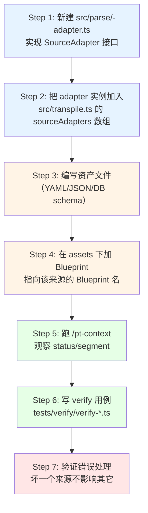

本页面是 **Pt 扩展性手册** 的"新增来源"专题——回答一个具体问题：**当你要把第二个、第三个异构知识源接入 Pt 时，需要改哪些文件、加哪些代码、注册到哪个数组？** 与侧重设计哲学的 [Source Adapter 注册表与依赖反转设计](11-source-adapter-zhu-ce-biao-yu-yi-lai-fan-zhuan-she-ji) 不同，本文专注落地路径与代码骨架。

> **范围声明**：本文只覆盖"加一个 Source Adapter"的端到端落地。Schema契约本身、注入点机制、Context 缓存策略分别在 [Schema 与 IR 契约（src/schema.ts）](12-schema-yu-ir-qi-yue-src-schema-ts)、[注入点机制与 Pi Extension 生命周期集成](9-zhu-ru-dian-ji-zhi-yu-pi-extension-sheng-ming-zhou-qi-ji-cheng)、[Context 缓存序列化与 sourceHash 失效策略](16-context-huan-cun-xu-lie-hua-yu-sourcehash-shi-xiao-ce-lue) 阐述。

Sources: [transpile.ts](src/transpile.ts#L30-L33), [schema.ts](src/schema.ts#L240-L247)

---

## 一、为什么需要 Source Adapter（动机与边界）

v8 模型在 `src/schema.ts` 定义了一份**不带任何来源格式痕迹**的 IR（`Domain` / `Channel` / `Blueprint` / `SchemaBundle`），而 OXN MD 只是众多可能来源之一。**Pt 核心只认 SchemaBundle，不认任何来源格式**——这是设计文档 [§6.2](docs/pt-asset-layering.md#L965-L974) 划下的红线：

```
反转前：Pt 核心 --消费--> OXN Asset 结构 <--解析-- OXN MD     ← 依赖向外
反转后：Pt 核心 --消费--> Pt Schema 接口 <--实现-- OXN Adapter   ← 依赖向内
                                           <--实现-- YAML Adapter（未来）
                                            <--实现-- DB Adapter（未来）
```

依赖向内的物理落点就是 [`sourceAdapters: SourceAdapter[]`](src/transpile.ts#L30-L33) 这个数组。新增来源 = **实现一个 `SourceAdapter` 对象 + 推入数组一行**——`transpile.ts`主体逻辑、`compileContext`、render链路均不需要改动。

| 维度 | 加新 Domain Type（页面 18） | 加新 Source Adapter（本文） |
|---|---|---|
| **触发的扩展点** | 内容性质标签（term/workflow/stack/…） | 来源格式（MD/YAML/DB/…） |
| **改动主战场** | `compile/context.ts` + `parse/domain.ts` | 新增 `src/parse/<name>-adapter.ts` + 注册表数组 |
| **是否改前端入口** | 否（同一 OXN adapter 内部分发 type） | 是（`sourceAdapters` 数组加一行） |
| **是否改中后端** | 否 | 否（关键不变量） |
| **Schema 影响** | 不影响（`Domain.type` 早已是 `string`） | 不影响（`SchemaBundle` 形状不变） |

Sources: [schema.ts](src/schema.ts#L240-L247), [transpile.ts](src/transpile.ts#L30-L33), [pt-asset-layering.md](docs/pt-asset-layering.md#L965-L974)

---

## 二、契约：`SourceAdapter` 接口与 `SchemaBundle` 货物

接口本体极简——`name` + 一个 `load()`，定义于 [`src/schema.ts#L244-L247`](src/schema.ts#L244-L247)：

```typescript
export interface SourceAdapter {
  name: string;
  load(cwd: string, blueprintName: string): Promise<SchemaBundle>;
}
```

`load(cwd, blueprintName)` 不接收任何"来源路径"——它只接收**工作目录**和**激活的蓝图名**，因为每个来源的资产组织方式（OXN 按目录枚举、YAML 按单一文件、DB 按表名查询）各不相同，这些细节全部封装在 adapter 内部。

`SchemaBundle` 是 adapter 必须交付的标准货物，定义于 [`src/schema.ts#L232-L238`](src/schema.ts#L232-L238)：

```typescript
export interface SchemaBundle {
  domains: Domain[];
  channels: Channel[];
  blueprints: Blueprint[];
  activeBlueprint: string;
}
```

| 字段 | 作用 | 必须存在 |
|---|---|---|
| `domains` | 内容层 Domain列表（type + modules） | ✅ 中端 `compileContext` 按名索引 |
| `channels` | 结构层 Channel 列表（injectionPoints） | ✅ Blueprint引用 Channel |
| `blueprints` | 配置层 Blueprint 列表（injectionPoints + compilation） | ✅ 调度循环按 `activeBlueprint`选取 |
| `activeBlueprint` | 当前激活的 Blueprint 名 | ✅调度循环 `[src/transpile.ts#L52-L55](src/transpile.ts#L52-L55)` 用它从 `blueprints` 里 find |

> **零容错点**：adapter 不能返回这四个字段之外的任何东西（不能多塞 `rawPath`、`source`、`metadata` 等），也不能少给——调度循环 [`src/transpile.ts#L36-L78`](src/transpile.ts#L36-L78) 直接 `.filter((b): b is SchemaBundle => b !== null)` 后透传给中端，不做字段适配。

Sources: [schema.ts](src/schema.ts#L232-L247), [transpile.ts](src/transpile.ts#L36-L78)

---

## 三、注册流程总图把"实现 + 注册 + 验证"三个动作画到一张图：



蓝色框是必须改的代码位置，橙色框是新资产（来源自有），绿色框是回归验证。**红色框**（错误处理）常被忽略，但它是"注册表层失败隔离"契约的检验点——见 [§七 边界与陷阱](#七边界与陷阱)。

Sources: [transpile.ts](src/transpile.ts#L30-L33), [parse/index.ts](src/parse/index.ts#L15-L57)

---

## 四、实现 YAML Adapter 完整示例

YAML adapter 是设计文档 [§6.6](docs/pt-asset-layering.md#L1141-L1172) 给出的官方未来示例，我们把它从15 行落地成一个完整可工作的模块。

### 4.1 资产文件（直接写 Schema 形状）

```yaml
# .pt/yaml/credit-rules.yaml — 用户与 YAML 共同的 Schema 形状
domains:
  - name: credit-rules
    type: term
    modules:
      Scene:
        - name: 客户分级 desc: 按客户历史交易额自动划档（普通/银/金/钻石）
        - name: 额度上限
          desc: 单笔交易最高额度上限依据档位动态调整
channels:
  - name: credit-channel
    injectionPoints:
      - name: 会话知识
        target: system_prompt
        mode: hybrid
        modules: [Scene]
blueprints:
  - name: credit-yaml
    channel: credit-channel
    injectionPoints:
      - name: 会话知识
        domains: [credit-rules]
    compilation:
      cache-dir: .pt/contexts/cache/
      split: single-file
```

YAML 来源的优势是**资产本身就是 Schema 形状**，无需任何"映射"——`name`、`desc`、`type`、`modules`、`injectionPoints` 全是字段名直接对齐 IR。

### 4.2 Adapter 实现代码

新建 `src/parse/yaml-adapter.ts`：

```typescript
// src/parse/yaml-adapter.ts — YAML → SchemaBundle
//
// 关键：YAML 资产结构 = SchemaBundle 结构，无需字段映射。
// 仅需运行时校验（缺字段返 null）保证不污染下游。

import { readFile } from "node:fs/promises";
import { join } from "node:path";
import { parse as parseYAML } from "yaml"; // 需 package.json 加 "yaml"依赖
import type { SchemaBundle, SourceAdapter } from "../schema.js";

export const yamlAdapter: SourceAdapter = {
  name: "yaml",

  async load(cwd: string, blueprintName: string): Promise<SchemaBundle> {
    // 1. 读单一 YAML 文件（YAML 来源组织方式：每来源一个 yaml）
    const path = join(cwd, ".pt/yaml", `${blueprintName}.yaml`);
    let raw: string;
    try {
      raw = await readFile(path, "utf8");
    } catch {
      // 文件不存在返 null —— 注册表层 .catch 会接住
      throw new Error(`YAML adapter: 未找到 ${path}`);
    }

    // 2. 解析
    const parsed = parseYAML(raw) as Partial<SchemaBundle>;

    // 3. 运行时校验：缺核心字段就抛错（注册表 .catch 隔离为 null）
    if (!parsed.domains || !parsed.channels || !parsed.blueprints) {
      throw new Error("YAML adapter: 缺少 domains/channels/blueprints 顶层字段");
    }

    // 4. 确认 activeBlueprint
    const active =
      parsed.blueprints.find((b) => b.name === blueprintName)
      ?? parsed.blueprints[0];
 if (!active) {
      throw new Error(`YAML adapter: blueprints列表为空`);
    }

    return {
      domains: parsed.domains,
      channels: parsed.channels,
      blueprints: parsed.blueprints,
      activeBlueprint: active.name,
    };
  },
};
```

### 4.3 注册到 `sourceAdapters` 数组

只改一行，定义于 [`src/transpile.ts#L30-L33`](src/transpile.ts#L30-L33)：

```typescript
// 反转前（MVP）
const sourceAdapters: SourceAdapter[] = [
  oxnAdapter,
  // 未来：yamlAdapter, dbAdapter, ...
];

// 反转后（接入 yamlAdapter 后）
import { yamlAdapter } from "./parse/yaml-adapter.js";   // ← 新增 import

const sourceAdapters: SourceAdapter[] = [
  oxnAdapter,
  yamlAdapter,                                            // ← 新增一行
  // 未来：dbAdapter, httpApiAdapter, ...
];
```

> **不可变的不变量**：`loadAndTranspile`（[`src/transpile.ts#L36-L78`](src/transpile.ts#L36-L78)）的主体逻辑、`compileContext`、`renderSystemPrompt`、缓存读写——都不改一行。注册表是"加 X 不动 Y"扩展性的物理证据。

Sources: [transpile.ts](src/transpile.ts#L30-L33), [transpile.ts](src/transpile.ts#L36-L78), [pt-asset-layering.md](docs/pt-asset-layering.md#L1141-L1172)

---

## 五、调度时序：注册表层发生了什么

当你加完 adapter 后，`loadAndTranspile(cwd, blueprintName)` 的执行路径如下：

```mermaid
sequenceDiagram
    participant Caller as 用户命令/Pi事件
    participant Transpile as transpile.ts
    participant Registry as sourceAdapters[]
    participant Oxn as oxnAdapter
    participant Yaml as yamlAdapter (新)
    participant Compile as compileContext
    participant Render as renderSystemPrompt

    Caller->>Transpile: loadAndTranspile(cwd, "credit-yaml")
    Transpile->>Registry: 遍历数组
    par 并行加载
        Transpile->>Oxn: oxnAdapter.load(cwd, "credit-yaml")
        Oxn-->>Transpile: SchemaBundle (OXN) ←来自 .pt/assets/blueprints/
    and
        Transpile->>Yaml: yamlAdapter.load(cwd, "credit-yaml")
        Yaml-->>Transpile: SchemaBundle (YAML) ← 来自 .pt/yaml/credit-yaml.yaml
    end

    Note 失败隔离: 任一 adapter .catch() → null
    Transpile->>Transpile: bundles = segs.filter(b => b !== null)

    loop 对每个 bundle
        Transpile->>Compile: compileContext(bp, channel, domains)
        Compile-->>Transpile: Context IR
        Transpile->>Render: renderSystemPrompt(ctx, channel)
        Render-->>Transpile: segment 字符串
    end

    Transpile-->>Caller: { segment, bundles, cacheHit }
```

三个关键时序行为：

| 行为 | 实现位置 | 含义 |
|---|---|---|
| **并行加载** | [`src/transpile.ts#L37-L46`](src/transpile.ts#L37-L46) | `Promise.all` 触发 N 个 adapter 同时跑，互不阻塞 |
| **失败隔离** | `load(...).catch(e => { console.error; return null })` | 单 adapter 抛错只让该 adapter 返 null，其它 adapter 仍参与编译 |
| **逐 bundle 编译** | [`src/transpile.ts#L52-L73`](src/transpile.ts#L52-L73) | 对每个非 null bundle 跑 `compileContext` + `renderSystemPrompt`，拼成 segment |

**推论**：当 OXN 和 YAML 共存时，激活同一个 Blueprint 名 `credit-yaml`，两个 adapter 都会加载——OXN 拿到的是 `.pt/assets/blueprints/credit-yaml.blueprint.md`，YAML 拿到的是 `.pt/yaml/credit-yaml.yaml`。它们各自返回独立的 `SchemaBundle`，都会被编译。**这是"多来源转译"模式的核心**——同一会话可同时承载多来源资产。

Sources: [transpile.ts](src/transpile.ts#L36-L78), [parse/index.ts](src/parse/index.ts#L83-L94)

---

## 六、OXN Adapter内部的"目录分发"模式（参考实现）

如果你的新来源也用"目录枚举"模式（与 OXN 相似但载体不同，例如 Markdoc / AsciiDoc / MDX），可参考 OXN adapter 的目录分发骨架，定义于 [`src/parse/index.ts#L15-L57`](src/parse/index.ts#L15-L57)：

```typescript
// src/parse/index.ts:15-57 — OXN adapter 实现
export const oxnAdapter: SourceAdapter = {
  name: "oxn",
  async load(cwd, blueprintName): Promise<SchemaBundle> {
    const domains = await loadAllDomains(cwd);       // .pt/assets/domains/*.md
    const channels = await loadAllChannels(cwd);     // .pt/assets/channels/*.md
    const blueprints = await loadAllBlueprints(cwd); // .pt/assets/blueprints/*.md

    const active = findBlueprint(blueprints, blueprintName);
    if (!active) {
      const fallback = blueprints[0];
      if (!fallback) {
        throw new Error(`Pt: 未找到 Blueprint "${blueprintName}"`);
      }
      return { domains, channels, blueprints, activeBlueprint: fallback.name };
    }
    return { domains, channels, blueprints, activeBlueprint: active.name };
  },
};
```

三个 `loadAll*` 共享一个 `loadDir` 工具（[`src/parse/index.ts#L84-L94`](src/parse/index.ts#L84-L94)），把"枚举 + 解析 + 容错"统一抽象：

| 行为 | 用途 | 复用价值 |
|---|---|---|
| `readdir(dir).filter(suffix)` | 枚举文件 | 适配任何"按目录 + 后缀"的来源 |
| `files.map(parser(f).catch(null))` | 单文件失败隔离 | 一个文件坏不影响其它 |
| `results.filter((r): r is T => r !== null)` | 类型守卫 | 把 `Array<T \| null>` 收窄到 `T[]` |

**复用建议**：如果新来源也是"目录枚举"形态（不是单一文件），可以把 `loadDir` 抽到 `src/parse/shared.ts` 并导出；如果来源形态完全不同（DB 表 / API endpoint），不需要复用 OXN 任何代码——直接实现 `SourceAdapter` 即可。

Sources: [parse/index.ts](src/parse/index.ts#L15-L57), [parse/index.ts](src/parse/index.ts#L84-L94)

---

## 七、边界与陷阱

| 陷阱 | 表现 | 规避方式 |
|---|---|---|
| **返回了带 OXN 痕迹的对象** | TS 类型看似对，但中端运行时拿不到字段 | 严格按 `SchemaBundle` 字段构造，**禁止塞** `Asset/Section/Item`（它们是 OXN adapter 私有 IR，定义于 [`src/parse/shared.ts#L26-L52`](src/parse/shared.ts#L26-L52)） |
| **`activeBlueprint` 不在 `blueprints` 里** | `findBlueprint` 返回 undefined，调度循环 `continue` 跳过该 bundle | 实现里强制 `parsed.blueprints.find(b => b.name === blueprintName) ?? parsed.blueprints[0]`，并在空列表时 throw |
| **adapter 抛同步异常** | 注册表层 `.catch` 接不到，链路崩 | 全部异常必须包成 `throw new Error(...)`，由 `Promise.all` 的 `.catch` 拦截转 null |
| **改了 `compileContext` 或 `renderSystemPrompt`** | 破坏了"加来源不动中后端"的不变量 | 重读 [`src/compile/context.ts#L33-L86`](src/compile/context.ts#L33-L86) 和 [`src/render/system-prompt.ts`](src/render/system-prompt.ts)——它们只消费 `SchemaBundle`，**不应感知** adapter 来源 |
| **想让 adapter 决定 mode 渲染** | 越权——mode 是 Channel 的字段 | mode 由 `Channel.injectionPoints[i].mode` 决定，adapter 只负责把 Channel 字段原样透传进 IR |
| **YAML 解析失败静默返 `{}`** | 空 bundle 通过类型检查但中端索引失败 | 必须在 adapter 里**显式校验**核心字段，缺则 throw（让 `.catch` 隔离） |
| **不同来源产了同名 Domain** | `compileContext` 的 `domainByName` 后写覆盖前写 | 当前实现按 bundle 隔离（每个 bundle 独立编译），同名 Domain 在同一 bundle 内仍需用户自觉避免 |

Sources: [schema.ts](src/schema.ts#L26-L52), [compile/context.ts](src/compile/context.ts#L33-L86), [parse/shared.ts](src/parse/shared.ts#L26-L52)

---

## 八、验证与回归

### 8.1 端到端验证清单

| 步骤 | 命令 | 预期输出 |
|---|---|---|
| 1. 类型检查 | `npx tsc --noEmit` | 无错误（`load` 返回 `Promise<SchemaBundle>` 通过） |
| 2. 注册表可视化 | `node -e "console.log(require('./src/transpile.ts'))"` | 数组长度 = adapter 数 + 1 |
| 3. 单来源激活 | `/pt-context credit-yaml`（Pi 命令） | `pt: credit-yaml` 状态行 + `已切换到 credit-yaml` 通知 |
| 4. 状态查看 | `/pt status` | `domains: 1, channels: 1, blueprints: 1`（YAML 来源的资源数） |
| 5. 多来源共存 | 切到 OXN blueprint 后跑 `/pt status` | OXN 资源数 + YAML 资源数（多来源转译生效） |
| 6. 失败隔离 | 故意把 YAML 资产改成无效语法 | 日志里 `[pt] adapter yaml failed: ...`，segment 仍由 OXN 产出 |

### 8.2 回归用例模板

参考 [`tests/verify/verify-phase77.ts`](tests/verify/verify-phase77.ts)已有结构，新增一个 `tests/verify/verify-yaml-adapter.ts`：

```typescript
// tests/verify/verify-yaml-adapter.ts — YAML adapter 接入验证
import { loadAndTranspile } from "../../src/transpile.js";

const cwd = process.cwd();
let failed = 0;
function check(name: string, ok: boolean, desc: string) {
  console.log(`  ${ok ? "✅" : "❌"} ${name}: ${desc}`);
  if (!ok) failed++;
}

async function main() {
  console.log("=== YAML adapter 接入验证 ===\n");

  // 1. 激活 YAML 来源 Blueprint
  const r = await loadAndTranspile(cwd, "credit-yaml");
  check("YAML adapter 返非空 segment", r.segment.length > 0,
    `segment length=${r.segment.length}`);
  check("YAML 来源含信用域",
    r.bundles.some(b => b.domains.some(d => d.name === "credit-rules")),
    "找到 credit-rules Domain");

  // 2. 与 OXN 共存（多来源转译）
  const rOxn = await loadAndTranspile(cwd, "pt"); // OXN Blueprint 名
  check("OXN 来源仍正常", rOxn.segment.length > 0,
    `pt segment length=${rOxn.segment.length}`);

  // 3. 失败隔离（临时破坏 YAML 资产，跑完后还原）
  // ... 写文件 → 跑 → 恢复  console.log(`\n=== ${failed === 0 ? "✅ 通过" : `❌ ${failed} 失败`} ===`);
  if (failed > 0) process.exit(1);
}
main().catch(e => { console.error(e); process.exit(1); });
```

### 8.3 端到端验证流程的完整说明

更详细的回归策略（与现有 verify 用例的组织方式、错误注入方法、CI 集成）见 [端到端验证流程与回归用例](20-duan-dao-duan-yan-zheng-liu-cheng-yu-hui-gui-yong-li)。

Sources: [verify-phase77.ts](tests/verify/verify-phase77.ts#L1-L165)

---

## 九、不同来源形态的落地决策表

按"载体形态"分类，给出新 adapter 的最小代码骨架选择：

| 来源形态 | 资产读取方式 | 内部数据校验 | 推荐代码骨架 |
|---|---|---|---|
| **单一文件**（YAML / JSON / TOML） | `readFile(join(cwd, "<dir>", `${name}.${ext}`))` | `parseXxx(raw)` + 显式字段检查 | 参考 [§四 yamlAdapter](四实现-yaml-adapter-完整示例) |
| **目录枚举**（MD / MDX / AsciiDoc） | `readdir(dir).filter(suffix)` + 每文件 `readFile + parse` | 单文件容错 → `T[]` | 复用 [`loadDir`](src/parse/index.ts#L84-L94) + 写三个 `loadAll*` |
| **数据库表**（Postgres / SQLite） | `db.query("SELECT * FROM ...")` | 列结构 → Schema 字段映射 | 在 `load()` 里做 `rows → Domain[]` 映射 |
| **HTTP API**（Confluence / Notion） | `fetch(url).then(r => r.json())` |响应结构 → Schema 字段映射 | 同 DB，需要映射层 |
| **Git 仓库**（git submodule） | `git submodule update` + `readdir` | 同目录枚举 | 复用 `loadDir` |

**关键决策点**：来源是否自带"Blueprint 名 → 资源"的 1:1 映射？如果是（YAML / DB），`load(cwd, blueprintName)` 直接拿这个蓝图即可；如果不是（OXN 目录枚举 + Blueprint 是子集），`load()` 内部按目录枚举后用 `blueprintName` 过滤。前者代码更短，后者更灵活。

Sources: [transpile.ts](src/transpile.ts#L30-L33), [parse/index.ts](src/parse/index.ts#L84-L94)

---

## 十、关键不变量（不能违反的规则）

加新 Source Adapter 必须遵守的"红线"——打破任意一条都意味着重构 Pt 核心：

1. **adapter 不修改 Pt 核心**（`src/transpile.ts`主体、`src/compile/`、`src/render/`）。`sourceAdapters` 数组那行 import 可以加，但 `loadAndTranspile` 函数体不动。
2. **adapter 不假设中后端存在 OXN 字段**。`Asset/Section/Item` 是 OXN 私有 IR（[`src/parse/shared.ts#L26-L52`](src/parse/shared.ts#L26-L52)），新 adapter 不能引用。
3. **adapter 必须交付标准 `SchemaBundle`**，四个字段全有，类型对齐（TS 类型检查守门）。
4. **adapter 失败必须 throw，不返 null**——`.catch` 转 null 是注册表层的活，adapter 内部不自己处理。
5. **adapter 可以新增 `src/parse/` 内文件**（如 `src/parse/yaml-adapter.ts`、`src/parse/db-adapter.ts`），只要最终输出 `SchemaBundle`。

| 不变量 | 由什么守护 |
|---|---|
| 类型契约 | TypeScript 编译（`tsc --noEmit`） |
| 错误隔离 | `Promise.all` + `.catch`（[`src/transpile.ts#L37-L46`](src/transpile.ts#L37-L46)） |
| 调度循环不变 | `loadAndTranspile` 主体不感知 adapter 数量 |
| 中后端不变 | `SchemaBundle` 是契约唯一载体 |

Sources: [schema.ts](src/schema.ts#L26-L52), [transpile.ts](src/transpile.ts#L36-L78)

---

## 十一、下一步

接入新 Source Adapter 通常不是终点——它是把新来源**纳入 Pt 完整工作流**的起点。推荐阅读路径：

1. **理解 IR 契约细节**：[Schema 与 IR 契约（src/schema.ts）](12-schema-yu-ir-qi-yue-src-schema-ts) ——知道 `Domain` / `Channel` / `Blueprint` / `InjectionPointConfig` 等核心类型的语义。
2. **熟悉前端解析骨架**：[解析前端：MD 词法与 H2/H3 切分](13-jie-xi-qian-duan-md-ci-fa-yu-h2-h3-qie-fen) —— OXN adapter 内部的 `readAsset` / `parseItems` 等工具如何把 MD 折算成 IR，新 adapter 可借鉴或自定义。
3. **掌握中端聚合逻辑**：[中端编译：按注入点聚合与 mode 渲染](14-zhong-duan-bian-yi-an-zhu-ru-dian-ju-he-yu-mode-xuan-ran) —— 新 adapter 返回的 `SchemaBundle` 进入 `compileContext` 后如何按 `mode` 编排。
4. **扩展 Domain 类型**：[注册新的 Domain Type 渲染器](18-zhu-ce-xin-de-domain-type-xuan-ran-qi) —— 如果你的新来源自带新内容类型（不是 term/workflow/stack），需要同步扩展 renderer。
5. **建立回归用例**：[端到端验证流程与回归用例](20-duan-dao-duan-yan-zheng-liu-cheng-yu-hui-gui-yong-li) —— 把新 adapter 纳入 `verify-phase77.ts` 的扩展性验证章节。

完整架构背景参见 [v8 四层模型：Domain→Channel→Blueprint→Context](7-v8-si-ceng-mo-xing-domain-channel-blueprint-context) 和 [三段式编译架构（parse→compile→render）](8-san-duan-shi-bian-yi-jia-gou-parse-compile-render)。