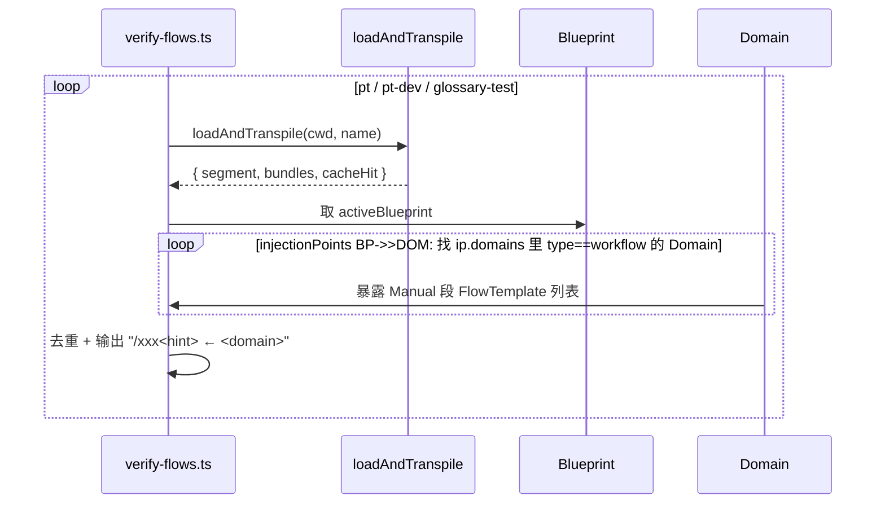

本页面是 v8 模型回归验证的**唯一权威入口**。当你修改了 `src/` 下任何一层的代码（parse / compile / render / cache / transpile），或者改动了 `.pt/assets/` 下的 Channel / Blueprint / Domain，本页描述的两条验证命令就是你必须跑通的关卡。它们不是单元测试，而是**直接调用生产入口 `loadAndTranspile()` 的端到端断言**——任何一环出问题，验证脚本都会以 `process.exit(1)` 失败收尾。

## 验证体系总览

验证脚本只有两份，均位于 `tests/verify/`目录：

| 脚本 | 角色 | 覆盖范围 | 退出码语义 |
| --- | --- | --- | --- |
| `verify-flows.ts` | 手册可达性冒烟 | 三个 Blueprint各自能触发哪些 `/xxx` 手册 | 无断言失败检测，跑完即结束 |
| `verify-phase77.ts` | v8 模型完整回归 | 八类断言（详见后文） | 任意失败 → `process.exit(1)` |

两者都通过 `import { loadAndTranspile } from "../../src/transpile.js"` 复用生产入口，不存在"验证专用通道"——**验证通过的产物就是 Pi 真实运行时注入 systemPrompt 的字符串**。

Sources: [verify-flows.ts](tests/verify/verify-flows.ts#L1-L2), [verify-phase77.ts](tests/verify/verify-phase77.ts#L1-L11), [transpile.ts](src/transpile.ts#L1-L40)

## 端到端验证链路

下图刻画两条脚本如何共同覆盖 v8 三段式链路（parse → compile → render → cache）：

```mermaid
flowchart LR subgraph assets[".pt/assets/"]
 BP1["blueprints/*.md<br/>(pt / pt-dev / glossary-test)"]
        CH1["channels/*.md<br/>(dev-knowledge / pt-dev)"]
        DOM["domains/*.md<br/>(pt-* / glossary-test)"]
    end

    subgraph src["src/ (生产代码)"]
        PARSE["parse/<br/>oxnAdapter"]
        COMPILE["compile/<br/>compileContext()"]
        CACHE["render/<br/>save/loadContext()"]
        RENDER["render/<br/>renderSystemPrompt()"]
    end

    subgraph verify["tests/verify/"]
        VF["verify-flows.ts<br/>(手册枚举)"]
        VP["verify-phase77.ts<br/>(8 项断言)"]
    end

    BP1 --> PARSE
    CH1 --> PARSE
    DOM --> PARSE
    PARSE -->|"SchemaBundle"| COMPILE
    COMPILE -->|"Context IR"| CACHE
    CACHE -->|"命中 → 用缓存<br/>未命中 → 重编译"| RENDER
    RENDER -->|"segment"| verify

    VF -.-> loadAndTranspile
    VP -.-> loadAndTranspile
```

两条脚本的区别只在断言侧：前者只打印每个 Blueprint 的可用手册清单，后者对**产物字符串 +缓存文件 + 注入点路由**做硬性匹配。

Sources: [transpile.ts](src/transpile.ts#L46-L79), [verify-flows.ts](tests/verify/verify-flows.ts#L3-L5), [verify-phase77.ts](tests/verify/verify-phase77.ts#L17-L22)

## 运行验证脚本

v8 验证**不需要先编译**——脚本通过 `tsx` 直接执行 `.ts`。这是因为 `tsconfig.json` 已声明 `"noEmit": true` 且 `package.json` 未配置 build 脚本（Pt运行时由 Pi 加载 `.ts`，见 [注入点机制与 Pi Extension 生命周期集成](9-zhu-ru-dian-ji-zhi-yu-pi-extension-sheng-ming-zhou-qi-ji-cheng)）。

```bash
# 完整回归（必跑）
npx tsx tests/verify/verify-phase77.ts

# 手册冒烟（轻量）
npx tsx tests/verify/verify-flows.ts
```

Phase 8 文档把这套用法作为**每步 commit前的门禁**：

>验证：`tsc --noEmit` 通过 + `tests/verify/verify-phase77.ts` 全过 + `tests/verify/verify-flows.ts` 全过

Sources: [tsconfig.json](tsconfig.json#L5-L6), [pt-dev-phases-v8.md](docs/pt-dev-phases-v8.md#L4-L6)

## verify-flows.ts：手册可达性冒烟

**目标**：列出"哪些 `/命令` 在每个 Blueprint 下可被触发"。这是 v8 workflow-Domain 中 FlowTemplate 的运行时投影。

执行流程：



**关键实现点**：

- **去重**：同一个 workflow-Domain 可能出现在 Blueprint 的多个 `ip.domains` 下，脚本用 `Set<string>` 去重——避免同一手册被打印多次。
- **类型筛选**：只输出 `d.type === "workflow"` 的 Domain；term-Domain / stack-Domain 的 `modules["Manual"]` 不是 FlowTemplate，不输出。
- **空清单分支**：若 Blueprint 不引用任何 workflow-Domain，输出 `(无 workflow-type Domain，无可触发手册)`。

Sources: [verify-flows.ts](tests/verify/verify-flows.ts#L4-L26)

## verify-phase77.ts：Phase 8.8 八项回归

这是真正的端到端回归。脚本主体由一个 `check(name, ok, desc)` 帮助函数驱动——任何一项失败都累加到 `failed` 计数，最终决定退出码。

| # | 检查类别 | 验证目标 | 失败典型原因 |
| --- | --- | --- | --- |
| 1 | 三 Blueprint 产物 + v8 H2 措辞 | `pt` segment 含 `parse/compile/render`；`pt-dev` segment 含 `pt-dev-flow` 但**不含业务示例**（客户/订单） | render 硬编码旧模块名；ip.domains 漏配或错配 |
| 2 | Context 缓存命中 | 第二次 `loadAndTranspile(cwd, "pt")` 必须 `cacheHit=true` 且 segment字节级一致 | `sourceHash` 计算未包含 Channel/Blueprint 任一者 |
| 3 | Channel 复用 | `dev-knowledge` Channel 被 ≥2 个 Blueprint 引用 | 误把 Channel 内联到 Blueprint；Channel 命名漂移 |
| 4 | 扩展性：glossary 假 type | `glossary-test` Blueprint 渲染出 `术语表` 段；`pt` Blueprint 不被污染 | 新 type 的 renderer 缺注册；module 装配逻辑有副作用 |
| 5 | v8 注入点 H2 落盘 | `pt-dev.context.md` 含 `## 会话知识` + `## 对话记忆`，**不含**旧 `## Scene` / `## Manual` | 序列化器仍写旧 H2；frontmatter 解析异常 |
| 6 | pt-quality 路由 | `pt-quality` 段出现在 `## 对话记忆` 与下一个 H2 之间；**不**出现在 `## 会话知识` 之后 | InjectionPointInstance.domains 写错注入点名 |
| 7 | 三 mode 产物差异 | `byDomain` 段含 `模块「」`；`byType` 段含 `业务术语`/`业务规则`；`hybrid` 段含 `全局约束` | compile 函数的 mode 分支缺失或字符串拼错 |
| 8 | Context 缓存文件落盘 | `.pt/contexts/cache/` 下存在三个 `*.context.md` 文件 | saveContext 未写盘；cacheDir 配置漂移 |

Sources: [verify-phase77.ts](tests/verify/verify-phase77.ts#L17-L161)

###类别 1：三 Blueprint 产物 + v8 H2 措辞

断言分三层：pt 含 v8 措辞、pt-dev 含开发流程、pt-dev 不含业务污染。第三条尤其重要——它保证"开发态 Blueprint"不会向 systemPrompt 注入业务示例，避免 LLM 在改 Pt 自身时混淆业务领域与框架领域。脚本用 `!results["pt-dev"].includes("客户")` 这种**反面断言**捕捉边界污染。

Sources: [verify-phase77.ts](tests/verify/verify-phase77.ts#L40-L51)

### 类别 2：Context 缓存命中

`loadAndTranspile()` 的返回值里 `cacheHit: anyHit` 标志一次完整加载是否命中了至少一个 bundle 的缓存。脚本顺序调用两次：

```typescript
const r1 = await loadAndTranspile(cwd, "pt"); // 首次写盘
const r2 = await loadAndTranspile(cwd, "pt");   // 应命中
check("pt 二次加载命中缓存", r2.cacheHit, `cacheHit=${r2.cacheHit}`);
check("缓存命中后 segment 一致", results.pt === r2.segment, ...);
```

`sourceHash` 取自 `compileContext()` 内部 `computeSourceHash(blueprint, channel, domains)`——FNV-1a 32-bit 哈希 + payload 长度，足以作缓存标识（不抗碰撞，但缓存场景不需要密码学强度）。详见 [Context 缓存序列化与 sourceHash 失效策略](16-context-huan-cun-xu-lie-hua-yu-sourcehash-shi-xiao-ce-lue)。

Sources: [verify-phase77.ts](tests/verify/verify-phase77.ts#L52-L58), [transpile.ts](src/transpile.ts#L26), [context.ts](src/compile/context.ts#L505-L526)

### 类别 3：Channel 复用

脚本**直接读 Blueprint frontmatter**（不调 transpile），用正则匹配 `## Channel` 段后的第一个非空行作为 Channel 名引用：

```typescript
const raw = await readFile(join(cwd, ".pt/assets/blueprints", f), "utf8");
const m = raw.match(/^## Channel\r?\n\r?\n(.+)/m);
```

然后统计每个 Channel 被多少 Blueprint 引用，要求 `dev-knowledge` ≥2。这条断言编码了 v8 的**复用契约**：Channel 是结构层资产，应被多个 Blueprint 引用；若全部 Blueprint 都"独占"一个 Channel，则结构层与配置层耦合。

Sources: [verify-phase77.ts](tests/verify/verify-phase77.ts#L60-L75)

### 类别 4：扩展性 — glossary 假 type

这是 v8 扩展性路径的核心断言：`glossary` 这个 Schema 没有显式声明的 `type` 字段，但只要给 Domain标 `type: glossary`，渲染器就能在 `glossary-test` Blueprint 下正确产出 `### 术语表「glossary-test」` 段，且不会污染其他 Blueprint 的 segment。

| Blueprint | segment 期望 | segment 期望（反） |
| --- | --- | --- |
| `glossary-test` | 含 `术语表` 或 `GlossaryEntry` | — |
| `pt` | — | **不**含 `GlossaryEntry` |

这条断言等价于 v8 §18 "注册新的 Domain Type 渲染器" 的可观测验证。

Sources: [verify-phase77.ts](tests/verify/verify-phase77.ts#L77-L85), [glossary-test.md](.pt/assets/domains/glossary-test.md#L1-L16), [context.ts](src/compile/context.ts#L405-L420)

### 类别 5：v8 注入点 H2 落盘

这是 v7→v8 迁移最容易遗漏的一环：旧 Context 文件 H2 是 `## Scene` / `## Manual`，新 H2 必须是 `## 会话知识` / `## 对话记忆`。脚本对**每个缓存文件**做三重断言：

```typescript
const hasHuiHuaZhiShi  = /^## 会话知识/m.test(raw);  // 必须出现
const hasDuiHuaJiYi    = /^## 对话记忆/m.test(raw);  // 必须出现
const noSceneManual    = !/^## Scene\b/m.test(raw) // 必须消失 && !/^## Manual\b/m.test(raw);
```

锚定正则必须用 `^## `（行首的 H2），否则会误中行内 `## Manual` 这种文本。

Sources: [verify-phase77.ts](tests/verify/verify-phase77.ts#L87-L101)

### 类别 6：pt-quality 路由

这条断言**不只**查 `pt-quality` 是否出现，还要查它出现在哪个 H2 段里。具体做法：

```typescript
const duiHuaIdx = ptDevCtx.indexOf("## 对话记忆");
const huiHuaIdx = ptDevCtx.indexOf("## 会话知识");
const qualityIdx = ptDevCtx.indexOf("pt-quality」");
const inContextMemory  = qualityIdx > duiHuaIdx && qualityIdx < nextH2AfterDuihua;
const notInSystemPrompt = qualityIdx < huiHuaIdx || qualityIdx > nextH2AfterHuihua;
```

它依赖 `pt-quality` Domain 渲染时产生 `术语表「pt-quality」` 这种字符串（`」` 是全角右书名号，作为断言锚点）。这要求 Blueprint 的 `injectionPoints[对话记忆].domains` 包含 `pt-quality`，且 `injectionPoints[会话知识].domains` **不**包含——前者对应 dev-knowledge Channel 的 `target: context_message`，后者对应 `target: system_prompt`。

Sources: [verify-phase77.ts](tests/verify/verify-phase77.ts#L103-L125)

### 类别 7：三 mode 产物差异

这条断言最具技巧性：它**临时改写 Channel 文件**，在三种 mode 下分别重编译，然后恢复原文件。

```mermaid
flowchart TB
    Start([开始]) --> Save["读 channelOrig<br/>备份原文件"]
    Save --> Loop{"for mode in<br/>byDomain / byType / hybrid"}
    Loop --> Replace["正则替换 mode: 字段"]
    Replace --> Write["写回 channel 文件"]
    Write --> Invalidate["清空 pt.context.md<br/>(强制重编译)"]
    Invalidate --> Reload["loadAndTranspile(cwd, 'pt')"]
    Reload --> Loop    Loop -->|done| Restore["finally: 写回 channelOrig"]
    Restore --> Assert{三组断言}
    Assert --> End([结束])
```

**关键技术细节**：

- **`try / finally` 必包**：脚本在 `finally` 里恢复原文件，避免污染仓库状态。即使 `loadAndTranspile` 抛错也会执行。
- **正则非贪婪**：`/(## 会话知识[\s\S]*?mode:\s*)\w+/m` 必须非贪婪匹配，否则会把整个文件吞掉。
- **强制重编译**：写空文件（不是删除）`pt.context.md` 是为了让下次 `loadContext` 抛 `readFile` 异常，从而触发重编译；删除文件被 `try/catch` 吞掉等效。
- **断言关键词**：每个 mode 对应一段特征性小标题——`byDomain` 出 `模块「」`，`byType` 出 `业务术语`/`业务规则`，`hybrid` 出 `全局约束`。这三个字符串是 compile 函数渲染输出时**唯一**的标记，缺一即破。

Sources: [verify-phase77.ts](tests/verify/verify-phase77.ts#L127-L153), [context.ts](src/compile/context.ts#L108-L155)

### 类别 8：Context 缓存文件落盘

最朴素的断言：`readdir(.pt/contexts/cache/)` 必须包含三个预期的 `.context.md` 文件。这是上一节 [Context 缓存序列化与 sourceHash 失效策略](16-context-huan-cun-xu-lie-hua-yu-sourcehash-shi-xiao-ce-lue) 的可观测收尾——只有真的写盘了，下次 `loadContext` 才可能命中。

Sources: [verify-phase77.ts](tests/verify/verify-phase77.ts#L155-L160)

## 断言模式与退出码

`verify-phase77.ts` 的 `check()` 帮助函数是统一的断言入口：

```typescript
function check(name: string, ok: boolean, desc: string) {
  console.log(`  ${ok ? "✅" : "❌"} ${name}: ${desc}`);
  if (!ok) failed++;
}
```

末段汇总：

```typescript
console.log(`\n=== ${failed === 0 ? "✅ 全部通过" : `❌ ${failed} 项失败`} ===`);
if (failed > 0) process.exit(1);
```

`main()` 外层还有 `main().catch(e => { console.error(e); process.exit(1); })`——任何 Promise 抛错（文件不存在、JSON 损坏）也会导致退出码非零。**CI 接入方只需看退出码**，不必解析 stdout。

Sources: [verify-phase77.ts](tests/verify/verify-phase77.ts#L18-L22), [verify-phase77.ts](tests/verify/verify-phase77.ts#L161-L164)

## 用例覆盖矩阵（v8 关键能力 ↗ 验证类别）

下表把"v8 模型承诺的关键能力"映射到"验证脚本如何观测"：

| v8 关键能力 | 验证类别 | 对应生产代码 | 失败影响 |
| --- | --- | --- | --- |
| 注入点显式化（H2=注入点） | 5、6 | [compile/context.ts](src/compile/context.ts#L52-L78) | Pi 注入点路由错位 |
| 模块级 Domain 引用 | 1、4 | [compile/context.ts](src/compile/context.ts#L67-L73) | 业务污染开发态 |
| Compilation 配置 | 8 | [render/cache.ts](src/render/cache.ts#L17-L23) | 缓存不落盘 → 永远重编译 |
| Channel 复用 | 3 | [schema.ts](src/schema.ts#L159-L168) | 结构层重复建设 |
| 三 mode 渲染 | 7 | [compile/context.ts](src/compile/context.ts#L108-L155) | 段落拼接顺序错 |
| sourceHash 失效策略 | 2 | [compile/context.ts](src/compile/context.ts#L505-L526) | 缓存永远不命中 / 永远命中 |
| FlowTemplate 手册触发 | verify-flows 整体 | [compile/context.ts](src/compile/context.ts#L485-L500) | `/命令` 不可用 |

Sources: [verify-phase77.ts](tests/verify/verify-phase77.ts#L17-L161), [verify-flows.ts](tests/verify/verify-flows.ts#L4-L26)

## 失败排查清单

验证脚本以 `❌` 标记时，按下表定位：

| 失败信息关键词 | 优先排查路径 |
| --- | --- |
| `cacheHit=false`（类别 2） | `computeSourceHash` 是否包含 Blueprint/Channel/Domains 全部三者；frontmatter 解析是否漏字段 |
| `## Scene` 残留（类别 5） | [render/cache.ts](src/render/cache.ts#L60-L84) 序列化器是否还按旧 H2 写 |
| `## 会话知识` 缺失（类别 5） | `serializeContext` 的 `modules` key 是否已切换为注入点名 |
| `pt-quality` 错位（类别 6） | [pt-dev.blueprint.md](.pt/assets/blueprints/pt-dev.blueprint.md#L36-L40) 的 `injectionPoints` 配置 |
| `byDomain`/`byType`/`hybrid` 缺失段（类别 7） | [compile/context.ts](src/compile/context.ts#L334-L420) 的 mode 分支渲染函数 |
| `*.context.md` 未落盘（类别 8） | `Blueprint.compilation.cacheDir` 拼写；`mkdir({ recursive: true })` 权限 |
| `glossary-test` 渲染异常（类别 4） | `glossary` type 是否在 `renderGlossarySceneSection` 注册（[compile/context.ts](src/compile/context.ts#L405-L420)） |

Sources: [verify-phase77.ts](tests/verify/verify-phase77.ts#L17-L161), [compile/context.ts](src/compile/context.ts#L334-L420)

## 扩展验证用例

新增断言应遵守三条约束：

1. **入口复用**：一律通过 `loadAndTranspile(cwd, blueprintName)` 拿到 segment，**不**直接调用 `compileContext()` 或 `renderSystemPrompt()`——端到端才是真正的回归。
2. **副作用清理**：若断言需要临时改写资产文件（如类别 7 的 mode 切换），必须用 `try / finally` 恢复原状，否则会污染下一个验证。
3. **退出码契约**：任意失败 → `process.exit(1)`。CI 集成只看退出码，不解析 stdout。

新增断言应**先**实现、再**后**纳入 `verify-phase77.ts`。常见的扩展方向：

- **新 mode**：在 `modeResults` 上加新键，加新 `check()` 行；正则在 [compile/context.ts](src/compile/context.ts#L108-L155) 渲染函数里加新段标题。
- **新 Blueprint**：在 `scenes` 数组加名，并在类别 1 / 类别 8 加对应断言；确保 `.blueprint.md` 文件存在。
- **新 Domain type**：写一个 `xxx-test.md` +配套 `xxx-test.blueprint.md`走类别 4 路径。

Sources: [verify-phase77.ts](tests/verify/verify-phase77.ts#L24-L26), [verify-phase77.ts](tests/verify/verify-phase77.ts#L127-L153)

## 与开发流程的衔接

`pt-dev` Blueprint 的 execute步骤把验证脚本作为"开发动作门禁"：

> 按 cite-flow 步骤执行（`tsc --noEmit` → `verify-phase77.ts` → `git commit`）

任何 Phase 8.x改动都先跑 tsc 类型检查，再跑回归，最后 commit——这是 v8 模型在 Blueprint 内置的"自检协议"，详见 [v8 四层模型：Domain→Channel→Blueprint→Context](7-v8-si-ceng-mo-xing-domain-channel-blueprint-context)。

Sources: [pt-dev.blueprint.md](.pt/assets/blueprints/pt-dev.blueprint.md#L36-L40), [pt-dev-phases-v8.md](docs/pt-dev-phases-v8.md#L103-L103)

## 下一步阅读

验证脚本触及的每一处都对应一个深入主题，建议按问题侧选读：

- 想理解 v8 IR 契约的字段来源 → [Schema 与 IR 契约（src/schema.ts）](12-schema-yu-ir-qi-yue-src-schema-ts)
- 想理解三段式链路为何这样拆 → [三段式编译架构（parse→compile→render）](8-san-duan-shi-bian-yi-jia-gou-parse-compile-render)
- 想理解缓存为何这样失效 → [Context 缓存序列化与 sourceHash 失效策略](16-context-huan-cun-xu-lie-hua-yu-sourcehash-shi-xiao-ce-lue)
- 想理解 FlowTemplate 如何展开 → [FlowTemplate 展开与变量绑定（手册机制）](17-flowtemplate-zhan-kai-yu-bian-liang-bang-ding-shou-ce-ji-zhi)
- 想加新 Domain type → [注册新的 Domain Type 渲染器](18-zhu-ce-xin-de-domain-type-xuan-ran-qi)
- 想加新数据源 → [接入新的 Source Adapter（多来源转译）](19-jie-ru-xin-de-source-adapter-duo-lai-yuan-zhuan-yi)