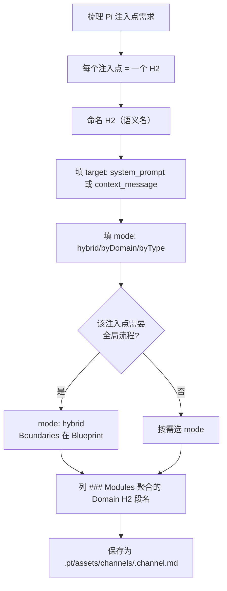
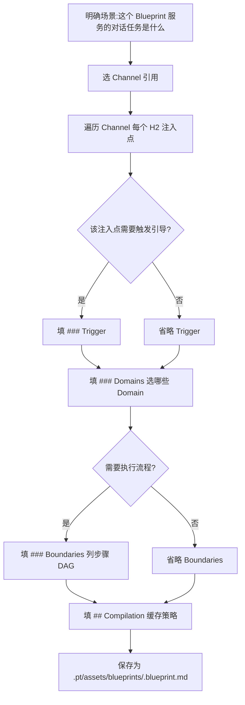

本页面聚焦 **如何编写 Pt v8 三层资产文件（Domain / Channel / Blueprint）**，回答三个核心问题：**每类资产内部写什么格式**、**字段如何映射到 IR**、**三者如何协同产出最终 Context**。这是 [资产目录约定与文件命名](3-zi-chan-mu-lu-yue-ding-yu-wen-jian-ming-ming) 的延伸——上页面讲"放哪里 / 叫什么"，本页面讲"里面写什么"。

## 三类资产的角色分工

在 v8 四层模型（Domain → Channel → Blueprint → Context）中，三类 Markdown 资产对应内容层、结构层与配置层，三者通过 H2 注入点同构串联：

```
┌──────────── 内容层 ────────────┐
│  Domain (异构领域知识) │  ← 你写 H2 段内容（Scene/Manual/Term/…）
│  - frontmatter.type 决定段格式   │
│  - H2 段是开放模块（供给侧）       │
└───────────────┬───────────────┘
                │ 提供 H2 段
                ▼
┌──────────── 结构层 ────────────┐
│  Channel (编译上下文通道)         │  ← 你声明注入点（target + modules + mode）
│  - 每个 H2 = 一个 Pi 注入点       │
│  - ### Modules 列 Domain H2 段名 │
└───────────────┬───────────────┘
                │ 复用结构
                ▼
┌──────────── 配置层 ────────────┐
│  Blueprint (通道蓝图)            │  ← 你按注入点选 Domain + Trigger/Boundaries + Compilation
│  - H2 与 Channel 同名（实例化）    │
│  - ## Compilation 管缓存策略 │
└───────────────┬───────────────┘
                │ 编译
                ▼
┌──────────── 产物层 ────────────┐
│  Context (注入到 Pi 的内容)       │  ← 不需手写，由 compileContext() 生成
│  - 按注入点聚合多 Domain 内容       │
│  - 缓存文件 <cacheDir>/*.context.md │
└───────────────────────────────┘
```

简言之：**Domain 写内容、Channel 声明结构、Blueprint 选内容并声明编译方式**。三者通过同名 H2 注入点（语义名）形成映射：Channel `## 会话知识` 是定义，Blueprint `## 会话知识` 是实例化，Context `## 会话知识` 是产物。

Sources: [src/schema.ts](src/schema.ts#L82-L260)、[docs/pt-asset-layering.md](docs/pt-asset-layering.md#L1-L80)

---

## Domain 资产编写：内容层的异构知识容器

Domain 是**异构领域知识**的最小承载单元。每个 Domain 一个 md 文件，frontmatter 用 `type` 标签区分内容性质，H2 段名是**开放的**——你新增 H2 段名不会破坏解析，但需要在 Channel 里显式声明才能进注入点。

### frontmatter 最小契约

| 字段 | 必填 | 取值 | 用途 |
|---|---|---|---|
| `type` | ✅ | `term` / `workflow` / `stack` / 扩展类型 | 决定各 H2 段**内部**字段解析规则 |
| `name` | ⚠️ 推荐 | 字符串 | Blueprint 引用本 Domain 的标识；若省略则从文件名去后缀推导 |

四种内置 type 的语义边界：

| Type | H2 `## Scene` 解析为 | H2 `## Manual` 解析为 | 典型场景 |
|---|---|---|---|
| **term** | `Term[]`（公理 / 概念） | `Rule[]`（规则：invariant / ban） | 业务术语、设计原则、规范约束 |
| **workflow** | `{ externals: ExternalRef[] }`（数据源） | `FlowTemplate[]`（可触发手册 +步骤） | 流程步骤、可执行手册 |
| **stack** | `ToolRef[]`（工具 + role + operations） | 空 | 技术栈声明、运行时工具清单 |
| **glossary** / 扩展 |走通用 fallback（Term形态） | 通用 fallback（Rule 形态） | 扩展 type 走通用 renderer，需自定义 |

扩展 type 的关键：Pt 主循环不识别时自动走通用 fallback（term 形态）——若需要更精细的渲染形态，可在 `src/compile/context.ts` 注册专属 renderer（见 [注册新的 Domain Type 渲染器](18-zhu-ce-xin-de-domain-type-xuan-ran-qi)）。

Sources: [src/parse/domain.ts](src/parse/domain.ts#L1-L70)、[.pt/assets/domains/pt-concepts.md](.pt/assets/domains/pt-concepts.md#L1-L5)

### H2 段的开放性与字段约定

Domain 用 H2 段切内容模块。**段名是开放的**（`## Scene` / `## Manual` / `## Term` / `## Glossary` / 任意扩展名）。Pt 按 H2 名读段，**不硬编码**。同一 Domain 的不同 H2 段可被不同 Blueprint 选进不同注入点。

#### `## Scene` 段（公理层 / What）

段内每个 H3 项是一个 Item：

```markdown
## Scene

### Pt是什么
- desc: Pi 扩展，把业务知识资产（OXN MD 文件）转译成 Pi Agent 用的 System Prompt

### v8 四层模型
- desc: Domain（内容层）+ Channel（结构层）+ Blueprint（配置层）+ Context（产物层）
```

**字段约定（按 type 区分）**：

| Type | Scene 项必填字段 | 可选字段 | 解析后类型 |
|---|---|---|---|
| term | `desc` | （扩展字段保留原样） | `Term { name, desc }` |
| workflow | `path` | `desc` | `ExternalRef { name, path, desc? }` |
| stack | （任一） | `role`、`operations: [a, b]` | `ToolRef { name, role?, operations? }` |
| glossary / 扩展 | `desc` | — | `Term { name, desc }`（fallback） |

#### `## Manual` 段（规则层 / Why）

段内每个 H3 项是一条规则：

```markdown
## Manual

### inv-layer-boundary
- slot: global
- type: invariant
- check: parse / compile / render 三层职责互不渗透

### dispatch-task-checklist
- items: [必读段已指明文档位置, 设计原则含"必须守住"的约束, 步骤含验收标准]
```

**Rule 字段对照**：

| 字段 | 类型 | 必填 | 说明 |
|---|---|---|---|
| `slot` | string | ⚠️ | 挂到哪个 slot；`global` 表示跨模块聚合 |
| `type` | `ban` / `invariant` | ⚠️ | `ban` 是禁止项（需 `items` 列具体值），`invariant` 是不变量 |
| `check` | string | ✅ | 规则描述（人类可读） |
| `items` | string[] | ban 时推荐 | 禁止的具体项（与 `check` 配合生成提示词里的 `[ ] 禁止...`） |

**Rule → Context Message渲染**（v8 修复的关键点）：当 Blueprint 把 `term` type 的 Domain 选进 `target=context_message` 注入点时，term-Manual 不再是被忽略的死代码——它会被渲染成 `- [ ] check 内容`（invariant）或 `- [ ] check：items.join`（ban）的对话记忆条目。

#### workflow-Domain 的 `## Manual` 特殊字段

workflow type 的 `## Manual` 段是 **FlowTemplate 手册库**，每条 H3 项都是一个可触发的手册：

```markdown
## Manual

### transpile
- argument-hint: <blueprint-name>
- intent: 把 Blueprint {{blueprint-name}} 转译成 System Prompt + Context Message
- vars: [blueprint-name]
- step: 读 .pt/assets/domains/ 下所有 .md → parse/domain.ts 每个解析为 Domain IR
- step: 调 compile/context.ts 的 compileContext() → Context IR
- step: render/system-prompt.ts 遍历注入点 → System Prompt 字符串
```

**FlowTemplate 字段**：

| 字段 | 必填 | 说明 |
|---|---|---|
| `argument-hint` | 否 | 用户参数提示（如 `<blueprint-name>`），渲染为 `/**transpile** <blueprint-name>` |
| `intent` | ✅ | 数据语义层：带 `{{}}` 占位符的前提 |
| `vars` | 否 | 占位符列表（手工冗余，便于人读；实际替换由 `{{name}}` 自动识别） |
| `step` | ✅×N | 手册步骤，每条一行（同名 H3 下允许多条 `- step:` 行） |

Sources: [src/parse/domain.ts](src/parse/domain.ts#L21-L132)、[src/parse/shared.ts](src/parse/shared.ts#L163-L205)、[.pt/assets/domains/pt-dev-flow.md](.pt/assets/domains/pt-dev-flow.md#L14-L52)

### Domain 编写实战对照表

下表展示从**人话描述**到**Domain md**的转化过程——这是写 Domain 的核心心智模型：

| 你想表达什么 | 应写在哪个 H2 段 | type | 字段 |
|---|---|---|---|
| "Pt 是一个什么工具" | `## Scene` | term | `### Pt 是什么 - desc: ...` |
| "做 X 任务的第 1/2/3 步" | `## Manual` | workflow | `### X - step: ... - step: ...` |
| "禁止用震惊/必看这种标题党词" | `## Manual` | term | `### ban-title-party - items: [震惊, 必看] - desc: ...` |
| "代码必须通过 tsc --noEmit" | `## Manual` | term | `### inv-tsc - type: invariant - check: ...` |
| "项目用 typescript + tsx 跑测试" | `## Scene` | stack | `### typescript - role: ...` |
| "可读 ./data/credit-limits.xlsx" | `## Scene` | workflow | `### credit-limits - path: ./data/credit-limits.xlsx` |

**判断方法**：
- 内容是"事实 / 概念" → Scene- 内容是"规则 / 步骤" → Manual
- 内容是"工具 / 运行时" → type=stack，进 Scene
- 内容是"流程步骤 + 数据源" → type=workflow

Sources: [src/parse/domain.ts](src/parse/domain.ts#L21-L132)、[.pt/assets/domains/pt-concepts.md](.pt/assets/domains/pt-concepts.md#L7-L33)

---

## Channel 资产编写：注入点结构的声明

Channel 是**编译上下文通道**——它**只管结构**，不管选哪些 Domain、也不管触发条件。一个 Channel 可被多个 Blueprint 复用，因为 Trigger/Boundaries 在 Blueprint 里（不在 Channel）。

### frontmatter 最小契约

| 字段 | 必填 | 取值 | 说明 |
|---|---|---|---|
| `name` | ⚠️ 推荐 | 字符串 | Channel 名（Blueprint 引用本 Channel 用此名）；省略则从文件名去 `.channel` 后缀 |

Channel 的 frontmatter **只承载 `name`**——它没有 `type` 字段（结构层没有内容异构的概念）。`# pt-dev (channel)` 这种 H1 标题可有可无，只是人读友好。

### H2 = 注入点（核心契约）

**Channel 的每个 H2（除 v7 残留段外）= 一个 Pi 注入点**。这是 v8 相对 v7 的核心显式化。注入点 = Pi Agent 的一个上下文注入位置（`system_prompt` / `context_message` / 未来扩展）。

```markdown
---
name: pt-dev
---

## 会话知识
target: system_prompt
mode: hybrid
### Modules
- Scene

## 对话记忆
target: context_message
### Modules
- Manual
```

### Channel H2 段字段表

| 字段 | 必填 | 取值 | 作用 |
|---|---|---|---|
| `target` | ✅ | `system_prompt` / `context_message` / 扩展字符串 | 注入到 Pi 的哪个上下文位置（render 按此分发） |
| `mode` | 否 | `byDomain` / `byType` / `hybrid` | System Prompt 聚合方式；context_message 类注入点无意义 |
| `### Modules` | 否（默认 `["Scene"]`） | `-<H2 段名>` 列表 | 本注入点**参与聚合的 Domain H2 段名**（裸名，无符号序号） |

**三种 mode 的语义**：

| Mode | 渲染行为 | 适用场景 |
|---|---|---|
| `byDomain` | 按 Domain 分块，每个 Domain 一个 `### 模块「name」` 段，模块内聚合各 H2 段 | 单一主题下多个 Domain 内容互不混 |
| `byType` | 跨 Domain 聚合——把所有 term 的术语集中成一个 `### 业务术语` 段、规则集中成 `### 业务规则` 段 | 多 Domain 同质内容（如统一术语表） |
| `hybrid`（默认） | byDomain + 全局约束 + 流程段拼接；先输出 trigger + global rules +流程，再按 byDomain渲染 | 复杂任务需要流程导引 + 模块知识 |

### Modules 列表的本质`### Modules` 列出的不是 Domain 名，而是 **Domain 的 H2 段名**。例如：

```markdown
## 会话知识
target: system_prompt
### Modules
- Scene #聚合所有被引用 Domain 的 ## Scene 段
- Term        # 也聚合 ## Term 段（开放扩展）

## 对话记忆
target: context_message
### Modules
- Manual      # 聚合所有被引用 Domain 的 ## Manual 段
```

这意味着同一个 Domain 可以**同时贡献多个 H2 段**到不同注入点——比如 term-Domain 的 `## Scene` 进会话知识、`## Manual` 进对话记忆。Channel 通过 H2 段名决定"哪部分内容去哪里"，Blueprint 通过 `### Domains` 决定"哪些 Domain 被引用"。

Sources: [src/parse/channel.ts](src/parse/channel.ts#L1-L83)、[.pt/assets/channels/pt-dev.channel.md](.pt/assets/channels/pt-dev.channel.md#L1-L17)、[src/compile/context.ts](src/compile/context.ts#L103-L155)

### Channel 编写流程



**实战要点**：
- H2 名用**语义名**（会话知识 / 对话记忆 / 任务上下文），不是技术名（system_prompt / context_message）——技术名放 `target` 字段
- `target` 字段是**语义名到技术名的桥梁**，render 按 target 分发而非硬编码 H2 名
- 加新注入点 = Channel 加新 H2 + target + Modules，**不改 render 代码**（v8 通用化的核心收益）

---

## Blueprint 资产编写：按注入点选 Domain + 编译方式

Blueprint 是**真正可执行的通道配置**——它把 Channel 的结构 + 自己选定的 Domain 组合 + Trigger/Boundaries + Compilation（缓存策略）封装成一个可激活的蓝图。

### frontmatter 最小契约

| 字段 | 必填 | 取值 | 说明 |
|---|---|---|---|
| `name` | ⚠️ 推荐 | 字符串 | Blueprint 名（用户面命令、Context 文件名、cache 文件名都引用此名） |

Blueprint 没有 `type` 字段，但通常以 `name: <blueprint-name>` 显式写在 frontmatter——避免文件名包含后缀导致的歧义。

### H2 = 注入点实例化（与 Channel 同名）

Blueprint 的 H2 必须与所引用 Channel 的 H2 同名（且一一对应）——这是 Channel 与 Blueprint 配对的硬性约定。Blueprint 在同名 H2 下做三件事：

1. **`### Domains`**：列出参与本注入点的 Domain（模块级引用）
2. **`### Trigger`**：本注入点的触发条件（实例级）
3. **`### Boundaries`**：本注入点的流程节点 DAG（实例级）

```markdown
---
name: pt-dev
---

## Channel

pt-dev

## 会话知识

### Domains
- pt-architecture
- pt-stack
- pt-concepts

### Trigger
当用户要开发/修改 Pt 自身（改 IR、改资产、扩展 Domain Type）时按以下流程回答；其余对话正常响应，勿套用本流程。

### Boundaries
### identify-task
- deps: []
- desc: 识别开发任务类型### cite-stack
- deps: [identify-task]
- desc: 按任务类型从 pt-stack 引用相关技术栈

### execute
- deps: [cite-stack]
- desc: 按流程执行（tsc → verify → commit）

## 对话记忆

### Domains
- pt-dev-flow
- pt-collab
- pt-quality

## Compilation

cache-dir: .pt/contexts/cache/
split: single-file
```

### Blueprint H2 段字段表

|字段 | 必填 | 位置 | 说明 |
|---|---|---|---|
| `## Channel` | ✅ | 顶级 H2 | 引用 Channel 名（裸值，第一个非空非 `-` 非 `#` 的行） |
| `### Domains` | ⚠️ | 每个注入点 H2 下 | 参与本注入点的 Domain 名（裸名列表） |
| `### Trigger` | 否 | 每个注入点 H2 下 | 本注入点的触发条件（裸文本或 H3 形式） |
| `### Boundaries` | 否 | 每个注入点 H2 下 | 流程节点 DAG（H3 子项 → BoundaryNode） |
| `## Compilation` | 否（默认 `single-file`） | 顶级 H2 | 编译方式（`cache-dir` + `split`） |

Sources: [src/parse/blueprint.ts](src/parse/blueprint.ts#L1-L101)、[.pt/assets/blueprints/pt-dev.blueprint.md](.pt/assets/blueprints/pt-dev.blueprint.md#L1-L49)

### Boundaries 段字段详解

Boundaries 是**实例级的执行流程 DAG**，每个 H3 子项是一个 BoundaryNode：

```markdown
### Boundaries
### step-1-name
- deps: []
- desc: 第一步做什么

### step-2-name
- deps: [step-1-name]
- desc: 第二步做什么，依赖 step-1-name
```

|字段 | 必填 | 取值 | 说明 |
|---|---|---|---|
| `deps` | ✅ | `[step-1, step-2]` 或 `[]` 或单值 `step-1` | 前置 slot 名列表 |
| `desc` | ⚠️ 推荐 | 字符串 | 步骤描述 |

Boundaries 在 render 时被编译成 `### 流程` 段，步骤用 `① ② ③` 编号，并用 `← 依赖 ①` 标注依赖关系。

### Compilation 段详解（v8 新增）

```markdown
## Compilation

cache-dir: .pt/contexts/cache/
split: single-file
```

| 字段 | 必填 | 取值 | 默认 | 说明 |
|---|---|---|---|---|
| `cache-dir` | 否 | 相对路径字符串 | `.pt/contexts/cache/` | Context 物理缓存目录 |
| `split` | 否 | `single-file` / `by-injection-point` | `single-file` | 缓存拆分策略 |

**两种 split 的差异**：

| 策略 | 文件结构 | 失效粒度 | 何时用 |
|---|---|---|---|
| `single-file` | `<name>.context.md`（含所有注入点） | 整体 | 默认，Context 小 |
| `by-injection-point` | `<name>.<ipName>.md`（每注入点一文件） | 注入点级（改会话知识不影响对话记忆缓存） | Context 大或多注入点并行编辑 |

Sources: [src/parse/blueprint.ts](src/parse/blueprint.ts#L215-L226)、[docs/pt-asset-layering.md](docs/pt-asset-layering.md#L312-L323)

### Blueprint 编写流程



**实战要点**：
- 一个 Channel 可被多个 Blueprint 复用——`dev-knowledge.channel.md` 同时被 `pt.blueprint.md` 和 `glossary-test.blueprint.md` 引用
- Trigger/Boundaries 在 Blueprint 而不在 Channel——因为它们是**实例级**内容（每个 Blueprint 各有不同触发条件）
- 模块级 Domain 引用是 v8 的核心收益：可以让 `pt-quality` Domain 只出现在 `对话记忆` 注入点而不污染 `会话知识` 注入点（v7 粗粒度做不到）

---

## 端到端示例：从需求到 Context产物

下表演示一个**完整流程**：从"我想做一个 Pt 知识问答"的需求出发，按三类资产依次编写，并展示编译产物。

### 步骤 1：编写 Domain（内容素材）

```markdown
# .pt/assets/domains/pt-concepts.md
---
type: term
name: pt-concepts
---

# pt-concepts

## Scene

### Pt 是什么
- desc: Pi 扩展，把 OXN MD 文件转译成 Pi Agent 用的 System Prompt

### v8 四层模型
- desc: Domain（内容层）+ Channel（结构层）+ Blueprint（配置层）+ Context（产物层）

## Manual

### inv-layer-boundary
- slot: global
- type: invariant
- check: parse / compile / render 三层职责互不渗透
```

### 步骤 2：编写 Channel（注入点结构）

```markdown
# .pt/assets/channels/dev-knowledge.channel.md
---
name: dev-knowledge
---

## 会话知识
target: system_prompt
mode: hybrid
### Modules
- Scene

## 对话记忆
target: context_message
### Modules
- Manual
```

### 步骤 3：编写 Blueprint（实例化）

```markdown
# .pt/assets/blueprints/pt.blueprint.md
---
name: pt
---

## Channel

dev-knowledge

## 会话知识

### Domains
- pt-concepts

### Trigger
当用户询问 Pt 自身相关知识时按以下流程回答。

### Boundaries
### identify-topic
- deps: []
- desc: 识别用户问题类别

### cite-domain
- deps: [identify-topic]
- desc: 按类别从 pt-concepts 引用## 对话记忆

### Domains
- pt-concepts

## Compilation

cache-dir: .pt/contexts/cache/
split: single-file
```

### 步骤 4：激活 Blueprint 看 Context产物

用 `/pt-context pt` 激活（或在 `.pi/settings.json` 写 `au.pt-context: pt`）。Pt 会编译产出 `.pt/contexts/cache/pt.context.md`：

```markdown
# pt.context.md（自动生成，你不需要手写）

## 会话知识
> 当用户询问 Pt 自身相关知识时按以下流程回答。

### 流程
① **identify-topic** — 识别用户问题类别
② **cite-domain** — 按类别从 pt-concepts 引用 ← 依赖 ①

### 模块「pt-concepts」
**术语**
- **Pt 是什么**：Pi 扩展，把 OXN MD 文件转译成 Pi Agent 用的 System Prompt
- **v8 四层模型**：Domain（内容层）+ Channel（结构层）+ Blueprint（配置层）+ Context（产物层）

## 对话记忆
### 模块「pt-concepts」
- [ ] parse / compile / render 三层职责互不渗透
```

产物由 `compileContext()`（`src/compile/context.ts` 第54 行）生成、`renderSystemPrompt()`（`src/render/system-prompt.ts` 第 13 行）格式化。

Sources: [src/compile/context.ts](src/compile/context.ts#L54-L86)、[src/render/system-prompt.ts](src/render/system-prompt.ts#L1-L23)、[.pt/contexts/cache/pt.context.md](.pt/contexts/cache/pt.context.md#L1-L100)

---

## 三类资产字段速查表

| 资产 | 段位置 | 字段 | 必填 | 取值/格式 |
|---|---|---|---|---|
| Domain | frontmatter | `type` | ✅ | `term` / `workflow` / `stack` / 扩展字符串 |
| Domain | frontmatter | `name` | ⚠️ 推荐 | 字符串（Blueprint 引用标识） |
| Domain | `## Scene` H3 项 | `desc` | term/glossary 必填 | 字符串 |
| Domain | `## Scene` H3 项 | `path` | workflow 必填 | 文件/API 路径 |
| Domain | `## Scene` H3 项 | `role` / `operations` | stack 可选 | 字符串 / 字符串数组 |
| Domain | `## Manual` H3 项 | `slot` | ⚠️ | 字符串（`global` 表示跨模块） |
| Domain | `## Manual` H3 项 | `type` | ✅ | `ban` / `invariant` |
| Domain | `## Manual` H3 项 | `check` | ✅ | 字符串（规则描述） |
| Domain | `## Manual` H3 项 | `items` | ban 推荐 | 字符串数组（具体禁止项） |
| Domain (workflow) | `## Manual` H3 项 | `argument-hint` / `intent` / `vars` / `step` | ✅/✅/否/✅×N | 字符串 / 字符串 / 数组 / 多行 |
| Channel | frontmatter | `name` | ⚠️ 推荐 | 字符串（Blueprint 引用标识） |
| Channel | `## <IP>` H2 | `target` | ✅ | `system_prompt` / `context_message` / 扩展 |
| Channel | `## <IP>` H2 | `mode` | 否 | `byDomain` / `byType` / `hybrid` |
| Channel | `## <IP>` H2 下 | `### Modules` | 否 | `- <H2段名>` 列表 |
| Blueprint | frontmatter | `name` | ⚠️ 推荐 | 字符串（Context 文件名 / 命令名） |
| Blueprint | 顶级 H2 | `## Channel` | ✅ | 裸值（Channel 名） |
| Blueprint | 注入点 H2 下 | `### Domains` | ⚠️ | `- <Domain 名>` 列表 |
| Blueprint | 注入点 H2 下 | `### Trigger` | 否 | 裸文本或 H3 项 |
| Blueprint | 注入点 H2 下 | `### Boundaries` | 否 | H3 子项：`- deps: [] - desc: ...` |
| Blueprint | 顶级 H2 | `## Compilation` | 否 | `cache-dir: <path>` + `split: <strategy>` |

Sources: [src/schema.ts](src/schema.ts#L82-L260)、[src/parse/domain.ts](src/parse/domain.ts#L1-L153)、[src/parse/channel.ts](src/parse/channel.ts#L1-L83)、[src/parse/blueprint.ts](src/parse/blueprint.ts#L1-L248)

---

## 常见编写错误与排查

| 错误现象 | 根因 | 修复 |
|---|---|---|
| Context 产物里没有我加的 Domain | Blueprint `### Domains` 没列该 Domain；或 Channel `### Modules` 列的 H2 段名 Domain 里没有 | 检查 `### Domains` 列表 + Domain 的 H2 段名是否在 Channel `### Modules`列表里 |
| 注入点全空 | Blueprint 的 H2 与 Channel 的 H2 **不同名**——同名是实例化的硬约定 | 把 Blueprint 的 H2 改成与 Channel H2 完全一致的字符串 |
| Term-Domain 的 Manual 在 System Prompt 段渲染不出来 | Channel `### Modules` 列表只列了 `Scene`，没列 `Manual` | 给 target=context_message 的注入点另起一个 H2 + `### Modules: - Manual` |
| Boundaries 的依赖箭头没渲染 | `### Boundaries` 下的 H3 项缺 `deps:` 字段 | 每个 BoundaryNode H3 下必须写 `- deps: [step-name]` 或 `- deps: []` |
| 缓存命中后改 Blueprint 不生效 | `.pt/contexts/cache/` 里旧 Context 没清，sourceHash 路径有缓存命中 | 删 `<cacheDir>/<name>.context.md` 强制重编译；或改 `## Compilation.cache-dir` 换个目录 |
| 加了 type=新类型但 Scene 渲染空 | 没在 `src/compile/context.ts` 注册专属 renderer | 调 `registerDomainSceneRenderer("新type", fn)`，或在 `domainSceneRenderers` 对象加一行；走通用 fallback 也可（输出 term 形态） |
| `name` 推导错了 | frontmatter 缺 `name`、文件名有后缀，fallback 用了文件名 | 显式写 `name: <期望值>`（这是 Blueprint 引用 Channel/Domain 的唯一标识） |
| `## Channel` 段引用不到 Channel | Channel 文件名没 `.channel` 后缀，或文件名与引用名不一致 | 文件名用 `<name>.channel.md`，Blueprint `## Channel` 段下写裸值 `<name>` |
| 运行时 `[pt] parse <dir>/<file> failed` | frontmatter YAML 格式错（如 `:` 后多空格、字段名拼错） | 检查 frontmatter 三横线包裹 + 每行 `key: value` 格式 |

Sources: [src/parse/index.ts](src/parse/index.ts#L83-L94)、[src/parse/shared.ts](src/parse/shared.ts#L78-L100)、[src/compile/context.ts](src/compile/context.ts#L330-L338)

---

## 验证闭环：写完资产怎么确认生效

资产写完后，按以下顺序验证：

1. **静态解析检查**——跑 `tsc --noEmit` 看类型错误，parse/compile/render 三层都可能因 IR 字段变化报错
2. **运行验证脚本**——`tests/verify/verify-phase77.ts` 跑四 Blueprint 产物语义等价 + 缓存命中 + Channel 复用 +扩展性（glossary-test Blueprint）
3. **激活 Blueprint 看产物**——`/pt-context pt` 激活 + `/pt status` 看激活状态 + `/pt full` 看完整产物字符串
4. **看物理 Context 文件**——`.pt/contexts/cache/<name>.context.md`（v8 修复后 term-Manual 也能正确渲染）

```mermaid
flowchart LR
    A[写/改资产 md] --> B[tsc --noEmit]
    B --> C{类型错?}
    C -->|是| D[改 src/schema.ts 或 parse 层]
    C -->|否| E[verify-phase77.ts]
    D --> B
    E --> F{产物语义错?}
    F -->|是| G[检查字段映射/段名/引用关系]
    F -->|否| H[/pt-context 激活]
    G --> A
    H --> I[/pt full 看产物]
    I --> J{符合预期?}
    J -->|否| A
    J -->|是| K[Phase X.Y: 提交]
```

Sources: [tests/verify/verify-phase77.ts](tests/verify/verify-phase77.ts#L1-L100)、[src/index.ts](src/index.ts#L165-L200)

---

## 下一步建议

掌握三类资产编写后，建议按以下顺序继续阅读：

- **调试**：用 [常用命令与调试输出](5-chang-yong-ming-ling-yu-diao-shi-shu-chu) 验证加载与转译是否正确。
- **看产物**：用 [查看与导出转译产物（/pt status|raw|full|flows）](6-cha-kan-yu-dao-chu-zhuan-yi-chan-wu-pt-status-raw-full-flows) 看 Context 编译结果。
- **深入架构**：当你想知道"为什么这样分层"，读 [v8 四层模型：Domain→Channel→Blueprint→Context](7-v8-si-ceng-mo-xing-domain-channel-blueprint-context) — 本页面提到的所有设计动机都在那里。
- **解析细节**：想知道"解析器到底怎么读我的 frontmatter / H2/H3"，读 [解析前端：MD 词法与 H2/H3 切分](13-jie-xi-qian-duan-md-ci-fa-yu-h2-h3-qie-fen)。
- **扩展**：加新 Domain Type 时读 [注册新的 Domain Type 渲染器](18-zhu-ce-xin-de-domain-type-xuan-ran-qi)；接入其他来源（YAML/API）时读 [接入新的 Source Adapter（多来源转译）](19-jie-ru-xin-de-source-adapter-duo-lai-yuan-zhuan-yi)。