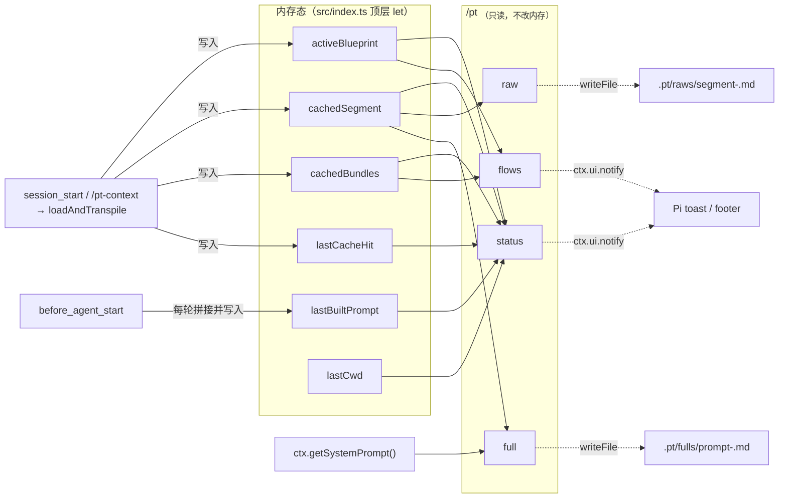
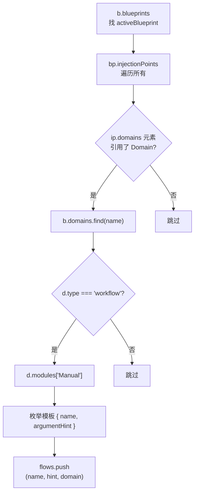

`/pt` 是 Pt 在 Pi Agent 内置的"检查与导出"入口，专注于把已经缓存到内存里的转译产物**就地可视或落盘**，而不是再跑一次转译。本页把这四个子命令（`status`、`raw`、`full`、`flows`）的输入来源、输出形态、典型用法一次讲清楚——它们全部读 `src/index.ts` 顶层的几个 `let` 变量（`activeBlueprint` / `cachedSegment` / `cachedBundles` / `lastBuiltPrompt` / `lastCacheHit` / `lastCwd`），**不写回任何 in-memory 状态**（除了 `lastCacheHit` 由 `transpileActive` 在 `session_start` 或 `/pt-context` 时设置）。

读到这里，你应该已经知道 [`/pt-context`](5-chang-yong-ming-ling-yu-diao-shi-shu-chu) 是如何切换 Blueprint 并填充这份内存态的；接下来我们只看这四个检查口子本身。

## 一、四个子命令的共同解剖`/pt` 命令注册在 `src/index.ts` 的 `pi.registerCommand("pt", ...)`，handler 入口首先做 `args.trim().toLowerCase()` 再分发。**无参 `/pt` 等价于 `/pt status`，并且会多发一条 notify 把完整 `cachedSegment` 贴出来**——这是肉眼快查段内容最方便的口子。



这张图揭示一个关键事实：**所有四个子命令都只读不写**，因此可以反复调用而不会污染内存态；写文件的两个子命令只是把内存里的字符串 snapshot 到磁盘，便于事后比对、归档或喂给外部 prompt diff工具。

Sources: [src/index.ts](src/index.ts#L19-L27), [src/index.ts](src/index.ts#L57-L67), [src/index.ts](src/index.ts#L164-L259)

## 二、共享的"数据源头表"

下表给出每个子命令实际读哪些字段，方便排查"为什么 `/pt status` 显示 `(未激活)`"这类问题。

| 子命令 | 读 | 来源变量 | 调试语义 |
|---|---|---|---|
| `status` | activeBlueprint、cachedBundles（domains/channels/blueprints计数 + workflows.Manual 计数）、cachedSegment.length、lastCacheHit、lastBuiltPrompt?.length、lastCwd | `src/index.ts#L168-L194` | 整个 session 的健康度快照 |
| `flows` | 每个 cachedBundle 的 `blueprints[activeBlueprint].injectionPoints[*].domains[*]` → workflow-type Domain 的 `modules["Manual"]` | `src/index.ts#L196-L222` | 当前 Blueprint 下 `/name` 路由覆盖范围 |
| `raw` | `cachedSegment` | `src/index.ts#L223-L233` | Pt 自己产出的那段干净 markdown（已剥 `<!-- ===== -->` 分隔注释） |
| `full` | `ctx.getSystemPrompt()` + `cachedSegment`（现拼，不读 `lastBuiltPrompt`） | `src/index.ts#L235-L256` | Agent 实际收到的完整 systemPrompt 字符串 |

> **`full` 为什么不用 `lastBuiltPrompt`？** 因为它只有在发过一轮对话后才被 `before_agent_start` 写入，切换 Blueprint 后立即调 `/pt full` 会读到旧 Blueprint 的 prompt。`full` 的实现改成现场拼——`base + "\n\n## 当前任务上下文\n\n" + cachedSegment`——保证"现在激活的是啥、`/pt full` 看到的就是啥"。

Sources: [src/index.ts](src/index.ts#L168-L259)

## 三、`/pt status`（含裸 `/pt`）

### 输出现场

六个字段用 ` | `拼成一行 info 级通知，例如：

```
pt context: pt-dev | pt domains: 8, channels: 2, blueprints: 3, flows: 4
| pt segment length: 6983 chars | pt cache hit: no
| pt last built prompt: 12450 chars | pt cwd: /Users/issac/pro/pt
```

### 字段解读对照表

| 字段 | 读自 | 为空/异常时 | 排查方向 |
|---|---|---|---|
| `pt context: <name>` | `activeBlueprint` | `(未激活)` | 从未 `transpileActive` 成功；查 `session_start` notify 与资产目录 |
| `pt domains / channels / blueprints / flows` | `cachedBundles` 三个数组 `.length` + workflow-type Domain 下 `modules["Manual"]` 模板数 | 全为 0 |资产目录为空；查 `.pt/assets/{domains,channels,blueprints}/` |
| `pt segment length: <n> chars` | `cachedSegment.length` | `0` | `cachedSegment` 为空（无 Blueprint 或编译失败） |
| `pt cache hit: yes/no` | `lastCacheHit` | 总是 `no` |每次启动都重编译；查 `Blueprint.compilation.cacheDir` 与 `sourceHash` 计算 |
| `pt last built prompt: <n> chars` | `lastBuiltPrompt.length` | `(未跑过 turn)` | 本 session 未触发过 `before_agent_start` |
| `pt cwd: <path>` | `lastCwd` | — | 检查当前进程实际 cwd，与资产目录预期比对 |

### 裸 `/pt` 的额外行为

当 `sub === ""` 且 `cachedSegment` 非空，handler 会**额外发一条 notify 把完整 segment 贴出来**——等价于"先 status，再 raw 的内容但不落盘"。这对终端极宽的开发者或调试 plugin 是最快的肉眼检查方式。

Sources: [src/index.ts](src/index.ts#L168-L194)

## 四、`/pt flows`

### 输出现场

```
可用手册（输入 /手册名 参数 触发 Context Message）:
  /risk-check <客户ID> <金额>  ← pt-dev-flow
  /quote-tier <客户ID>  ← pt-dev-flow
  /explain-axiom <术语>  ← pt-concepts
```

### 它到底在遍历什么

不是全 bundle扫 `type=workflow` 的 Domain；也不是扫描当前 Blueprint 的所有 `modules`。它严格走"注入点 → Domain → FlowTemplate"这条链路：



注意 `IPS` 上**没有过滤 `target === 'context_message'`**——这一点与 FlowTemplate 的实际触发逻辑（`input` 事件走 `findFlowInBundle`，那里用的是 `injectionPoints.filter(ip => ip.domains.length > 0)`）略有不同。当前实现把任意含 domains 的注入点都纳入列表；如果你看到 `/pt flows` 列了某条 `/name` 但实际不会触发，多半是 `target` 不匹配或 input 事件 fallback 给了 Pi 原生 `$1 $2`。

### 触发与展开的区别

`/pt flows` 只列名，**不展开模板**。真正把 FlowTemplate + 用户参数渲染成完整手册 markdown的是 `bindFlowTemplate(tpl, args)`（`src/render/context-message.ts#L67-L100`），由 `input` 事件拦截调用。展开后的形态是 `# name` + `_参数_` + `## 前提` + `## 步骤` 四段，`{{var}}` 占位符被替换为参数 token，缺变量则保留字面量（不抛错）。

### 何时显示空

`cachedBundles` 为空时返回 `无激活 Blueprint，先用 /pt-context <name> 激活`；遍历完发现0 条则返回 `当前 Blueprint 无可触发手册（target=context_message 注入点无 workflow-type Domain）`。

Sources: [src/index.ts](src/index.ts#L196-L222), [src/render/context-message.ts](src/render/context-message.ts#L131-L149)

## 五、`/pt raw`

### 行为

把 `cachedSegment` 写到 `<cwd>/.pt/raws/segment-<Date.now()>.md`，并弹 info 通知 `已写入 <path>（<n> chars）`。文件不存在会自动 `mkdir({ recursive: true })`，时间戳保证不互相覆盖。

### `cachedSegment` 是什么形状

它来自 `loadAndTranspile` 的最后一步：`bundles → compile → cache(命中则跳过) → renderSystemPrompt → join("\n\n") → stripAssetComments`。strip 这一步把所有 `<!-- ===== Domain: xxx ===== -->` / `<!-- ===== Workflow: xxx ===== -->` 之类的注入版分隔注释剥掉，剩余的就是按 Channel 注入点顺序聚合的纯 markdown段。

### 实际产物样例（来自历史落盘）

```
### 业务术语
- **文章**：有标题、正文、结构完整的成稿；区别于片段或草稿笔记。
- **选题**：一篇文章要回答的核心问题；选题决定文章价值，先定选题再写。

### 业务禁忌
- 标题党词汇：禁止 震惊 / 惊呆了 / 必看

### 业务不变量
- 成稿正文字数不少于 800 字。

### 执行流程
按以下 slot 顺序执行：
1. select-topic（确定选题和目标读者）
2. outline（写大纲，每节一句话） — 依赖 select-topic
...
```

可以看到每个 H2 段对应一个注入点聚合结果，Domain/Workflow/Stack/Blueprint 各贡献一段。

### 与 `/pt full` 的关键差异

`raw` 只看 Pt注入的部分——**没有** Pi 原生的 systemPrompt 内容，也没有外层标题。适合"只看我的 OXN 转译产物是否对"的场景。

### 失败路径

若 `cachedSegment` 为 null（从未激活 Blueprint），handler 弹 warning `无 segment 可显示` 并 return，**不写空文件**。

Sources: [src/index.ts](src/index.ts#L223-L233), [src/transpile.ts](src/transpile.ts#L37-L79), [src/render/system-prompt.ts](src/render/system-prompt.ts#L14-L23)

## 六、`/pt full`

### 行为

现场拼 `ctx.getSystemPrompt() + "\n\n## 当前任务上下文\n\n" + cachedSegment`（`cachedSegment` 为空时只写基础 systemPrompt 并附 warning），写到 `<cwd>/.pt/fulls/prompt-<Date.now()>.md`，弹 info `完整 systemPrompt 已写入 <path>（<n> chars）`。

### 与 `lastBuiltPrompt` 的关系

刻意**不依赖** `lastBuiltPrompt`，理由有二：

1. **新 Blueprint 切换后立即可调**：`lastBuiltPrompt` 只在 `before_agent_start` 里被赋值；要触发该 hook 必须先发一轮对话。`full` 现拼保证 `/pt-context xxx && /pt full` 在同一次命令行里就能拿到新产物的完整 prompt。
2. **避免 base 漂移**：Pi 的 `ctx.getSystemPrompt()` 是"当前"的 base（含最新的 AGENTS.md / tools / skills 摘要），比 `lastBuiltPrompt` 更贴近 Agent 这一瞬间实际看到的字符串。

### 实际产物样例

文件首部是 Pi 原生 systemPrompt 全文（"You are an expert coding assistant operating inside pi..." + Available tools + Pi documentation 段 + Skills 段），尾段接 `## 当前任务上下文` 标题，再接 cachedSegment 的全文——所以一份 `fulls/prompt-*.md` 自带 LLM 视角的完整输入。

### 典型用法

- **逐字审查 Agent 输入**：把 `.pt/fulls/prompt-<ts>.md` 喂给任何 LLM prompt diff / 优化工具。
- **回归资产改动**：md 资产改动后 `/pt-context<same> && /pt full`，对比新旧文件即可看到 H2 段聚合结果是否漂移。
- **跨 Blueprint 切景比对**：连切 `pt` / `pt-dev` / `glossary-test` 各跑一次 `/pt full`，拉三个文件 diff 段差异。

Sources: [src/index.ts](src/index.ts#L235-L256)

## 七、四子命令速查对照| 子命令 | 是否落盘 | 落盘路径 | 是否依赖 `lastBuiltPrompt` | 适合场景 |
|---|---|---|---|---|
| `/pt`（裸） | ❌ | — | ❌ | 终端快查：六字段摘要 + 当前 segment 一并弹出 |
| `/pt status` | ❌ | — | ❌ | CI/脚本化检查 session 健康度；与磁盘 `ls .pt/assets/*/` 交叉验证 |
| `/pt flows` | ❌ | — | ❌ | 确认当前 Blueprint 下 `/name` 路由清单；与 `input` 事件实测触发对照 |
| `/pt raw` | ✅ | `.pt/raws/segment-<ts>.md` | ❌ |单独审计 Pt 注入的 OXN 转译产物段（剥离 Pi 原生内容） |
| `/pt full` | ✅ | `.pt/fulls/prompt-<ts>.md` | ❌（用 `ctx.getSystemPrompt()` 现拼） | 拿到 Agent 实际收到的完整 systemPrompt，供逐字审查或外部 diff |

>共同前置：全部要求至少成功跑过一次 `session_start` 或 `/pt-context`，否则 `cachedSegment` / `cachedBundles` 为空，`raw` / `full` / `flows` 会走 warning 分支。

## 八、典型调试工作流

下面把四子命令串成三种常用剧本，每个都对应中级开发者的真实排障路径。

### 剧本 A：确认"我现在激活的是啥"

```
/pt status
```

读 `pt context: ... | pt domains: N, channels: M, blueprints: K, flows: F`。把 N/M/K 与 `ls .pt/assets/{domains,channels,blueprints}/ | wc -l` 对照，差值通常是文件命名不符（如缺 `.blueprint.md` 后缀）被 parse 阶段静默过滤。

### 剧本 B：审计 Pt 注入的 OXN 知识是否漂移

```
#改 asset 前
/pt raw # 拿到 segment-<ts1>.md
# 改 asset 后
/pt-context <same>
/pt raw    # 拿到 segment-<ts2>.md
diff .pt/raws/segment-<ts1>.md .pt/raws/segment-<ts2>.md
```

比直接 diff `.pt/contexts/cache/<name>.context.md` 更直观——raw 已经 strip掉 asset 分隔注释，只剩干净的 H2 聚合段。

### 剧本 C：抓 Agent 这一瞬间看到的完整 prompt

```
/pt-context pt-dev
/pt full   # 写 prompt-<ts>.md
# 给外部 LLM / prompt 优化工具喂这份文件
```

切换后**不需要先发消息**就能拿到新产物——这是 `full` 刻意不依赖 `lastBuiltPrompt` 的最大收益。

Sources: [src/index.ts](src/index.ts#L164-L259)

## 九、与其他命令的边界

| 想要做的事 | 用哪个 | 为什么不是 `/pt` 子命令 |
|---|---|---|
| 切换 Blueprint | [`/pt-context`](5-chang-yong-ming-ling-yu-diao-shi-shu-chu) | 会改 `activeBlueprint` / `cachedSegment` / `cachedBundles`，属于"激活态变更"，不在 `/pt` 检查口范围 |
| 触发某条手册 | 直接在 input 里 `/name args` | 走 `input` 事件 + `bindFlowTemplate` 实时展开；`/pt flows` 只列不展开 |
| 看某条手册展开后的样子 | `bindFlowTemplate(tpl, args)` 函数调用 | `/pt` 子命令没有提供"展开某条"口子；要展开得自己写 tsx 脚本或等真正触发 |
| 改资产后强制重编译 | `/pt-context <same>` | 它会再跑 `loadAndTranspile`；`sourceHash` 变了自然重编译，未变走 cache |
| 看转译链路本身 |读源码 | `/pt` 只读内存态产物，不暴露 parse/compile/render 三段过程；详见 [三段式编译架构](8-san-duan-shi-bian-yi-jia-gou-parse-compile-render) |

## 十、下一步建议

- 想理解这内存态是怎么被填充的：去看 [常用命令与调试输出](5-chang-yong-ming-ling-yu-diao-shi-shu-chu)，里面把 `session_start` / `/pt-context` 写入这五个 `let` 变量的过程逐行拆解了。
- 想理解 `cachedSegment` 字符串是怎么拼出来的（按注入点聚合 + mode）：[中端编译：按注入点聚合与 mode 渲染](14-zhong-duan-bian-yi-an-zhu-ru-dian-ju-he-yu-mode-xuan-ran) 与 [后端渲染：System Prompt 与 Context Message 输出](15-hou-duan-xuan-ran-system-prompt-yu-context-message-shu-chu) 串起了 `loadAndTranspile`内部的 render 调用。
- 想理解为什么 `/pt full` 现拼的 base + segment 就是 Agent 看到的 systemPrompt：去看 [per-session 内存态、缓存与 provider prompt cache](10-per-session-nei-cun-tai-huan-cun-yu-provider-prompt-cache)，里面把 `before_agent_start` 的覆写层讲透了。
- 想给 `/pt` 子命令加新口子（比如 `/pt diff` 比较两次落盘）：照 [注册新的 Domain Type 渲染器](18-zhu-ce-xin-de-domain-type-xuan-ran-qi) 的"加一行注册 + 函数体"思路，在 `src/index.ts` 的 `/pt` handler 里加一个 `if (sub === "diff")` 分支即可，主循环不动。