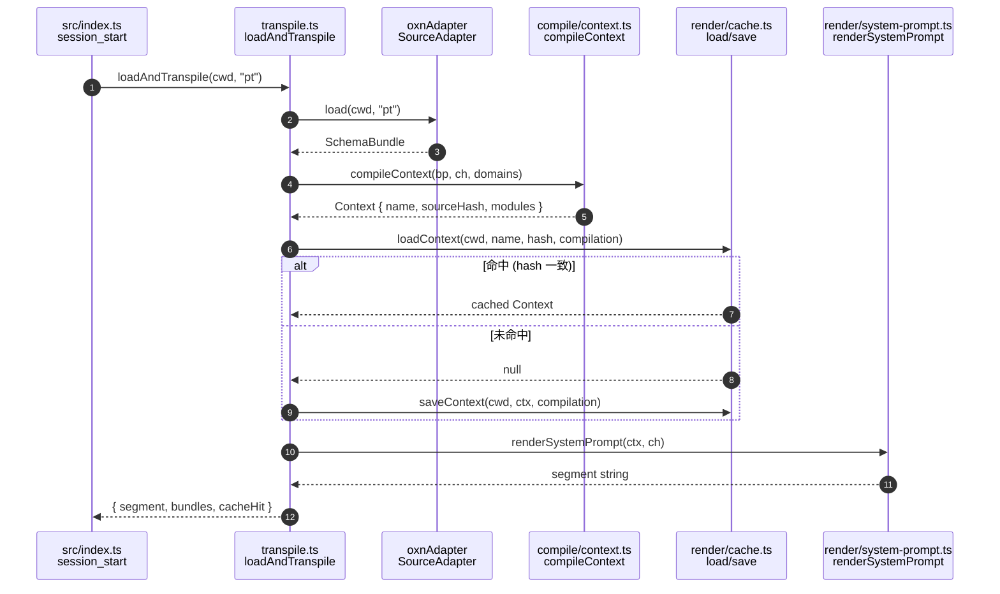
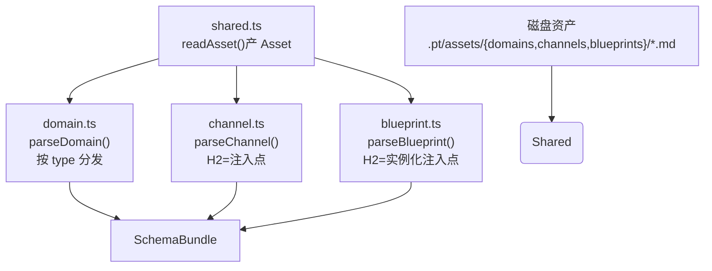
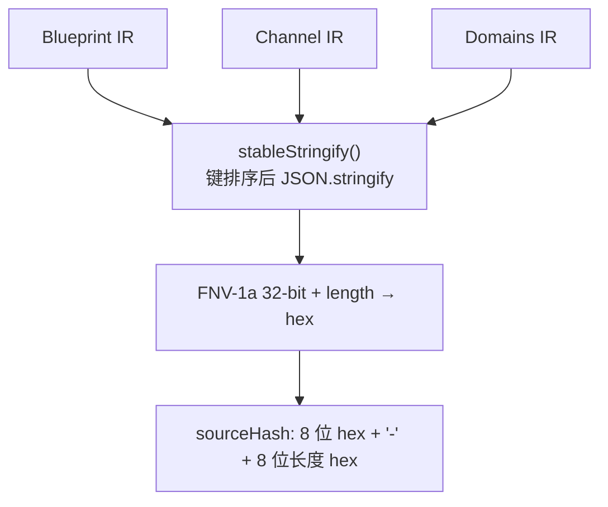

Pt 的核心是一段**三段式编译流水线**：把异构知识源（OXN MD 资产）按 `parse → compile → render` 的顺序逐步精炼，最终输出 Pi Agent 可消费的 System Prompt 与 Context Message。整条链路入口在 `src/transpile.ts` 的 `loadAndTranspile()`，它按顺序调用前端、中端、后端三个独立模块，并用 sourceHash 驱动的 Context 文件做缓存命中/失效。本页聚焦于这条链路的**结构、数据契约与各段职责边界**——具体到每一段内部的细节解析、缓存策略、Pi 事件对接，会在后续页面展开。

## 一、为什么是「编译」而不是「模板拼装」

Pt 处理的对象是**半结构化的知识资产**（frontmatter + H2/H3），产出是**结构化的 prompt 段落**（每段都有语义角色：触发条件、流程、术语、工具、手册步骤）。这种"源语言 →变换 → 目标语言"的工作流与通用编译器本质同构——源有语法树（asset 的 Section/Item），目标有产物结构（systemPrompt 段落），中间需要 IR 解耦多来源与多后端。

Sources: [docs/pt-asset-layering.md](docs/pt-asset-layering.md#L1279-L1354)

## 二、三段式架构总览图

下面这张图展示三段的输入输出契约与中间产物。**所有数据流动都通过 SchemaBundle / Context 这两个 IR 对象**，前端不感知 prompt形态，后端不感知来源格式，中端不读文件也不直接出字符串——这就是三段式解耦的硬约束。

```mermaid
flowchart LR subgraph Frontend["① 前端 parse/（源 → IR）"]
        OXNA["oxnAdapter<br/>SourceAdapter"]
        Shared["shared.ts<br/>frontmatter + H2/H3 词法"]
        DA["domain.ts<br/>domains/*.md"]
        CA["channel.ts<br/>channels/*.md"]
        BA["blueprint.ts<br/>blueprints/*.md"]
        Shared --> DA
        Shared --> CA
        Shared --> BA
        OXNA --> DA
        OXNA --> CA
        OXNA --> BA
    end

    subgraph IR1["IR #1：SchemaBundle"]
        SB["SchemaBundle<br/>domains[] / channels[] /<br/>blueprints[] / activeBlueprint"]
    end

    subgraph Midend["② 中端 compile/（IR → IR）"]
        CC["context.ts<br/>compileContext()<br/>computeSourceHash()"]
        Disp["dispatchInjectionPoint()<br/>按 ipConfig.target 分发"]
    end

    subgraph IR2["IR #2：Context"]
        Ctx["Context<br/>name / sourceHash /<br/>modules[注入点名 → markdown]"]
    end

    subgraph Backend["③ 后端 render/（IR → 产物）"]
        SP["renderSystemPrompt()<br/>Context + Channel → 字符串"]
        CM["bindFlowTemplate()<br/>FlowTemplate + 参数 → 手册"]
        Cache["saveContext / loadContext<br/>.pt/contexts/cache/*.context.md"]
 Ctx --> Cache
 Cache --> SP
    end

    subgraph PI["Pi Agent 注入"]
        BAS["before_agent_start"]
        IE["input 事件"]
    end

    OXNA -->|load cwd| SB
    SB --> CC
    CC --> Disp
    Disp --> Ctx
    Ctx --> SP
    SP -->|segment| BAS
    SB --> CM
    CM -->|展开后文本| IE
```

- **前端**把磁盘上的 `*.md` 资产读成内存 IR（`SchemaBundle`），对来源格式一无所知的中后端只看到 IR。
- **中端**按 `Blueprint + Channel` 的注入点声明，把多个 Domain 的 H2 段聚合成 `Context.modules[注入点名]`。
- **后端**把 `Context` 渲染为最终字符串并写入缓存文件，复用已编译产物。
- **调度器** `transpile.ts` 是三段的粘合层，负责按顺序调用与缓存命中决策。

Sources: [src/transpile.ts](src/transpile.ts#L1-L77) · [src/schema.ts](src/schema.ts#L1-L40) · [docs/pt-asset-layering.md](docs/pt-asset-layering.md#L1320-L1354)

## 三、三段职责边界（硬约束）

判断三段式架构是否真正解耦，有三个反向判据：**换来源不动核心、换编排不动解析与生成、换后端目标不动前端**。三个判据都成立的前提，是下面这张边界表被严格遵守——任何越界（例如让后端读 MD 文件、或让中端拼字符串）都会破坏解耦。

| 段 | v8 名 | 输入 | 输出 | 严禁做的事 |
|---|---|---|---|---|
| **前端** | `parse/` | OXN MD / YAML / 扩展来源 | `SchemaBundle { domains, channels, blueprints, activeBlueprint }` | 生成 prompt 字符串、做 layout 编排 |
| **中端** | `compile/` | `SchemaBundle` + 选定的 `Blueprint` + `Channel` | `Context { name, sourceHash, modules }` | 读来源文件、直接出 prompt 字符串 |
| **后端** | `render/` | `Context` | System Prompt / Context Message 字符串 + 缓存文件 | 读来源文件、做 layout 编排 |

补充几点 v8 的关键设计：

- **中端入口极薄**：只在 `src/compile/index.ts` 里 re-export 两个函数——`compileContext` 与 `computeSourceHash`，所有真实逻辑收敛在 `context.ts`。
- **后端只渲染不编排**：v7 之前曾把 layout 编排放在后端，导致 Phase 5.5 时中端叙事塌陷；Phase 7 重新把中端拉回，所有 `mode: byDomain | byType | hybrid` 的拼接都在中端做，后端只负责按 `target` 把注入点内容拼成字符串。
- **IR 双重身份**：前端产出的 `SchemaBundle` 是"配置态"（包含所有 Blueprint/Domain/Channel），中端产出的 `Context` 是"产物态"（包含按 Blueprint 选定的、已聚合的内容）；两者是显式的两段 IR，名字不可混用。

Sources: [docs/pt-asset-layering.md](docs/pt-asset-layering.md#L1356-L1378) · [src/compile/index.ts](src/compile/index.ts#L1-L3) · [src/render/system-prompt.ts](src/render/system-prompt.ts#L1-L22)

## 四、调度器：`transpile.ts` 把三段串成链路

`loadAndTranspile(cwd, blueprintName)` 是整个三段式的入口函数，被 `src/index.ts` 的 `session_start` 与 `switchBlueprint` 调用。它内部按"parse → compile → cache → render"四步串行调度：

1. **parse阶段**：并行调所有 `SourceAdapter.load(cwd, blueprintName)`，当前注册表里只有 `oxnAdapter`（见 [src/transpile.ts](src/transpile.ts#L23-L28)），失败降级为 `null` 但不抛错。
2. **对每个 bundle 编译**：按 `activeBlueprint` 找 Blueprint，按 `bp.channel` 找 Channel，调 `compileContext(bp, ch, bundle.domains)` 得到 `Context` IR。
3. **cache 决策**：调 `loadContext(cwd, ctx.name, ctx.sourceHash, bp.compilation)` 比对 hash——命中就用缓存里的 `Context`（直接走 render），未命中就 `saveContext()` 落盘后用内存里的 `Context`。
4. **render 阶段**：调 `renderSystemPrompt(ctx, channel)` 把所有 `target=system_prompt` 的注入点内容拼成最终 segment。

最终把多 bundle 的 segment 拼起来，去掉 `<!-- ===== -->` 注入版分隔注释。

下面是调度器的完整数据流：



Sources: [src/transpile.ts](src/transpile.ts#L36-L73) · [src/index.ts](src/index.ts#L37-L46)

## 五、前端（`parse/`）：源格式 → SchemaBundle IR

前端的入口是 `src/parse/index.ts` 中的 `oxnAdapter`——它实现了 `SourceAdapter` 接口（见 [src/schema.ts](src/schema.ts#L211-L214)）：`load(cwd, blueprintName) → Promise<SchemaBundle>`。这条管线把 OXN MD 资产解析为四个 IR 类型：`Domain`、`Channel`、`Blueprint`、`SchemaBundle`。

### 5.1 四个文件分工

| 文件 | 职责 | 关键函数 |
|---|---|---|
| `src/parse/shared.ts` | 通用 MD 词法/语法：frontmatter 解析、H2 段切分、H3 项解析、scalar 解析 | `readAsset`、`splitSections`、`parseItems`、`extractBareListUnderH3` |
| `src/parse/domain.ts` | `domains/*.md → Domain IR`，按 type 标签分发 H2 段内部格式 | `parseDomain`、`toTerms` / `toRules` / `toExternals` / `toTools` / `toFlowTemplates` |
| `src/parse/channel.ts` | `channels/*.md → Channel IR`，H2=注入点 | `parseChannel`、`parseInjectionPointFromSection` |
| `src/parse/blueprint.ts` | `blueprints/*.md → Blueprint IR`，按 H2=注入点组织 | `parseBlueprint`、`extractBoundariesFromRaw`、`parseCompilationFromSection` |
| `src/parse/index.ts` | Source Adapter 入口，按目录位置分发到上面三个 adapter，组装 `SchemaBundle` | `oxnAdapter.load` |

### 5.2 v8 前端的两条新规则

1. **Channel H2 = 注入点**：每个 H2（除 `## Modules` / `## Layout` 等 v7 残留段外）都是一个 `InjectionPointConfig`，H2 名即注入点名（语义名如"会话知识"），H2 下 `target: system_prompt` 与 `mode: hybrid` 决定注入位置与编排方式，`### Modules` 下列出参与本注入点的 Domain H2 段名。
2. **Blueprint 按注入点选 Domain**：Blueprint同样按 H2 切注入点实例化（`InjectionPointInstance`），每个 H2 下的 `### Domains` 列参与本注入点的 Domain 名，`### Trigger` / `### Boundaries` 描述本注入点的触发条件与流程节点 DAG，`## Compilation` 声明缓存目录与拆分策略。

下面这张图把前端内部的数据流画出——所有 adapter 共用 `shared.ts` 的词法层，但各自的 H2 段语义映射互不耦合。



### 5.3 前端产出的 SchemaBundle 形态

```typescript
interface SchemaBundle {
  domains: Domain[];        // 内容层：异构领域知识
  channels: Channel[];      // 结构层：编译上下文通道
  blueprints: Blueprint[];  // 配置层：异构知识编译上下文通道蓝图
  activeBlueprint: string;  // 当前激活的 Blueprint 名
}
```

每个元素的具体字段定义见 [src/schema.ts](src/schema.ts#L40-L209)——例如 `Channel.injectionPoints: InjectionPointConfig[]`、`Blueprint.compilation: CompilationConfig`、`Domain.modules: Record<H2名, 内容>`。前端不感知任何 prompt 形态，也不知 Pi 的 `before_agent_start` 等事件名。

Sources: [src/parse/index.ts](src/parse/index.ts#L1-L93) · [src/parse/shared.ts](src/parse/shared.ts#L1-L332) · [src/parse/domain.ts](src/parse/domain.ts#L1-L152) · [src/parse/channel.ts](src/parse/channel.ts#L1-L100) · [src/parse/blueprint.ts](src/parse/blueprint.ts#L1-L247) · [src/schema.ts](src/schema.ts#L40-L209)

## 六、中端（`compile/`）：SchemaBundle → Context IR

中端只有2 个文件：`index.ts` 极薄地 re-export，`context.ts` 承担所有编译逻辑。中端吃下 `Blueprint + Channel + Domains[]`，吐出 `Context IR`——`{ name, sourceHash, modules: Record<注入点名, markdown字符串> }`。

### 6.1 核心循环`compileContext(blueprint, channel, domains)` 的核心是双重遍历：先按 Domain 名建索引，再遍历 `Channel.injectionPoints`，对每个注入点配置 `ipConfig` 找 Blueprint 里同名 `ipInstance`，再按 `ipConfig.target` 分发到不同的 compiler：

| `ipConfig.target` | 分发函数 | 输出内容 |
|---|---|---|
| `system_prompt` | `compileSystemPromptModule` | 触发条件 + 全局约束（hybrid）+ 流程 DAG + Domain sections（byDomain/hybrid）/ 跨域聚合（byType）+ 工具段 + 手册目录 |
| `context_message` | `compileContextMessageModule` | 按 H2 段聚合：workflow 的 Manual → 手册列表；term 的 Manual → 规则列表；其他 → 通用列表 |
| 其他（扩展） | `compileGenericInjectionPoint` | 按 H2 段聚合的通用列表 |

这层分发的目的是**让中端不感知任何具体 H2 名**——新增注入点只需要 Channel 加 H2 + Blueprint 加同 H2，不动中端主循环。同理，`system_prompt` 注入点里的"按 type 分发渲染"通过 `domainSceneRenderers: Record<type, renderer>` 注册表扩展（见 [src/compile/context.ts](src/compile/context.ts#L322-L338)）——新增 Domain Type 只加 renderer 函数，**中端主循环、Schema、后端都不动**。

### 6.2 sourceHash 失效策略

中端在 `computeSourceHash()` 里把 Blueprint、Channel、Domains 做 `stableStringify`（键排序）后 JSON 串接，再走 FNV-1a 32-bit +长度混合 hash。这个 hash 是后端缓存命中/失效的唯一判据，**Domain/Channel/Blueprint 三者任一变化即失效**。



### 6.3 中端产出的 Context形态

```typescript
interface Context {
  name: string;                          // 跟 Blueprint 一对一
  sourceHash: string;                    // 三者任一变化即失效
  modules: Record<string, string>;       // 注入点名 → 聚合后的 markdown
}
```

注意 `modules` 的 key 在 v8 已从模块名（Scene/Manual）变成注入点名（会话知识/对话记忆）——这是 v8 的关键语义变化，但结构仍是 `Record<string, string>`。

Sources: [src/compile/context.ts](src/compile/context.ts#L36-L78) · [src/compile/context.ts](src/compile/context.ts#L292-L338) · [src/compile/context.ts](src/compile/context.ts#L464-L499)

## 八、后端（`render/`）：Context → 产物字符串 + 缓存

后端入口在 `src/render/index.ts`（10 行），对外暴露 4 个函数：`renderSystemPrompt`、`bindFlowTemplate`、`findFlowInBundle`、`saveContext`/`loadContext`。**后端不做编排，只渲染与缓存**——这是 v7重新拉回三段式后的硬约束。

### 8.1三个后端文件分工

| 文件 | 职责 | 关键函数 |
|---|---|---|
| `render/system-prompt.ts` | `Context + Channel → System Prompt 字符串`，遍历 `Channel.injectionPoints` 聚合 `target=system_prompt` 的注入点 | `renderSystemPrompt` |
| `render/context-message.ts` | `FlowTemplate + 参数 → Context Message 字符串`（binder 展开 `{{var}}` 占位符），并提供 `findFlowInBundle` 让 Pi `input` 事件按名查找 | `bindFlowTemplate`、`findFlowInBundle`、`renderContextMessage` |
| `render/cache.ts` | `Context` 文件读写 + hash 校验，序列化格式含 `source-hash:` frontmatter | `saveContext`、`loadContext` |
| `render/index.ts` | 后端入口，re-export 上面三者 | — |

### 8.2 System Prompt 渲染

`renderSystemPrompt(ctx, channel)` 是后端最简的一段——遍历 `channel.injectionPoints`，对 `target === "system_prompt"` 的注入点取 `ctx.modules[ip.name]`，最后 `\n\n` 拼成整段字符串。**不读任何源文件、不做任何 layout 决策**，所有编排已经在中端的 `compileSystemPromptModule` 里完成。

### 8.3 Context Message 渲染（手册展开）

`bindFlowTemplate(tpl, args)` 把用户在 `/风险检查客户A 5000` 输入的 args 按 `tpl._vars` 或 `argument-hint` 拆成变量 spec，按位置绑定到 `{{var}}` 占位符。变量 spec 支持 `name|default:foo` 语法。错误或缺失的变量保持字面量不抛错。

`findFlowInBundle(blueprint, domains, tplName)` 让 Pi 的 `input` 事件能跨 Domain 在 Blueprint 的 `target=context_message` 注入点里按模板名查找 `FlowTemplate`，找到后立刻交给 `bindFlowTemplate` 展开。

### 8.4 Context 缓存

`saveContext(cwd, ctx, compilation)` 把 `Context` 写到 `<cacheDir>/<name>.context.md`（默认 `.pt/contexts/cache/`），文件 frontmatter 含 `source-hash:` 与 `name:`，每段 H2 对应一个注入点名。`loadContext(cwd, name, expectedHash, compilation)` 读盘 + 反序列化 + 比对 hash，三者任一不满足返 `null`（触发调度器重编译）。

Sources: [src/render/system-prompt.ts](src/render/system-prompt.ts#L1-L22) · [src/render/context-message.ts](src/render/context-message.ts#L1-L148) · [src/render/cache.ts](src/render/cache.ts#L1-L110) · [src/render/index.ts](src/render/index.ts#L1-L10)

## 九、与 Pi Extension 的接缝点

三段式产物最终落到 Pi 的两个事件钩子：

- **`before_agent_start`**（在 `src/index.ts` 第 86-92 行）：后端 `renderSystemPrompt`产出的 `segment` 拼到 `event.systemPrompt` 尾部，作为本轮 System Prompt。
- **`input`**（在 `src/index.ts` 第 99-111 行）：用户输入 `/name args` 时，`findFlowInBundle` 找到模板，`bindFlowTemplate` 展开后 transform 文本——这是 Pt 接管手册展开的入口。

这意味着：**System Prompt 是"预先编译好一次性注入"，Context Message 是"运行时按需展开"**——两者都属于后端产物，但触发时机不同。完整的事件集成与 `session_start` / `session_shutdown`内存态隔离，会在 [注入点机制与 Pi Extension 生命周期集成](9-zhu-ru-dian-ji-zhi-yu-pi-extension-sheng-ming-zhou-qi-ji-cheng) 页面展开。

Sources: [src/index.ts](src/index.ts#L78-L112)

## 十、与通用编译器的差异

Pt **采用编译架构**（三段式 + IR 契约 + 多前端多后端），但**不照搬通用编译器的实现复杂度**。下表是刻意保留的简化：

| 维度 | 通用编译器 | Pt |
|---|---|---|
| 源语言 | 形式语言（C/Rust，严格文法） | 半结构化（markdown + frontmatter，文法宽松） |
| IR | 严格类型化（SSA、类型系统、控制流图） | Schema 对象（普通 TS interface） |
| 中端 | 几十个 pass，性能优化 | 少量变换（编排策略、模板选择） |
| 后端目标 | 机器码（严格） | 自然语言 prompt（LLM 容错） |
| 语义保持 | 严格等价 | 宽松（prompt 有冗余容错） |

所以 Pt 不建复杂 IR 类型系统、不造 pass 管道框架、后端不是 codegen 是 promptgen——拼结构化 markdown 而已。

Sources: [docs/pt-asset-layering.md](docs/pt-asset-layering.md#L1416-L1432)

## 十一、验证三段式解耦的三条判据

下面三个反向验证在每次架构改动时都应跑一遍：

1. **能否换来源不动核心？** 加 `yamlAdapter`，仅新增一个 `src/parse/yaml.ts` + 在 `src/transpile.ts` 的 `sourceAdapters` 注册——中后端零改动。
2. **能否换编排不动解析与生成？** 中端换 `mode` 实现（例如新增 `mode: byRegion`）——前后端零改动，只需新增 `compileByRegionSystemPromptModule` 分支。
3. **能否换后端目标不动前端？** 加新后端产物（例如 `renderOutputToJson`导出供非 Pi agent 用）——前端零改动，只需在 `src/render/` 加新文件并在 `index.ts` re-export。

如果某次改动违反上面三条之一，说明抽象有泄漏，需要先回退 IR 设计。

Sources: [docs/pt-asset-layering.md](docs/pt-asset-layering.md#L1364-L1368) · [src/transpile.ts](src/transpile.ts#L23-L28)

## 十二、读下去的建议路径

基于本篇建立的三段式骨架，下一步可以分别深入每一段的实现细节：

- **前端深读**：[解析前端：MD 词法与 H2/H3 切分](13-jie-xi-qian-duan-md-ci-fa-yu-h2-h3-qie-fen) — 看 `shared.ts` 的 frontmatter/scalar/array/object 解析、H2/H3 切分算法的完整细节。
- **中端深读**：[中端编译：按注入点聚合与 mode 渲染](14-zhong-duan-bian-yi-an-zhu-ru-dian-ju-he-yu-mode-xuan-ran) — 看 `compileContext` 三种 target 的完整流程、`byDomain/byType/hybrid` 三种 mode 的实际差异、注册制 renderer 扩展机制。
- **后端深读**：[后端渲染：System Prompt 与 Context Message 输出](15-hou-duan-xuan-ran-system-prompt-yu-context-message-shu-chu) — 看 `bindFlowTemplate` 的 binder 算法与变量 spec语法、`renderContextMessage` 的运行时展开。
- **缓存深读**：[Context 缓存序列化与 sourceHash 失效策略](16-context-huan-cun-xu-lie-hua-yu-sourcehash-shi-xiao-ce-lue) — 看 FNV-1a 算法、`stableStringify` 排序策略、`serializeContext/deserializeContext` 的 markdown 往返。
- **IR 契约**：[Schema 与 IR 契约（src/schema.ts）](12-schema-yu-ir-qi-yue-src-schema-ts) — 看 `SchemaBundle` / `Context` / `InjectionPointConfig` 等所有 TS interface 的完整定义。
- **Pi 事件集成**：[注入点机制与 Pi Extension 生命周期集成](9-zhu-ru-dian-ji-zhi-yu-pi-extension-sheng-ming-zhou-qi-ji-cheng) — 看三段式产物如何落到 `before_agent_start` / `input` 钩子，以及 per-session 内存态隔离。
- **扩展机制**：[注册新的 Domain Type 渲染器](18-zhu-ce-xin-de-domain-type-xuan-ran-qi) 与 [接入新的 Source Adapter（多来源转译）](19-jie-ru-xin-de-source-adapter-duo-lai-yuan-zhuan-yi) — 验证本篇"加新 type 不动主循环、加新来源不动核心"的设计承诺。