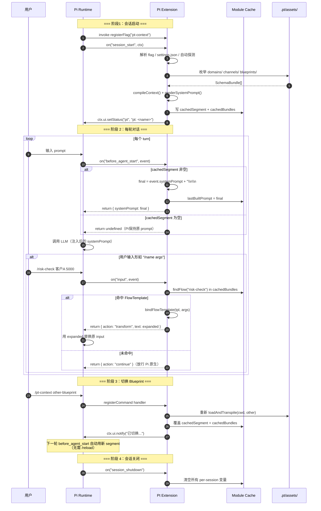

本文档深入 Pt v8 的核心装配逻辑——理解 Pt 如何把"异构领域知识"通过 **注入点（Injection Point）** 注入到 Pi Agent 的不同上下文位置，以及这套注入机制如何接入 Pi 的 ExtensionAPI 事件总线。这条主线是把 v8 四层模型（Domain→Channel→Blueprint→Context）与 Pi 运行时生命周期对齐的关键。

阅读本文档前，建议先建立以下基础认知：
- **v8 IR 契约**：[Schema 与 IR 契约（src/schema.ts）](12-schema-yu-ir-qi-yue-src-schema-ts)——理解 `InjectionPointConfig` / `InjectionPointInstance` / `InjectionTarget` 等核心类型
- **三段式编译架构**：[三段式编译架构（parse→compile→render）](8-san-duan-shi-bian-yi-jia-gou-parse-compile-render)——本文档关注 render阶段的产物如何"挂"到 Pi 事件上
- **v8 四层模型**：[v8 四层模型：Domain→Channel→Blueprint→Context](7-v8-si-ceng-mo-xing-domain-channel-blueprint-context)——本文档是其在 Pi 集成层的展开

## 一、注入点机制：Channel 的 H2 与 Blueprint 的 H2 同名约定

v8 之前（v7），Channel 用 `## Modules` 列表声明"含哪些模块"，而"模块去哪个注入点"是隐式约定，写死在 render 端的硬编码里（如 `renderSystemPrompt(ctx, ch)` 直接读 `ctx.modules["Scene"]`）。v8 的核心改造是 **把注入点提升为 H2**——Channel 每个 H2 二级标题就是 Pi 的一个上下文注入位置，Blueprint 同名 H2 实例化该注入点。

注入点的定义分散在 Channel 与 Blueprint 两侧：

| 角色 | IR 类型 | 文件载体 | 关键字段 | 决定什么 |
|---|---|---|---|---|
| **结构定义** | `InjectionPointConfig` | Channel md 的 H2 | `name / target / modules / mode` | 这个注入点**长什么样**——注入到 Pi 哪里、用什么模式、聚合哪些 Domain H2 段 |
| **结构实例化** | `InjectionPointInstance` | Blueprint md 的同名 H2 | `name / domains / trigger / boundaries` | 这个注入点**装什么**——选哪些 Domain、什么条件触发、执行步骤是什么 |

这种"结构与实例化分离"的设计带来一个关键收益：**同一个 Channel 可被多个 Blueprint 复用**——`dev-knowledge` 被 `pt` 和 `glossary-test` 共用，但各自的 Trigger、Boundaries、Domain 组合不同，结构定义零拷贝。

Channel侧的注入点解析由 `parseInjectionPointFromSection` 完成，H2 名即 `InjectionPointConfig.name`，H2 下的 `target:` / `mode:` 是字段，`### Modules` 下列出的裸名项是 `modules: string[]`。Blueprint 侧的解析由 `parseInjectionPointFromSection`（同名不同实现）处理 `### Domains` / `### Trigger` / `### Boundaries`三个 H3 段。

Sources: [src/parse/channel.ts](src/parse/channel.ts#L43-L66), [src/parse/blueprint.ts](src/parse/blueprint.ts#L79-L96), [src/schema.ts](src/schema.ts#L116-L161)

## 二、InjectionTarget 与 Pi 注入位置的映射

`InjectionTarget` 在 schema 层是一个开放字符串类型，但当前实现收敛到两个语义值，分别对应 Pi扩展的两类事件通道：

| `target` 值 | Pi 事件 / API | 产物形态 | 触发时机 | 典型场景 |
|---|---|---|---|---|
| `system_prompt` | `before_agent_start` | markdown 字符串 | 每轮对话开始前 | 会话级持久知识（术语、架构、规则） |
| `context_message` | `input` | FlowTemplate 展开后的 markdown | 用户输入 `/name` 命令时 | 一次性任务手册（流程步骤、数据源绑定） |

这种映射不是写在 schema 里的硬编码，而是 `dispatchInjectionPoint` 在 compile阶段按 `ipConfig.target` 分发到不同的渲染函数：target 为 `system_prompt` 走 `compileSystemPromptModule`，target 为 `context_message` 走 `compileContextMessageModule`，未知 target 走通用 `compileGenericInjectionPoint`。这种"扩展点开放、已知 target 特化"的写法保留了扩展空间，已知 target 又得到精细化处理。

render 端的"按 target 收集"由 `renderSystemPrompt` 完成——它遍历 `Channel.injectionPoints`，把 `target === "system_prompt"` 的注入点对应的 `ctx.modules[ip.name]` 串接成最终注入字符串：

```ts
// src/render/system-prompt.ts — render 端通用化（不再硬编码 ctx.modules["Scene"]）
export function renderSystemPrompt(ctx: Context, channel: Channel): string {
  const parts: string[] = [];
  for (const ip of channel.injectionPoints) {
    if (ip.target === "system_prompt") {
      const content = ctx.modules[ip.name];
      if (content) parts.push(content);
    }
  }
  return parts.join("\n\n");
}
```

`target === "context_message"` 的注入点不被 system prompt 消费，而是被 input handler 通过 `findFlowInBundle` 反向扫描 `blueprint.injectionPoints` 的 domains 找到 FlowTemplate。这套反向链路解释了"为什么 Pi 的两条注入路径在 schema 层共享 InjectionPointConfig形状，但运行时各自走不同的查找路径"。

Sources: [src/schema.ts](src/schema.ts#L116-L127), [src/compile/context.ts](src/compile/context.ts#L74-L87), [src/render/system-prompt.ts](src/render/system-prompt.ts#L13-L22), [src/render/context-message.ts](src/render/context-message.ts#L108-L137)

## 三、Pi ExtensionAPI 集成全景Pt 与 Pi 的集成点都集中在 `src/index.ts` 的 default export 函数里。Pi 的 ExtensionAPI 通过 `on(event, handler)` 暴露事件总线、通过 `registerCommand` / `registerFlag` 注册扩展点。Pt 用了其中五个事件/接口，构成完整生命周期闭环：

```mermaid
flowchart TB
    subgraph Pi["Pi ExtensionAPI"]
        Flag[registerFlag<br/>pt-context]
        SStart[on session_start<br/>loadAndTranspile]
        BAS[on before_agent_start<br/>注入 systemPrompt]
        Inp[on input<br/>拦截 /name]
        SShut[on session_shutdown<br/>清内存态]
        CmdC[registerCommand<br/>pt-context]
        CmdP[registerCommand<br/>pt]
    end

    subgraph Pt["Pt v8 链路"]
        Cache[(cachedSegment<br/>cachedBundles<br/>lastBuiltPrompt)]
        Transpile[loadAndTranspile<br/>parse→compile→render]
        Bind[bindFlowTemplate<br/>展开 FlowTemplate]
    end

    subgraph OXN["OXN Assets"]
        D[.pt/assets/domains]
        C[.pt/assets/channels]
        BP[.pt/assets/blueprints]
    end

    Flag -.启动参数.-> SStart
    SStart --> Transpile
    Transpile --> D    Transpile --> C
    Transpile --> BP
    Transpile --> Cache
    CmdC -.切换触发.-> Transpile
    BAS<--> Cache
    Inp <--> Cache
    Inp --> Bind
    SShut --> Cache

    style Pt fill:#f5f5f5
    style Cache fill:#fff4cc
```

上图的几个关键映射：

- **flag → session_start**：`pi.registerFlag("pt-context")` 把 CLI 参数暴露出去，session_start 启动时通过 `pi.getFlag("pt-context")` 读取，作为激活 Blueprint 的第一优先级（CLI > settings.json > 自动探测）。
- **session_start → transpile**：在会话开始时跑一次 `loadAndTranspile`，把结果（segment + bundles）写入模块级缓存变量。
- **before_agent_start ↔ cache**：每轮 LLM 调用前从缓存读 segment，拼到 `event.systemPrompt` 末尾返回。
- **input ↔ cache**：用户输入 `/name` 时从 `cachedBundles` 反查 FlowTemplate，命中则展开为 Context Message。
- **session_shutdown → cache**：会话结束时清空所有缓存，避免下次会话复用旧状态。

Sources: [src/index.ts](src/index.ts#L69-L132), [package.json](package.json#L8-L13)

## 四、Pi ExtensionAPI 事件与 Pt 行为的对应表

Pt 对每个 Pi 事件的处理是一个明确的契约。下表汇总每个事件的触发条件、Pt 行为、对应 schema 类型与代码位置：

| Pi 事件 | 触发时机 | Pt 行为 | 关键变量 | 代码位置 |
|---|---|---|---|---|
| `registerFlag("pt-context")` | 扩展加载 |暴露字符串型 CLI 参数 | `flagVal` | [src/index.ts#L70-L73](src/index.ts#L70-L73) |
| `session_start` | 新会话/恢复/重载 | 选 Blueprint →跑 `loadAndTranspile` → 写 footer | `cachedSegment / cachedBundles / lastCacheHit` | [src/index.ts#L76-L102](src/index.ts#L76-L102) |
| `before_agent_start` | 每轮 LLM 调用前 |拼 segment 到 systemPrompt 末尾，返回替换对象 | `lastBuiltPrompt` | [src/index.ts#L104-L109](src/index.ts#L104-L109) |
| `input` | 用户提交 prompt | 拦截 `/name`，命中则返回 `{ action: "transform", text }` | `cachedBundles` | [src/index.ts#L112-L122](src/index.ts#L112-L122) |
| `session_shutdown` | 退出/重载/切换会话 | 清所有 per-session 内存态 | 全部模块级变量 | [src/index.ts#L125-L130](src/index.ts#L125-L130) |
| `registerCommand("pt-context")` | 用户执行命令 | 切换 Blueprint 即时重转译 | 同 `loadAndTranspile` | [src/index.ts#L134-L161](src/index.ts#L134-L161) |
| `registerCommand("pt")` | 用户执行命令 | 查/导出转译产物（status/flows/raw/full） | `cachedSegment / cachedBundles / lastBuiltPrompt` | [src/index.ts#L164-L273](src/index.ts#L164-L273) |

值得注意的两条边界：
- **`before_agent_start` 早返回逻辑**：若 `cachedSegment` 为空（Blueprint 未加载），handler 直接 `return undefined`——这意味着 Pi 不应用任何修改，保持原有 systemPrompt。"降级"设计避免扩展崩溃阻塞会话。
- **`input` 早返回逻辑**：解析不到 `/name` 模式，或模板不在 `cachedBundles` 里时，返回 `{ action: "continue" }`——放行给 Pi 原生 `$1 $2` 模板机制。Pt 只接管自己声明过的命令，未声明的完全不影响。

Sources: [src/index.ts](src/index.ts#L76-L130), [src/index.ts](src/index.ts#L134-L273)

## 五、生命周期时序：一次完整轮转

下图展示用户启动 Pi 到完成一次对话、再到切换 Blueprint 的完整时序——是上节表格的可视化展开：



这张时序图揭示了 Pt 的两个核心特性：

**特性一：轮级别注入是 read-only 的。** `before_agent_start` 只从 `cachedSegment` 读取并拼接到 systemPrompt——它不会触发任何转译、文件 I/O 或 schema 解析。每轮的开销只有字符串拼接 + `lastBuiltPrompt` 赋值。这是为了让每轮 LLM 调用的延迟保持在最低水平。

**特性二：Blueprint 切换是 lazy 即时生效。** 通过 `/pt-context <name>` 切换后，只更新 `cachedSegment` / `cachedBundles`；`before_agent_start` 下一轮就自动读到新值，无需 `/reload`。这套设计规避了 `/reload` 重启扩展的开销。

Sources: [src/index.ts](src/index.ts#L76-L161), [src/transpile.ts](src/transpile.ts#L31-L70), [src/render/context-message.ts](src/render/context-message.ts#L41-L72)

## 六、Per-Session 内存态：模块级变量的语义

Pt 把所有会话级状态都放在 `src/index.ts` 顶层的模块作用域变量里——这是有意为之，因为 Node.js 模块缓存在同一进程内是单例的，而 Pi 的每个 session跑在独立进程里（fork-per-session 架构），所以"模块级"等同于"会话级"。这套设计在 Pi 文档里有明确依据：会话级状态用 `module-level variables`，避免引入持久化层。

| 变量 | 类型 | 职责 | 写入时机 | 失效时机 |
|---|---|---|---|---|
| `activeBlueprint` | `string \| null` | 当前激活的 Blueprint 名 | `transpileActive()`完成后 | `session_shutdown` |
| `cachedSegment` | `string \| null` |注入 systemPrompt 的字符串段 | `transpileActive()` 完成后 | `session_shutdown` |
| `cachedBundles` | `SchemaBundle[] \| null` | 完整 IR集合（供 input handler 查 FlowTemplate） | `transpileActive()` 完成后 | `session_shutdown` |
| `lastCwd` | `string` | 上一次 session_start 的 cwd（命令补全用） | `session_start` | 无（下次 session_start 覆盖） |
| `lastBuiltPrompt` | `string \| null` | 上一次 `before_agent_start` 后的最终 prompt（`/pt full` 用） | `before_agent_start` | `session_shutdown` |
| `lastCacheHit` | `boolean` | 上一次转译是否命中缓存 | `transpileActive()` 完成后 | 下次 `transpileActive()` 覆盖 |

这套状态管理有几个值得展开的设计取舍：

- **`cachedSegment` 与 `cachedBundles` 必须同步**：因为 `before_agent_start` 用前者，`input` 用后者——切换 Blueprint 时两者由 `transpileActive()` 一次性原子写入，避免出现"segment 已切换但 bundles 还是旧的"中间态。
- **`lastBuiltPrompt` 缓存的"双路径"价值**：`/pt full` 命令导出最终 prompt 时优先用 `lastBuiltPrompt`，但当 Blueprint 刚切换未触发过 `before_agent_start` 时，它会 fallback 到 `ctx.getSystemPrompt() + cachedSegment` 现拼。注释明确说"这样切换 Blueprint 后立即 `/pt full` 就能拿到新产物，不用先发对话触发 before_agent_start"——这是 UX 设计上的健壮性。
- **`session_shutdown` 全量清零**：`cachedSegment = null` / `cachedBundles = null` / `activeBlueprint = null` / `lastBuiltPrompt = null` 一次性清除，但保留 `lastCwd` 用于命令补全的 fallback。这种"清到必要程度"避免下次会话误用旧状态。

`per-session` 内存态、缓存与 provider prompt cache 的细节将单独成文（参见 [per-session 内存态、缓存与 provider prompt cache](10-per-session-nei-cun-tai-huan-cun-yu-provider-prompt-cache)），本节只解释其在注入点机制中的角色。

Sources: [src/index.ts](src/index.ts#L16-L25), [src/index.ts](src/index.ts#L27-L34), [src/index.ts](src/index.ts#L104-L130), [src/index.ts](src/index.ts#L241-L249)

## 七、注入点模式与渲染策略`InjectionPointConfig.mode` 字段只在 `target === "system_prompt"` 的注入点上有意义，决定多个 Domain 内容聚合的呈现顺序。v8 提供了三种模式：

| Mode | 渲染策略 | 适用场景 | 实现位置 |
|---|---|---|---|
| `byDomain` | 按 Blueprint.domains 声明顺序逐个域展开 | 强上下文关联（按角色分模块阅读） | [src/compile/context.ts#L131-L139](src/compile/context.ts#L131-L139) |
| `byType` | 按内容类型聚合（先所有术语、再所有规则、再所有工具） | 跨域同类知识聚合 | [src/compile/context.ts#L131-L139](src/compile/context.ts#L131-L139) |
| `hybrid`（默认） | `byDomain` + 全局约束抽取（hybrid only抽 `slot: global` 的规则到顶部） | 大多数场景：保留域结构同时抽出全局约束 | [src/compile/context.ts#L94-L105](src/compile/context.ts#L94-L105) |

`compileSystemPromptModule` 是这套策略的主入口，按顺序输出6 段：
1. **Trigger**：从 `ipInstance.trigger` 取，作为该注入点的触发条件（> 引用块形式）
2. **全局约束**（仅 hybrid）：跨模块聚合 `slot: global` 的 Rule，渲染为 `### 全局约束`
3. **流程段**：从 `ipInstance.boundaries` 取 BoundaryNode列表，按 DAG 顺序渲染（含 deps、步骤专属规则、外部数据源）
4. **Domain sections**（byDomain / hybrid）：按 Blueprint.domains 顺序逐域渲染；每个域按 type 分发到不同的 `renderTermSceneSection` / `renderWorkflowSceneSection` / `renderStackSceneSection` / `renderGlossarySceneSection`
5. **工具段**（除 byType 外）：聚合所有 stack-Domain 的 ToolRef
6. **可用手册**：聚合所有 workflow-Domain 的 FlowTemplate（仅在 `target: system_prompt` 的注入点里展示 `/{name}` 列表）

这套六段式模板解释了为什么同一 Blueprint 在不同 Channel 下能产出截然不同的 systemPrompt——Channel 控制注入点的 target/mode，Blueprint 控制 trigger/boundaries/domains 组合，三者解耦。

Sources: [src/compile/context.ts](src/compile/context.ts#L94-L160), [src/compile/context.ts](src/compile/context.ts#L399-L475)

## 八、注入点 → Domain Scene Renderer 的扩展点

v8 的 Domain renderer 注册表是注入点机制的扩展基石。`src/compile/context.ts` 内部维护一个 `Record<type, DomainSceneRenderer>` 注册表，已注册 `term / workflow / stack / glossary` 四种 type 的 renderer：

```ts
// src/compile/context.ts — Domain type → Scene renderer（已注册：term / workflow / stack / glossary）
const domainSceneRenderers: Record<string, DomainSceneRenderer> = {
  term: renderTermSceneSection,
  workflow: renderWorkflowSceneSection,
  stack: renderStackSceneSection,
  glossary: renderGlossarySceneSection,
};

export function registerDomainSceneRenderer(type: string, fn: DomainSceneRenderer): void {
  domainSceneRenderers[type] = fn;
}
```

`formatDomainSceneSection` 在主循环里按 `d.type` 查表调用——未注册的 type 返回空字符串（不输出），但**不会报错**。扩展新 type只需：

1. 实现一个 `(d: Domain, mode, modules) => string` 形态的 renderer
2.调 `registerDomainSceneRenderer("xxx", fn)`
3. 在 Domain frontmatter 把 `type: xxx`

这条扩展通道独立于注入点本身——注入点管"内容去哪"，renderer 管"内容怎么渲染"，两者通过 `d.type` 解耦。详见 [注册新的 Domain Type 渲染器](18-zhu-ce-xin-de-domain-type-xuan-ran-qi)。

Sources: [src/compile/context.ts](src/compile/context.ts#L325-L348)

## 九、Source Adapter 注册表与依赖反转

Pi 扩展必须能在 Pi 进程里跑通，但 Pt 的核心编译逻辑不应与具体的资产格式（OXN / YAML / DB）耦合。`src/transpile.ts` 顶部的 `sourceAdapters` 数组就是依赖反转的入口：

```ts
// src/transpile.ts — Source Adapter 注册表（MVP 只有 OXN）
const sourceAdapters: SourceAdapter[] = [
  oxnAdapter,
  // 未来：yamlAdapter, dbAdapter, ...
];
```

`SourceAdapter.load(cwd, blueprintName)` 是契约入口，返回 `SchemaBundle`。MVP 只注册 `oxnAdapter`，它按目录位置分发到 `parseDomain` / `parseChannel` / `parseBlueprint`，各自从 `.pt/assets/{domains,channels,blueprints}/*.md` 读出 IR。

这套反转机制让 Pt核心只认 SchemaBundle，不认任何来源格式——上层加新来源只需注册一个新 adapter。`loadAndTranspile` 用 `Promise.all` 并行调用所有 adapter，失败降级为 `null` 不影响其它 adapter——这套并行 + 降级保证了某个来源暂时不可用时其它来源仍可继续注入。

详细的多来源扩展机制参见 [Source Adapter 注册表与依赖反转设计](11-source-adapter-zhu-ce-biao-yu-yi-lai-fan-zhuan-she-ji) 与 [接入新的 Source Adapter（多来源转译）](19-jie-ru-xin-de-source-adapter-duo-lai-yuan-zhuan-yi)。

Sources: [src/transpile.ts](src/transpile.ts#L19-L23), [src/transpile.ts](src/transpile.ts#L31-L70), [src/schema.ts](src/schema.ts#L218-L221)

## 十、注入点机制的三层边界

把整套机制放到一张图中理解最直观：

```mermaid
flowchart LR
    subgraph L1["v8 IR 契约（schema.ts）"]
        IPC[InjectionPointConfig<br/>Channel 侧]
        IPI[InjectionPointInstance<br/>Blueprint 侧]
        IT[InjectionTarget<br/>system_prompt / context_message]
    end

    subgraph L2["编译产出（context.ts）"]
        Ctx[Context IR<br/>modules:注入点名 → markdown]
        Cmp[compileContext<br/>dispatchInjectionPoint]
    end

    subgraph L3["Pi 运行时（index.ts）"]
        SStart[session_start<br/>触发转译]
        BAS[before_agent_start<br/>读 cachedSegment]
        Inp[input<br/>反查 FlowTemplate]
    end

    IPC -.target字段.-> IT
    IPI -.name 字段.-> IPC
    Cmp -->|遍历 IPC| IPC
    Cmp -->|按 target 分发| IT
    Cmp --> Ctx

    SStart -.触发.-> Cmp
    BAS -->|ctx.modules ip.name| Ctx
    Inp -->|findFlowInBundle扫 IPI.domains| IPI```

这张图揭示了注入点机制的**三层边界**：

1. **Schema边界**：Channel 与 Blueprint 通过同名 H2 + `InjectionPointConfig` / `InjectionPointInstance` 契约对齐，但 schema 不感知 Pi 事件（`InjectionTarget` 只是字符串标记）。
2. **Compile 边界**：compile阶段按 `target` 分发到不同的渲染函数，产出 `Context.modules[ip.name] = markdown` 形态的物理层产物。
3. **Pi 集成边界**：index.ts 在 Pi 事件里读 compile产物——`before_agent_start` 拼 systemPrompt，`input` 反查 FlowTemplate。两类 Pi 事件共享同一份 Context，但走不同的查找路径。

这种"schema 不耦合 Pi，compile 按 target 分发，运行时按事件路由"的三层分离，让 v8 模型对 Pi 的 API 演进保持弹性——未来 Pi 增加新的注入位置时，只需在 `InjectionTarget` 加新值、compile 加新分发函数、index.ts 加新事件绑定，schema 主体不动。

## 十一、命令层：pt-context 与 pt`registerFlag` 和 `session_start` 是隐式触发，`/pt-context` 与 `/pt` 是用户显式控制——二者构成"自动 +手动"的完整控制面板。

**`/pt-context <name>`**：即时切换 Blueprint。参数为空时弹选择器（`ctx.ui.select`），有参数则直接调用 `switchBlueprint()`——后者做"重转译 + 通知"，但**不立刻触发出新一轮**——下一轮自动用新 segment。即时生效靠的是 `cachedSegment` 在下一轮 `before_agent_start` 被读到的特性。

**`/pt <sub>`**：查看/导出转译产物。支持 `status`（默认）/ `flows` / `raw` / `full`：
- `status`：显示当前 Blueprint 名、各类资源数、segment 长度、缓存命中状态、上次构建的 prompt 长度、cwd
- `flows`：列出所有可触发的 `/name` 手册（按 `blueprint.injectionPoints` 里 `target=context_message` 的注入点的 domains 聚合）
- `raw`：把 `cachedSegment` 写到 `.pt/raws/segment-<ts>.md`，供离线检视
- `full`：现拼最终 systemPrompt 写到 `.pt/fulls/prompt-<ts>.md`——优先用 `lastBuiltPrompt`，未跑过 turn 则 fallback 到 `ctx.getSystemPrompt() + cachedSegment`

这套 `/pt` 命令组是开发期的"可观测性窗口"——把 Pt 黑盒运行的过程暴露成可读文件，便于调试。

Sources: [src/index.ts](src/index.ts#L134-L161), [src/index.ts](src/index.ts#L164-L273)

## 十二、关键设计取舍总结

把整篇文档浓缩为几个核心设计决策，便于快速回顾：

| 决策点 | 选择 | 备选 | 取舍理由 |
|---|---|---|---|
| 注入点定义位置 | Channel H2（结构层） | Blueprint 顶级字段 | 结构与配置分离，Channel 可跨 Blueprint 复用 |
| Channel.target 字段 | 字符串（保留扩展） | 枚举（封闭） | 未来 Pi 加新位置时 schema 不需改 |
| `before_agent_start` 行为 | 拼接到 systemPrompt 末尾 | 完全替换 systemPrompt | 保留 Pi 默认系统提示 + 资源（skills/themes） |
| `input` 命中策略 | 只接管 `cachedBundles` 声明过的 `/name` | 接管所有 `/name` | 不污染 Pi 原生 `$1 $2` 模板机制 |
| 注入点 → renderer 解耦 | `Record<type, DomainSceneRenderer>` 注册表 | if-else 硬编码 | 加新 type = 一行注册 + 一个函数 |
| 状态存储位置 | 模块级变量 | Context / Pinia / Redis | Node 模块缓存 = 会话级单例，零外部依赖 |
| Blueprint 切换方式 | 改 `cachedSegment`，下轮生效 | 触发 `/reload` | 切换开销 = 一次转译 + 字符串拼接，不重启扩展 |
| Source Adapter 注册 | `sourceAdapters: SourceAdapter[]` 数组 | 抽象工厂 + DI容器 | MVP 阶段简单优先，保留并行调用 + 失败降级 |

## 十三、阅读延展

注入点机制是 Pt 的"装配层"——它把上层 IR产物与下层 Pi 运行时粘合起来。沿着这条主线继续深入，推荐以下章节：

- **配套章节**：[per-session 内存态、缓存与 provider prompt cache](10-per-session-nei-cun-tai-huan-cun-yu-provider-prompt-cache)——本文档涉及的缓存变量在 prompt cache 场景下的更深入讨论
- **来源反转**：[Source Adapter 注册表与依赖反转设计](11-source-adapter-zhu-ce-biao-yu-yi-lai-fan-zhuan-she-ji)——`sourceAdapters` 数组的设计动机与扩展机制
- **渲染细节**：[后端渲染：System Prompt 与 Context Message 输出](15-hou-duan-xuan-ran-system-prompt-yu-context-message-shu-chu)——`renderSystemPrompt` 与 `bindFlowTemplate` 的完整路径
- **编译细节**：[中端编译：按注入点聚合与 mode 渲染](14-zhong-duan-bian-yi-an-zhu-ru-dian-ju-he-yu-mode-xuan-ran)——`compileContext` 的聚合逻辑
- **扩展实操**：[注册新的 Domain Type 渲染器](18-zhu-ce-xin-de-domain-type-xuan-ran-qi) / [接入新的 Source Adapter（多来源转译）](19-jie-ru-xin-de-source-adapter-duo-lai-yuan-zhuan-yi)——基于本文档的扩展实践