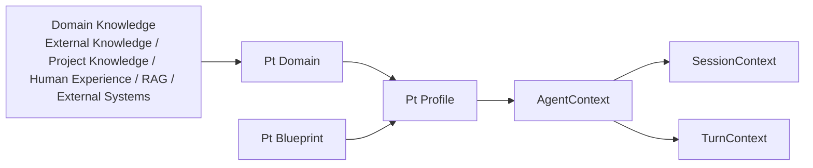

# Pt
可配置的上下文编译器。

---

## Pt 是什么

Pt 把领域知识编译成可配置的 AgentContext。其可以把用户的领域知识异构成 Pt Domain，再通过 Pt Profile 场景配置编译成 AgentContext，Pi 会获取 SessionContext 作为固定注入，而 TurnContext 则是推理时按需注入。



## 安装

Pt 是 Pi 扩展，两种安装方式任选其一。

### 方式一：Pi 插件安装（推荐）

```bash
pi install npm:@istuen/pt
```

Pi 自动加载 Pt。项目级安装（团队共享，写入 `.pi/settings.json`）加 `-l`：

```bash
pi install -l npm:@istuen/pt
```

### 方式二：npm 安装 + 手动配置

```bash
npm install @istuen/pt
```

然后在 `.pi/settings.json` 或 `~/.pi/agent/settings.json` 配置扩展入口：

```json
{
  "pi": {
    "extensions": ["./node_modules/@istuen/pt/dist/index.js"]
  }
}
```

## 快速开始

### 1. 使用内建 Profile

进入 pi 后用 `/pt-profile` 选择 `guide`，或直接 `/pt-profile guide`：

```
/pt-profile guide
```

也可以启动时用 flag 激活：

```bash
pi --pt-profile guide
```

#### 内建 `guide` Profile 
用 pt-default Pt Blueprint + 五个内建 Pt Domain（`user-info` / `agent-info` / `project-analysis` / `authoring` / `usage`）——Agent 立刻有“用户身份 + Agent 身份 + 怎么写 Pt 资产 / 怎么分析项目 / 怎么用 Pt”的知识。

### 2. 自定义构建

用自然语言告诉 Agent 你的项目情况——`guide` Profile 会分析当前项目，帮你创建合适的 Domain 和 Profile，或直接告诉你该怎么创建。

---

## 功能特性

### Pt Domain 异构资产

Pt Domain 采用 Markdown 作为内容文档。
内容可以任何领域知识、经验指导、规范手册，也可以是查询外部数据源、操作外部系统的知识文档。

通过 MD 自带语法简单、方便的构建内容结构：
- **H2 做 Module**（内容段，如 `## Scene`、`## Flows`）。
- **H3 做语义**（项名，如 `### 角色分工`）。
- **列表项做描述**（`- desc: ...`）。

示例：
```markdown
---
name: user-info
---
# user-info

## User
### who-am-i
- desc: 我是这个项目的开发者

### preferences
- desc: 偏好类型安全、模块化设计
```

### Pt Profile 场景配置

对 LLM 配置场景，通过引用 Pt Domain，可以组合不同场景下所需的上下文。
自定义上下文结构可以是session-context、主题、用户与 Agent 的身份信息、reference-manual 等，定义 Agent 推理范围。
支持同会话切换 Profile，也支持跨会话共享 Profile。

示例：
```markdown
---
name: my-dev
blueprint: pt-default
domains: [user-info, authoring, usage]                      # 必填
optional-domains: ["@prj/user-info", "@prj/product-design"]  # 可选：prj 可选填
---
```

#### 使用其他 Pt Profile

Pt Profile 可 `use` 另一 Pt Profile 作为基础，增量覆盖：

```yaml
---
name: my-dev
use: @pt-internal/pt-dev          # 继承 pt-dev 作为基础
blueprint: @team-stdlib/minimal   # 可覆盖 pt-dev 的 blueprint
domains: [my-domain]              # 追加去重 pt-dev 的 domains，
---
```

#### 通用 Profile
optional-domains 声明后，创建指定路径 Domain 即可注入该 Profile，结合 Pt Pack 让多项目使用该 Profile，一次定义，项目追加。

### Pt Blueprint 结构转换

Pt Profile 与 Pt Domain 的衔接结构，定义 Pt Profile 可以聚合 Pt Domain 哪些内容并如何注入到 LLM。
session 是 SessionContext 注入，构建整个会话的固定上下文。
turn 是 TurnContext 注入，由 LLM 在对话时按需获取。

```yaml
name: pt-default
groups:
  - name: session-context
    inject: session
    modules: [Scene, Participant]
  - name: trigger-index
    inject: session
    modules: [Trigger]
  - name: reference-manual
    inject: turn
    modules: [Rules, Flows, Checklists]
```

### AgentContext 编译注入

Pt Profile + Pt Blueprint + Pt Domain 编译后的 AgentContext。
SessionContext 每轮固定注入，LLM 保持上下文稳定。
TurnContext 推理时按需触发注入，LLM 可选择参考。

### Pt Pack 资产包

把 Pt Domain + Pt Blueprint + Pt Profile 作为一个 Pack 被多个项目使用与用户分享。
可以单独管理，构建与沉淀用户与团队的资产包。

| Pack | 来源 | 寻址名 | 说明 |
|---|---|---|---|
| **project** | `<cwd>/.pt/assets/`（默认）或 `pt.project-pack-dir` 配置 | `@prj` | 项目专属资产，永远最高优先 |
| **settings** | `.pi/settings.json` 的 `pt.asset-packs[]` | `@<manifest-name>` | 团队共享 / 第三方 Pack，按声明顺序后者赢 |
| **builtin** | `src/builtin/assets/`（随 npm 包） | `@pt` | 内建 fallback（guide 等） |

#### Pack 解析 
引用可限定 Pack：`@pack-name/asset-name`。
不限定时按优先级自动解析（project > settings > builtin）。

```yaml
# profile.md frontmatter
blueprint: "@pt-project/pt-default"          # 限定到 pt-project pack（project pack 也可用 manifest.name 寻址）
domains: ["@fullstack/team-stdlib", workflow]    # @fullstack 限定 + 无前缀自动解析
```

在 `.pi/settings.json` 加载第三方 / 团队 Pack（只声明 path，name 从 manifest 读）：

```json
{
  "pt": {
    "asset-packs": [
      { "path": "~/projects/pt-team" },
      { "path": "~/shared-pt-assets" }
    ]
  }
}
```

---

## 命令速查

### 用户命令（slash command）

| 命令 | 作用 |
|---|---|
| `--pt-profile <name>` | Pi 启动时激活 Profile（CLI 优先级最高） |
| `/pt-profile` | 弹出 Profile 选择器 |
| `/pt-profile <name>` | 切换 Profile（下一轮生效） |
| `/pt` | 查看当前编译状态（同 `/pt status`） |
| `/pt status` | 编译状态 + segment/cache/pack 健康摘要 |
| `/pt packs` | 各 Pack 加载详情（name / version / asset 计数 / DEGRADED 原因） |
| `/pt flows` | 列出当前 Profile 可触发的 FlowTemplate |
| `/pt check [--profile X] [--fix]` | 项目配置体检（missing ### Modules / 悬挂引用 / 未知 modName） |
| `/pt make-manual <flow> [args...] [--issue <name>]` | 创建 FlowTemplate 实例文档（写入 `.pt/manuals/`） |
| `/pt raw` | 把当前 segment 写入 `.pt/cache/raws/` |
| `/pt full` | 完整 systemPrompt 落盘（写入 `.pt/cache/fulls/`） |
| `/pt logs` | tail 最近 50 条日志 |
| `/pt logs:clear` | 清空当前 session 日志 |
| `/pt sessions` | 列出所有 session 日志文件 |

### LLM 工具（Agent 可调用）

| 工具 | 作用 |
|---|---|
| `pt_status` | 编译状态（profile / domain / flow 计数 / cache hit） |
| `pt_packs` | Pack 详情（name/version/desc/asset 计数） |
| `pt_flows` | 当前 Profile 可触发的 FlowTemplate 列表 |
| `pt_make_manual` | 创建手册实例文档（`procedure` / `args` / `issue`） |
| `pt_turn_inject <domain-or-flow>` | 按需注入 Domain 手册段或展开 FlowTemplate |
| `pt_verify` | 跑 verify probe，写回 manual checklist |
| `pt_check` | 扫描项目配置问题（missing Modules / 悬挂引用 / 未知 modName） |
| `pt_check_refs` | Profile→Blueprint→Domain 引用完整性 |

---

## License

MIT
